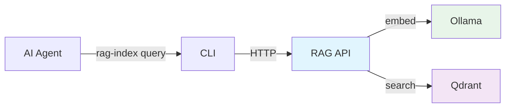

# rag-stack

A vector-first knowledge base for AI agents — ingest any text (code, docs, articles, transcripts, notes), embed it locally, and retrieve relevant context via semantic search, with graph traversal planned on the roadmap.



## What It Does

1. **Ingest** any text — send content to the API via HTTP, or use the CLI to bulk-index Git repositories
2. **Embed** each chunk using a local model (Ollama + nomic-embed-text)
3. **Store** embeddings in Qdrant (vector DB)
4. **Query** by natural language — semantic similarity search for context-rich results

AI agents (Claude Code, OpenClaw, or any HTTP/CLI-capable agent) use this to retrieve grounded context without stuffing entire knowledge bases into their context window. Vector search finds *what's relevant* today; graph relationships are planned in the roadmap.

## Quickstart

```bash
# Start the stack
docker compose up -d

# Pull the embedding model (first time only)
curl http://localhost:11434/api/pull -d '{"name":"nomic-embed-text"}'

# Verify
curl -s http://localhost:8080/healthz
# → {"ok":true}
```

## Ingest Content

Via the HTTP API (any text):

```bash
curl -s -X POST http://localhost:8080/ingest \
  -H "Content-Type: application/json" \
  -d '{
    "items": [{
      "id": "my-doc",
      "text": "Your text content here...",
      "source": "notes/meeting.md"
    }]
  }'
```

Via the CLI (bulk Git repository indexing):

```bash
cd cli && npm install && npm run build

node dist/index.js index \
  --repo https://github.com/<org>/<repo>.git \
  --api http://localhost:8080
```

## Query

```bash
curl -s -X POST http://localhost:8080/query \
  -H "Content-Type: application/json" \
  -d '{"query": "authentication flow", "topK": 5}'

# Or via CLI
node dist/index.js query \
  --api http://localhost:8080 \
  --q "authentication flow" \
  --topK 5
```

## Components

| Component | Role | Tech |
|-----------|------|------|
| **RAG API** | Chunk, embed, store, search | Fastify, Node.js |
| **Qdrant** | Vector storage and similarity search | Qdrant v1.10 |
| **Ollama** | Local embedding model runtime | nomic-embed-text (768d) |
| **CLI** | Bulk-index Git repos and query from terminal | Node.js, TypeScript |
| **Helm Chart** | Kubernetes deployment | Helm 3 |

## Documentation

| Doc | Topic |
|-----|-------|
| [Vision & Roadmap](docs/00-vision.md) | Where rag-stack is headed |
| [Architecture](docs/01-architecture.md) | Components, data flow, security |
| [Local Development](docs/02-local-dev.md) | Docker Compose setup |
| [CLI Reference](docs/03-cli.md) | Commands, flags, examples |
| [Agent Integrations](docs/04-claude-skills.md) | Using rag-stack with Claude Code, OpenClaw, etc. |
| [Helm Deployment](docs/05-helm-remote.md) | Kubernetes + Ingress + auth |
| [Troubleshooting](docs/06-troubleshooting.md) | Common issues and fixes |
| [In-Cluster Indexing](docs/07-indexing-in-cluster.md) | Indexing from inside Kubernetes |
| [Contributing](docs/08-contributing.md) | Development setup and PR process |
| [API Reference](docs/09-api-reference.md) | Endpoints, request/response formats |

## License

See [LICENSE](LICENSE).
