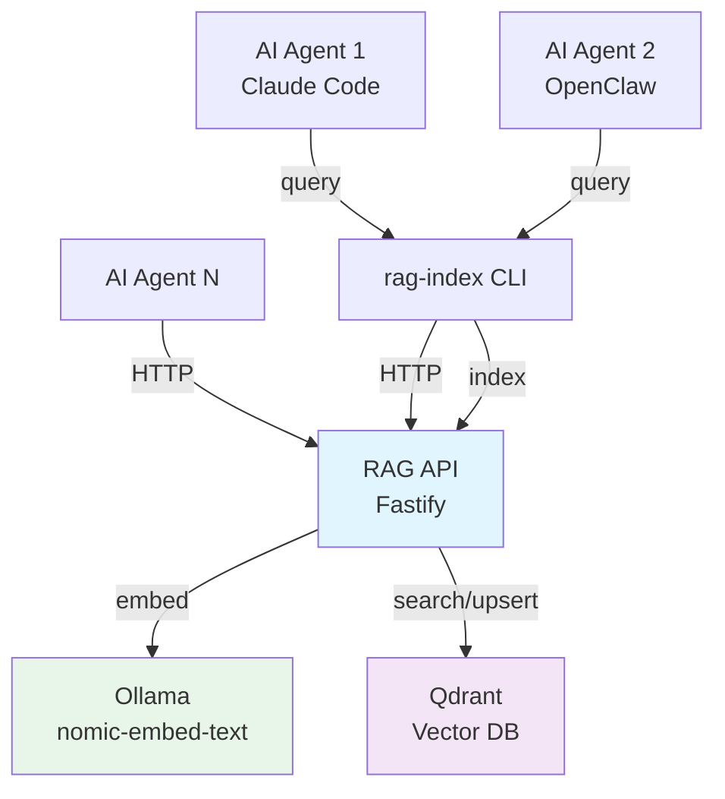

# Vision

rag-stack is a semantic knowledge base for AI agents — a retrieval-augmented generation (RAG) system that stores and retrieves grounded context from any text content: code, documentation, articles, emails, transcripts, or notes.

## Why

AI agents work best with relevant context, but stuffing entire knowledge bases into a model's context window is wasteful and expensive. rag-stack keeps the heavy retrieval work outside the model loop: ingest once, query many times, return only what's relevant. The API is content-agnostic — it chunks, embeds, and searches any text you give it.

## Architecture Overview

## Roadmap

### v0.5 — MVP (current)

What exists today:

- HTTP API: `/ingest` and `/query` endpoints — content-agnostic, accepts any text
- CLI indexer: bulk-index Git repos (clone, chunk, ingest via API)
- Bearer token authentication
- Docker Compose for local development
- Helm chart for Kubernetes deployment
- In-cluster indexing Job
- Agent integrations: Claude Code skill, OpenClaw AgentSkill

### v1.0 — Production Ready

Hardening and extensibility:

- **Testing:** Unit tests for core logic, integration tests for API routes
- **Input validation:** JSON Schema on all API routes
- **Multiple embedding providers:** Adapter pattern — swap Ollama for OpenAI, Cohere, or local alternatives
- **Pluggable vector backends:** Qdrant today, Pinecone/Weaviate/pgvector via adapters
- **Rate limiting and request throttling**
- **Structured logging and health checks** (beyond `/healthz`)
- **API versioning** (`/v1/ingest`, `/v1/query`)

### v2.0 — Multi-Agent Memory Hub

The full vision:

- **Multi-tenancy:** Isolated collections per team/project with scoped tokens
- **Agent authentication:** Per-agent API keys with fine-grained permissions
- **Cross-collection search:** Federated queries across multiple collections
- **Real-time sync:** Webhook-triggered re-indexing when content sources change
- **Agent collaboration:** Shared memory spaces where multiple agents contribute and query
- **Observability:** Distributed tracing, query analytics, embedding cache hit rates
- **SDK/client libraries:** TypeScript, Python, Go clients (beyond CLI)

## Principles

- **Stateless API, stateful storage.** The API process holds no state. Scale it horizontally.
- **Local-first.** Docker Compose must always work. Cloud deployment is optional.
- **Agent-agnostic.** Not tied to any single agent. Claude Code, OpenClaw, or any agent that can call HTTP or shell out to a CLI can use rag-stack.
- **Content-agnostic.** Not just for code. Any text content — docs, articles, emails, transcripts — is a first-class citizen.
- **Minimal dependencies.** Every dependency must justify its existence.
- **Security by default.** Auth is optional locally, mandatory in production.
