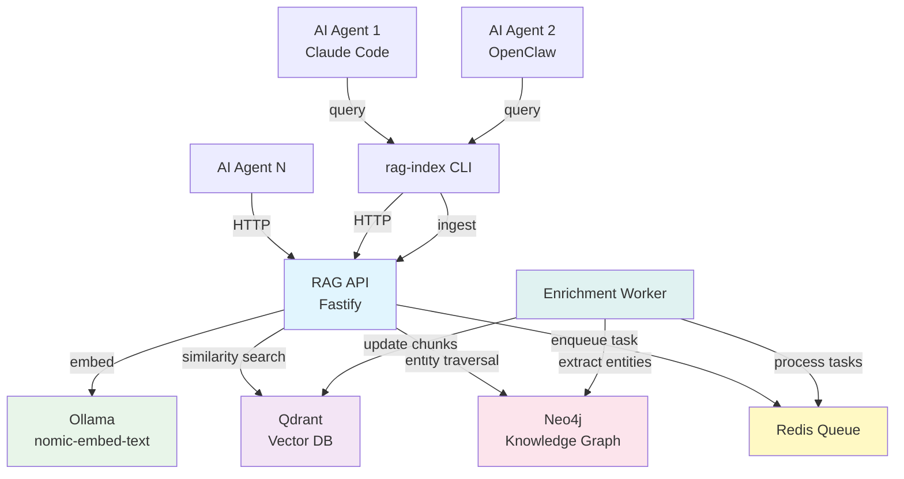

# Vision

rag-stack is a multi-agent memory hub: a shared retrieval-augmented generation (RAG) layer with enrichment and knowledge graph capabilities.

## Why

AI agents work best with relevant context, but stuffing entire knowledge bases into a model's context window is wasteful and expensive. rag-stack keeps the heavy retrieval work outside the model loop: ingest once, query many times, return only what's relevant.

Vector search alone finds *semantically similar* content. But real knowledge has structure — docs reference code, emails discuss designs, repos depend on libraries. The knowledge graph captures these relationships, enabling retrieval that follows connections, not just similarity. The combination is more powerful than either alone:

| Query type | Vector DB | + Graph DB |
|-----------|----------|------------|
| "Find code about auth" | Semantic match | Same |
| "What docs reference this function?" | Can't | Follow edges |
| "Show the email thread behind this design" | Can't | Traverse relationships |
| "What depends on this library?" | Can't | Dependency graph |
| "Find auth code AND everything connected to it" | Partial | Hybrid: similarity + graph neighbors |

## Architecture Overview

## Roadmap

### v0.5 — MVP (completed)

What exists:

- HTTP API: `/ingest` and `/query` endpoints — content-agnostic, accepts any text
- CLI indexer: bulk-index Git repos (clone, chunk, ingest via API)
- Bearer token authentication
- Docker Compose for local development
- Helm chart for Kubernetes deployment
- In-cluster indexing Job
- Agent integrations: Claude Code skill, OpenClaw AgentSkill

### v1.0 — Enrichment & Knowledge Graph ✅ (completed)

**Metadata extraction pipeline:**
- ✅ **Tiered extraction:** tier-1 (sync, heuristic/AST/EXIF) → tier-2 (async, spaCy NLP) → tier-3 (async, LLM)
- ✅ **9 document types:** code, Slack, email, meeting notes, images, PDFs, articles, text, generic
- ✅ **Auto-detection:** Document type inference from file extension and content
- ✅ **Pluggable LLM adapter:** Ollama (local), Anthropic, OpenAI with smart model routing
- ✅ **Async enrichment worker** in Python with Redis task queue
- ✅ **Retry logic:** Exponential backoff with dead-letter queue for failed tasks
- ✅ **Status tracking:** Per-document enrichment status via `/enrichment/status/:baseId`

**Knowledge graph:**
- ✅ **Neo4j graph storage:** Entity and relationship storage with indexed lookups
- ✅ **Entity extraction:** NER via spaCy (tier-2) and LLM-based extraction (tier-3)
- ✅ **Relationship extraction:** Automatic discovery of entity relationships
- ✅ **Hybrid retrieval:** Vector search + graph expansion via `graphExpand` parameter
- ✅ **Graph queries:** Direct entity lookup via `/graph/entity/:name`
- ✅ **Document linking:** Track which documents mention which entities

**API endpoints:**
- ✅ `GET /enrichment/status/:baseId` — Check enrichment status for a document
- ✅ `GET /enrichment/stats` — System-wide enrichment statistics
- ✅ `POST /enrichment/enqueue` — Manually trigger enrichment tasks
- ✅ `GET /graph/entity/:name` — Query entity details and connections

**CLI enhancements:**
- ✅ `rag-index ingest` — Ingest arbitrary files (PDFs, images, Slack exports)
- ✅ `rag-index enrich` — Trigger and monitor enrichment with `--force` and `--stats-only` flags
- ✅ `rag-index graph` — Query knowledge graph entities
- ✅ `--enrich` / `--no-enrich` / `--doc-type` flags on all ingest commands

**Infrastructure:**
- ✅ Docker Compose profiles: `--profile enrichment` for full stack (Redis, Neo4j, worker)
- ✅ Helm chart: all enrichment resources gated on `enrichment.enabled`
- ✅ Backwards-compatible: existing API/CLI behavior unchanged when enrichment disabled
- ✅ Environment-driven configuration: `ENRICHMENT_ENABLED`, `NEO4J_URL`, `REDIS_URL`

### v2.0 — Production Hardening + Multi-Agent Hub (planned)

**Production hardening:**
- **Testing:** Comprehensive unit and integration test coverage
- **Input validation:** JSON Schema on all API routes (in progress)
- **Multiple embedding providers:** Adapter pattern — swap Ollama for OpenAI, Cohere, or local alternatives
- **Pluggable vector backends:** Qdrant today, Pinecone/Weaviate/pgvector via adapters
- **Rate limiting and request throttling**
- **Structured logging and health checks** (beyond `/healthz`)
- **API versioning** (`/v1/ingest`, `/v1/query`)

**Multi-agent hub:**
- **Multi-tenancy:** Isolated collections per team/project with scoped tokens
- **Agent authentication:** Per-agent API keys with fine-grained permissions
- **Cross-collection search:** Federated queries across multiple collections
- **Real-time sync:** Webhook-triggered re-indexing when content sources change
- **Agent collaboration:** Shared memory spaces where multiple agents contribute and query
- **Observability:** Distributed tracing, query analytics, embedding cache hit rates
- **SDK/client libraries:** TypeScript, Python, Go clients (beyond CLI)

## Principles

- **Stateless API, stateful storage.** The API process holds no state. Scale it horizontally.
- **Local-first.** Docker Compose must always work. Cloud deployment is optional.
- **Agent-agnostic.** Not tied to any single agent. Claude Code, OpenClaw, or any agent that can call HTTP or shell out to a CLI can use rag-stack.
- **Content-agnostic.** Not just for code. Any text content — docs, articles, emails, transcripts, PDFs, images — is a first-class citizen.
- **Minimal dependencies.** Every dependency must justify its existence.
- **Security by default.** Auth is optional locally, mandatory in production.
