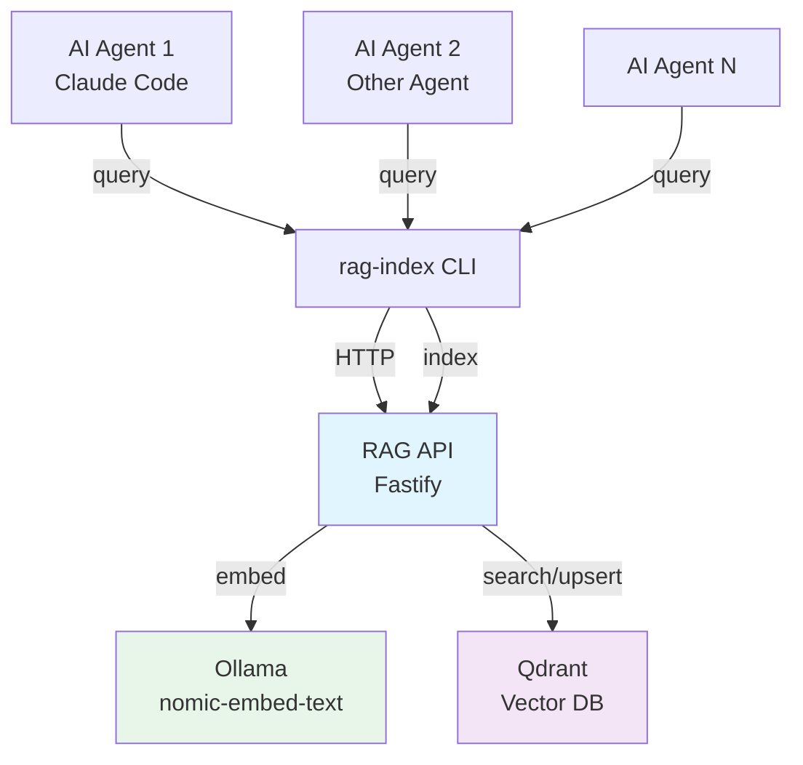

# Vision

rag-stack is a shared memory layer for AI coding agents — a retrieval-augmented generation (RAG) system that stores and retrieves grounded context from indexed repositories.

## Why

AI coding agents work best with relevant context, but stuffing entire repositories into a model's context window is wasteful and expensive. rag-stack keeps the heavy retrieval work outside the model loop: index once, query many times, return only what's relevant.

## Architecture Overview

## Roadmap

### v0.5 — MVP (current)

What exists today:

- CLI indexer: clone repos, chunk files, ingest via API
- RAG API: `/ingest` and `/query` endpoints backed by Qdrant + Ollama
- Bearer token authentication
- Docker Compose for local development
- Helm chart for Kubernetes deployment
- In-cluster indexing Job
- Claude Code skill integration

### v1.0 — Production Ready

Hardening and extensibility:

- **Testing:** Unit tests for core logic, integration tests for API routes
- **Input validation:** JSON Schema on all API routes
- **Multiple embedding providers:** Adapter pattern — swap Ollama for OpenAI, Cohere, or local alternatives
- **Pluggable vector backends:** Qdrant today, Pinecone/Weaviate/pgvector via adapters
- **Rate limiting and request throttling**
- **Structured logging and health checks** (beyond `/healthz`)
- **API versioning** (`/v1/ingest`, `/v1/query`)

### v2.0 — Multi-Agent Memory Hub

The full vision:

- **Multi-tenancy:** Isolated collections per team/project with scoped tokens
- **Agent authentication:** Per-agent API keys with fine-grained permissions
- **Cross-project search:** Federated queries across multiple indexed repositories
- **Real-time sync:** Webhook-triggered re-indexing when repos change
- **Agent collaboration:** Shared memory spaces where multiple agents contribute and query
- **Observability:** Distributed tracing, query analytics, embedding cache hit rates
- **SDK/client libraries:** TypeScript, Python, Go clients (beyond CLI)

## Principles

- **Stateless API, stateful storage.** The API process holds no state. Scale it horizontally.
- **Local-first.** Docker Compose must always work. Cloud deployment is optional.
- **Agent-agnostic.** Not tied to Claude Code. Any agent that can shell out to a CLI or call HTTP can use rag-stack.
- **Minimal dependencies.** Every dependency must justify its existence.
- **Security by default.** Auth is optional locally, mandatory in production.
