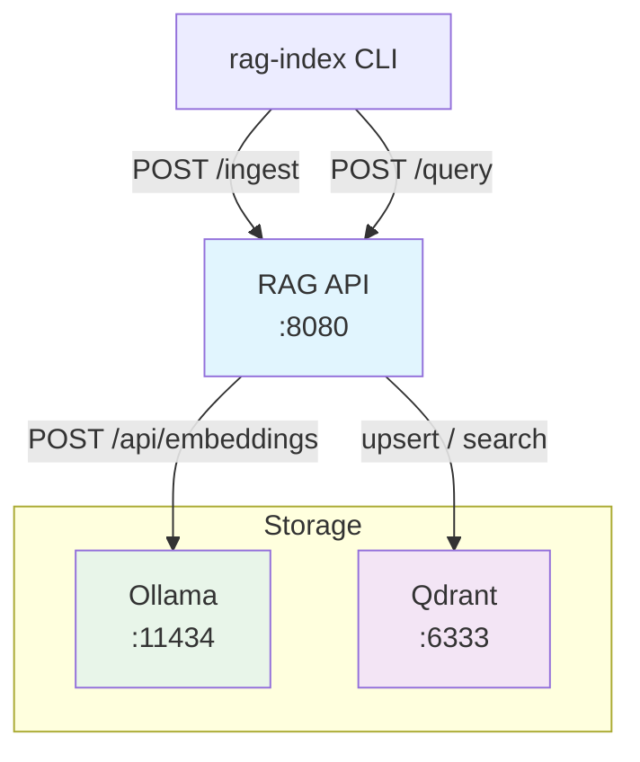
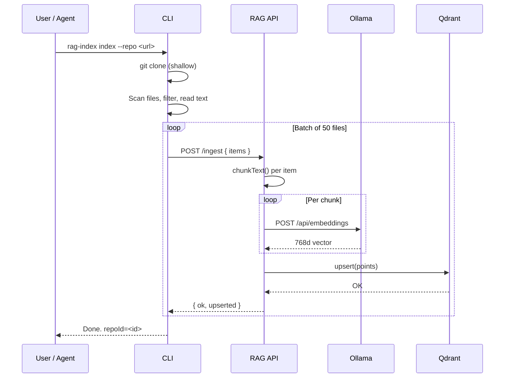
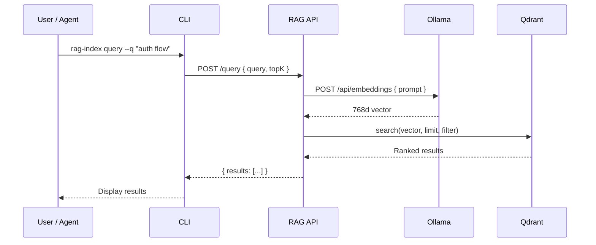
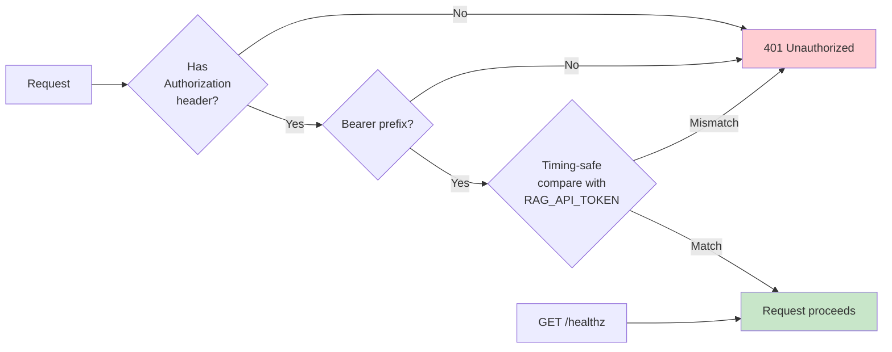

# Architecture

rag-stack is a four-component system: CLI, API, vector database, and embedding runtime.

## Component Diagram

## Components

### RAG API (Fastify)

Stateless HTTP service exposing two core endpoints:

- `POST /ingest` — Receives text items, chunks them, embeds each chunk via Ollama, upserts vectors into Qdrant
- `POST /query` — Embeds the query text, performs similarity search in Qdrant, returns ranked results
- `GET /healthz` — Always unauthenticated, returns `{ ok: true }`

### Qdrant (Vector DB)

Stores embedding vectors with metadata payloads. Each collection holds vectors of a fixed dimension (768 for nomic-embed-text) using cosine distance.

Metadata payload per point:
- `text` — the original chunk text
- `source` — source URL or path
- `chunkIndex` — position of chunk within the original document
- `repoId`, `repoUrl`, `path`, `lang`, `bytes` — indexing metadata

### Ollama (Embedding Runtime)

Runs the `nomic-embed-text` model locally. The API calls Ollama's `/api/embeddings` endpoint for each text chunk. Produces 768-dimensional vectors.

### CLI (rag-index)

Command-line tool for indexing and querying. Clones Git repos to a temp directory, scans for text files, sends them in batches to the API's `/ingest` endpoint.

## Index Data Flow

## Query Data Flow

## Security Model

- Token auth is optional (disabled when `RAG_API_TOKEN` is empty)
- `/healthz` always bypasses auth
- Token comparison uses timing-safe algorithm to prevent timing attacks
- Tokens are provided via environment variable, never hardcoded
