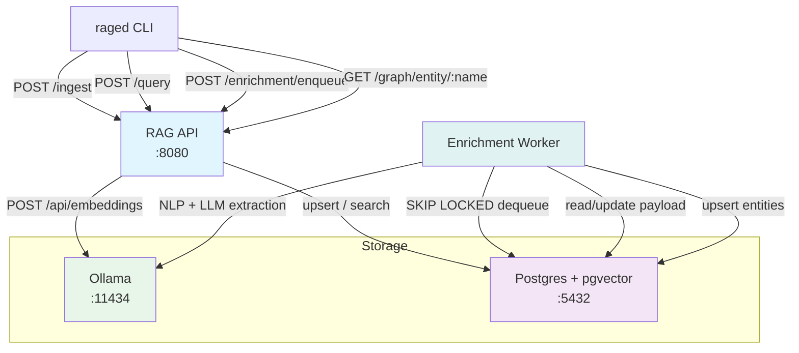
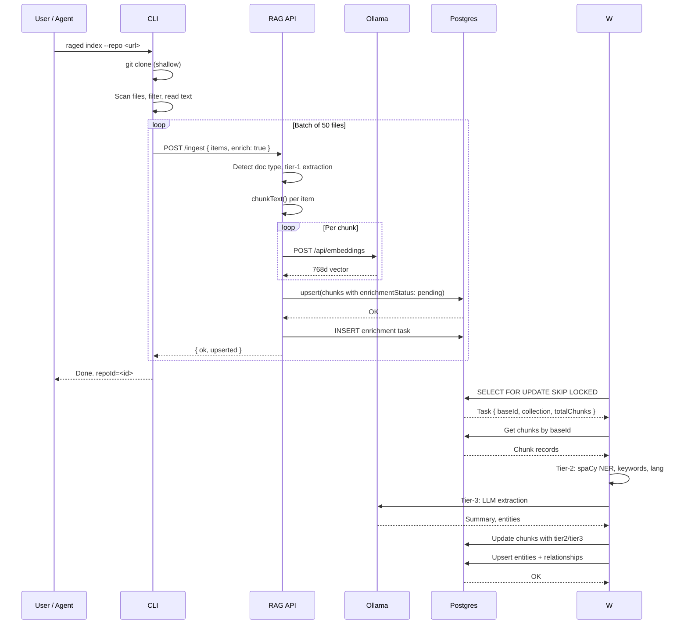
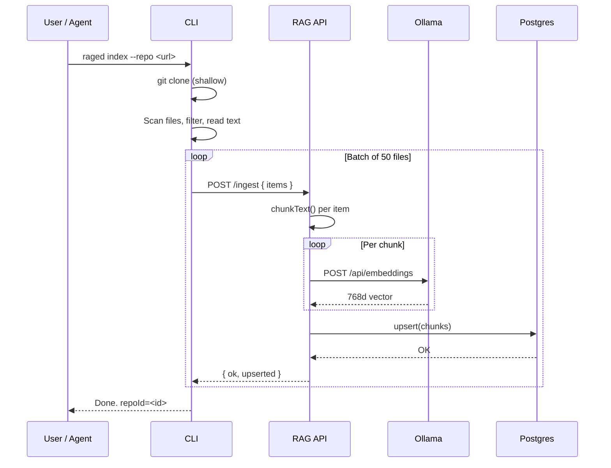
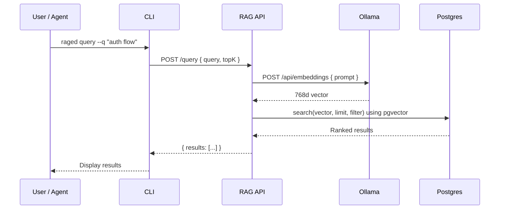
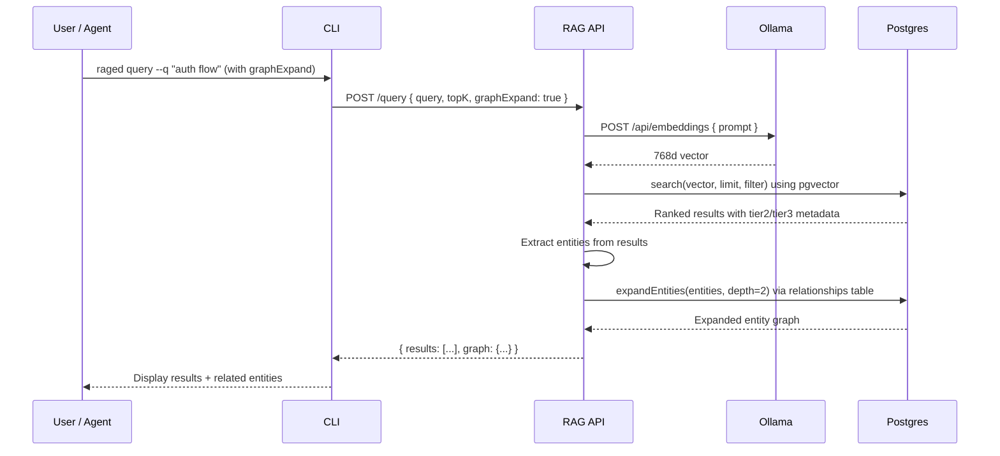
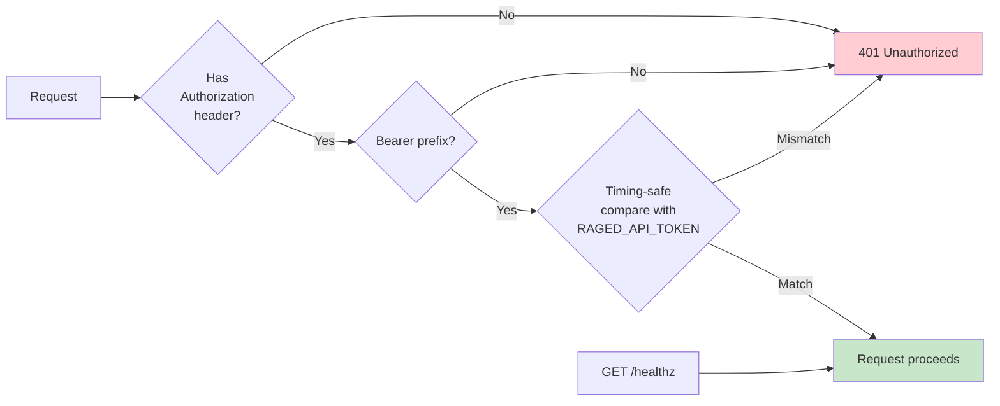

# Architecture

raged is a multi-component system for RAG with enrichment and knowledge graph capabilities.

## Component Diagram

## Components

### RAG API (Fastify)

Stateless HTTP service exposing core endpoints:

**Ingestion & Query:**
- `POST /ingest` — Receives text items or URLs (code, docs, PDFs, images, web pages, etc.), optionally fetches URL content server-side with SSRF protection, runs tier-1 extraction, chunks, embeds via Ollama, upserts vectors into Postgres, optionally enqueues enrichment
- `POST /query` — Embeds the query text, performs similarity search in Postgres using pgvector, optionally expands entities from Postgres relationships, returns ranked results

**Enrichment:**
- `GET /enrichment/status/:baseId` — Get enrichment status for a document
- `GET /enrichment/stats` — System-wide enrichment statistics
- `POST /enrichment/enqueue` — Manually trigger enrichment for existing chunks

**Knowledge Graph:**
- `GET /graph/entity/:name` — Lookup entity details and connections in Postgres

**Health:**
- `GET /healthz` — Always unauthenticated, returns `{ ok: true }`

### Postgres + pgvector (Vector DB)

Stores embedding vectors with metadata in Postgres tables using the pgvector extension. Each collection holds vectors of a fixed dimension (768 for nomic-embed-text) with cosine distance search support.

Metadata per chunk:
- `text` — the original chunk text
- `source` — source URL or path
- `chunkIndex` — position of chunk within the original document
- `enrichmentStatus` — `none`, `pending`, `processing`, `enriched`, or `failed`
- `tier1`, `tier2`, `tier3` — metadata from extraction tiers (when enriched)
- `repoId`, `repoUrl`, `path`, `lang`, `bytes` — indexing metadata (present when ingested via CLI)

### Ollama (Embedding Runtime)

Runs the `nomic-embed-text` model locally for embeddings, and LLM models (llama3, llava) for tier-3 extraction. The API calls Ollama's `/api/embeddings` endpoint for each text chunk. Produces 768-dimensional vectors.

### Postgres Task Queue

Holds enrichment tasks using a Postgres table with SKIP LOCKED for concurrent processing:
- `enrichment_tasks` table — tasks with status tracking
- Workers use `FOR UPDATE SKIP LOCKED` to claim tasks without contention
- Failed tasks tracked via status field after max retries

### Postgres Entities & Relationships

Stores entities and relationships extracted from documents in Postgres tables. Supports graph traversal for hybrid vector+graph retrieval.

Database schema includes: `entities` table (with columns: name, type, description), `relationships` table (with source, target, relationship type)
Relationship types: Configurable based on extraction (e.g., `uses`, `relates_to`, `mentions`)

### Enrichment Worker (Python)

Async background service that:
1. Pulls enrichment tasks from Postgres using `FOR UPDATE SKIP LOCKED`
2. Runs tier-2 extraction (spaCy NER, TextRank keywords, language detection)
3. Runs tier-3 extraction (LLM-based summaries and entity extraction via pluggable provider)
4. Updates Postgres chunk records with `tier2`/`tier3` metadata
5. Upserts entities and relationships to Postgres
6. Updates task status to failed after max retries

### URL Ingestion Flow

When a `url` field is provided (and `text` is omitted), the API performs server-side content fetching:

**SSRF Protection:**
- Blocks private IP ranges (RFC 1918, loopback, link-local)
- DNS rebinding defense: resolves hostname before request and rejects private IPs
- Rejects non-HTTP/HTTPS schemes
- Fixed 30-second request timeout

**Supported Content Types:**
- `text/html` — Readability article extraction (jsdom + @mozilla/readability)
- `application/pdf` — pdf-parse text extraction with page metadata
- `text/plain`, `text/markdown` — passthrough
- `application/json` — pretty-printed JSON as text

**Error Handling:**
Partial success model — successfully fetched items are ingested, failures are returned in `errors` array with per-URL status and reason.

### CLI (raged)

Command-line tool with five commands:
- `index` — Clone Git repo and index files
- `query` — Search for similar chunks
- `ingest` — Ingest arbitrary files (PDFs, images, text) or URLs with `--url` flag
- `enrich` — Trigger/monitor enrichment tasks
- `graph` — Query knowledge graph entities

## Enriched Index Data Flow

## Index Data Flow

## Query Data Flow

### Basic Vector Search

### Hybrid Vector + Graph Search

## Security Model

- Token auth is optional (disabled when `RAGED_API_TOKEN` is empty)
- `/healthz` always bypasses auth
- Token comparison uses timing-safe algorithm to prevent timing attacks
- Tokens are provided via environment variable, never hardcoded
