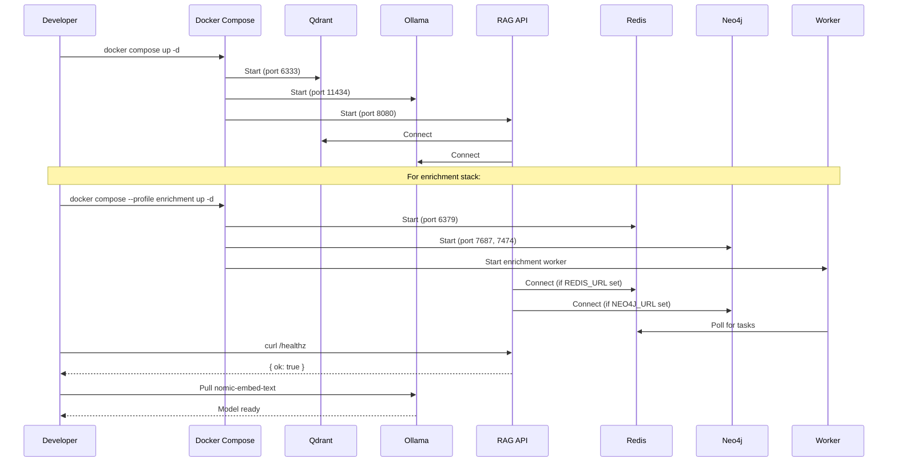

# Local Development

Run the full raged locally using Docker Compose. No cloud services required.

## Startup



## Steps

### Base Stack (Vector Search Only)

```bash
# 1. Start core services (Qdrant, Ollama, API)
docker compose up -d

# 2. Verify the API is running
curl -s http://localhost:8080/healthz
# → {"ok":true}

# 3. Pull the embedding model (first time only)
curl http://localhost:11434/api/pull -d '{"name":"nomic-embed-text"}'
```

### Full Stack (with Enrichment & Knowledge Graph)

```bash
# 1. Start all services including Redis, Neo4j, and enrichment worker
docker compose --profile enrichment up -d

# 2. Verify the API is running
curl -s http://localhost:8080/healthz
# → {"ok":true}

# 3. Pull the embedding model (first time only)
curl http://localhost:11434/api/pull -d '{"name":"nomic-embed-text"}'

# 4. (Optional) Pull LLM for tier-3 extraction
curl http://localhost:11434/api/pull -d '{"name":"llama3"}'

# 5. Verify enrichment is enabled
curl -s http://localhost:8080/enrichment/stats
# → {"queue":{"pending":0,...},"totals":{...}}
```

## Services

### Base Stack

| Service | Port | Purpose |
|---------|------|---------|
| `api` | 8080 | RAG API (Fastify) |
| `qdrant` | 6333 | Vector database |
| `ollama` | 11434 | Embedding model runtime |

### Enrichment Stack (--profile enrichment)

| Service | Port | Purpose |
|---------|------|---------|
| `redis` | 6379 | Task queue for async enrichment |
| `neo4j` | 7474 (HTTP), 7687 (Bolt) | Knowledge graph database |
| `enrichment-worker` | - | Python enrichment worker (background service) |

## Optional: Enable Auth Locally

Set `RAGED_API_TOKEN` in `docker-compose.yml` under the `api` service:

```yaml
environment:
  RAGED_API_TOKEN: "my-dev-token"
```

Then pass `--token my-dev-token` to CLI commands (or set `RAGED_API_TOKEN` env var).

## Optional: Configure Enrichment

Enrichment is enabled via Docker Compose profiles. To customize enrichment behavior, set environment variables in `docker-compose.yml`:

**API service:**
```yaml
environment:
  ENRICHMENT_ENABLED: "true"  # Enable enrichment features
  REDIS_URL: "redis://redis:6379"  # Task queue (must be set manually)
  NEO4J_URL: "bolt://neo4j:7687"  # Knowledge graph (must be set manually)
  NEO4J_USER: "neo4j"
  NEO4J_PASSWORD: ""  # Default docker-compose uses NEO4J_AUTH=none
```

**Worker service:**
```yaml
environment:
  REDIS_URL: "redis://redis:6379"
  QDRANT_URL: "http://qdrant:6333"
  OLLAMA_URL: "http://ollama:11434"
  NEO4J_URL: "bolt://neo4j:7687"
  NEO4J_USER: "neo4j"
  NEO4J_PASSWORD: "password"
  WORKER_CONCURRENCY: "4"  # Number of concurrent tasks
  EXTRACTOR_PROVIDER: "ollama"  # Options: ollama, anthropic, openai
  EXTRACTOR_MODEL_FAST: "llama3"  # Fast model for quick extraction
  EXTRACTOR_MODEL_CAPABLE: "llama3"  # Capable model for complex extraction
  EXTRACTOR_MODEL_VISION: "llava"  # Vision model for image inputs
```

## Tear Down

```bash
# Stop services (keep data)
docker compose down

# Stop services and delete data volumes
docker compose down -v
```

## Developing the API

For hot-reload during API development:

```bash
cd api
npm install
QDRANT_URL=http://localhost:6333 OLLAMA_URL=http://localhost:11434 npm run dev
```

This runs the API directly on your machine while Qdrant and Ollama run in Docker.

## Developing the CLI

```bash
cd cli
npm install
npm run dev -- index --repo <url> --api http://localhost:8080

# Test URL ingestion
npm run dev -- ingest --url https://example.com/article --api http://localhost:8080
```

## URL Ingestion Examples

The API supports server-side URL fetching for web pages, PDFs, and other content types:

### Via HTTP API

**Ingest a web article:**
```bash
curl -s -X POST http://localhost:8080/ingest \
  -H "Content-Type: application/json" \
  -d '{
    "items": [{
      "url": "https://example.com/article"
    }]
  }'
```

**Ingest a PDF from URL:**
```bash
curl -s -X POST http://localhost:8080/ingest \
  -H "Content-Type: application/json" \
  -d '{
    "items": [{
      "url": "https://example.com/whitepaper.pdf",
      "source": "Example Whitepaper"
    }]
  }'
```

**Mixed batch (URLs + text):**
```bash
curl -s -X POST http://localhost:8080/ingest \
  -H "Content-Type: application/json" \
  -d '{
    "items": [
      {"url": "https://example.com/article"},
      {"text": "Direct text content", "source": "notes/snippet.txt"}
    ]
  }'
```

### Via CLI

```bash
# Ingest a web page
node dist/index.js ingest --url https://example.com/article --api http://localhost:8080

# Ingest a PDF
node dist/index.js ingest --url https://example.com/whitepaper.pdf --api http://localhost:8080
```

**Supported Content Types:**
- HTML (Readability article extraction)
- PDF (pdf-parse text extraction)
- Plain text, Markdown (passthrough)
- JSON (pretty-printed)

**SSRF Protection:**
URL ingestion includes automatic security protections:
- Blocks private IP ranges (10.x.x.x, 192.168.x.x, 127.x.x.x, etc.)
- DNS rebinding defense: resolves hostname before request and rejects private IPs
- Fixed 30-second request timeout
- Rejects non-HTTP/HTTPS schemes
