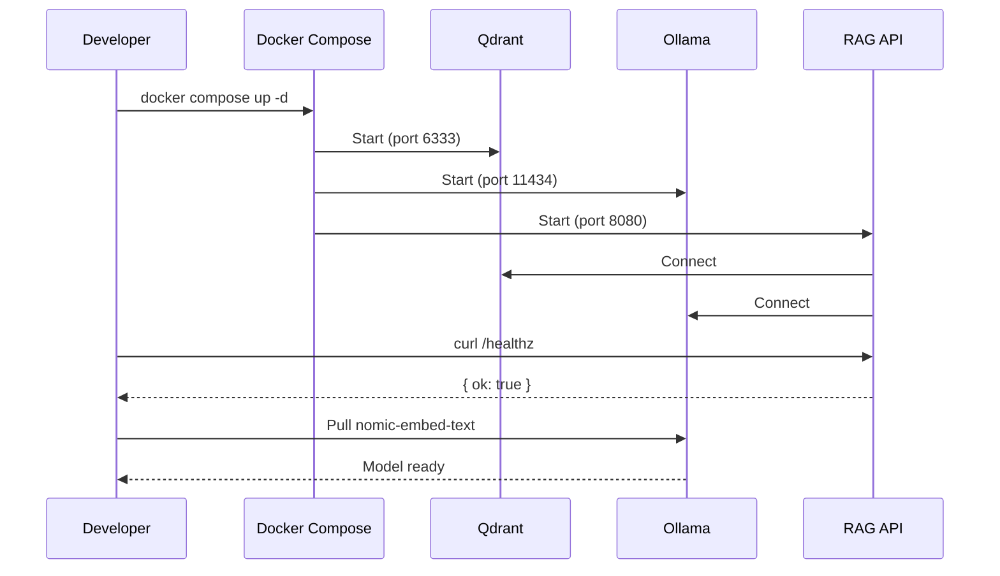

# Local Development

Run the full rag-stack locally using Docker Compose. No cloud services required.

## Startup



## Steps

```bash
# 1. Start all services
docker compose up -d

# 2. Verify the API is running
curl -s http://localhost:8080/healthz
# → {"ok":true}

# 3. Pull the embedding model (first time only)
curl http://localhost:11434/api/pull -d '{"name":"nomic-embed-text"}'
```

## Services

| Service | Port | Purpose |
|---------|------|---------|
| `api` | 8080 | RAG API (Fastify) |
| `qdrant` | 6333 | Vector database |
| `ollama` | 11434 | Embedding model runtime |

## Optional: Enable Auth Locally

Set `RAG_API_TOKEN` in `docker-compose.yml` under the `api` service:

```yaml
environment:
  RAG_API_TOKEN: "my-dev-token"
```

Then pass `--token my-dev-token` to CLI commands (or set `RAG_API_TOKEN` env var).

## Tear Down

```bash
# Stop services (keep data)
docker compose down

# Stop services and delete data volumes
docker compose down -v
```

## Developing the API

For hot-reload during API development:

```bash
cd api
npm install
QDRANT_URL=http://localhost:6333 OLLAMA_URL=http://localhost:11434 npm run dev
```

This runs the API directly on your machine while Qdrant and Ollama run in Docker.

## Developing the CLI

```bash
cd cli
npm install
npm run dev -- index --repo <url> --api http://localhost:8080
```
