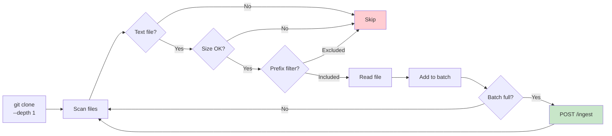

# CLI (rag-index)

Command-line tool for indexing Git repositories and querying the RAG API.

## Build

```bash
cd cli
npm install
npm run build
```

## Commands

### index

Clone a Git repository, scan for text files, and ingest them into the RAG API.

```bash
node dist/index.js index --repo <git-url> [options]
```

| Flag | Default | Description |
|------|---------|-------------|
| `--repo` | _(required)_ | Git URL to clone |
| `--api` | `http://localhost:8080` | RAG API URL |
| `--collection` | `docs` | Qdrant collection name |
| `--branch` | _(default branch)_ | Git branch to clone |
| `--repoId` | _(repo URL)_ | Stable identifier for this repo |
| `--token` | _(env `RAG_API_TOKEN`)_ | Bearer token for auth |
| `--include` | _(all)_ | Only index files matching this path prefix |
| `--exclude` | _(none)_ | Skip files matching this path prefix |
| `--maxFiles` | `4000` | Maximum files to process |
| `--maxBytes` | `500000` | Maximum file size in bytes |
| `--keep` | `false` | Keep the cloned temp directory |

### query

Search the RAG API for relevant chunks.

```bash
node dist/index.js query --q "<search text>" [options]
```

| Flag | Default | Description |
|------|---------|-------------|
| `--q` / `--query` | _(required)_ | Search query text |
| `--api` | `http://localhost:8080` | RAG API URL |
| `--collection` | `docs` | Qdrant collection name |
| `--topK` | `8` | Number of results to return |
| `--repoId` | _(none)_ | Filter by repository ID |
| `--pathPrefix` | _(none)_ | Filter by file path prefix |
| `--lang` | _(none)_ | Filter by language |
| `--token` | _(env `RAG_API_TOKEN`)_ | Bearer token for auth |

## Index Lifecycle



## Authentication

Two ways to provide the auth token:

1. **Flag:** `--token my-token`
2. **Environment variable:** `export RAG_API_TOKEN=my-token`

The flag takes precedence over the environment variable.

## Examples

Index a public repo:
```bash
node dist/index.js index \
  --repo https://github.com/fastify/fastify.git \
  --api http://localhost:8080 \
  --collection fastify-docs \
  --include docs/
```

Query with filters:
```bash
node dist/index.js query \
  --api http://localhost:8080 \
  --q "request validation" \
  --topK 5 \
  --collection fastify-docs \
  --lang md
```
