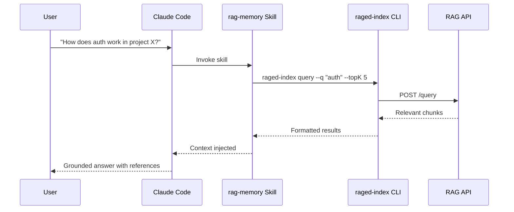
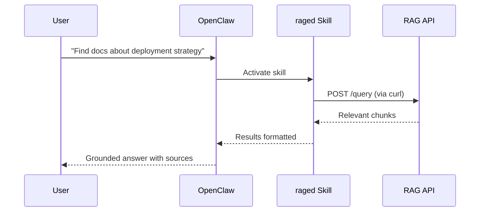

# Agent Integrations

raged is agent-agnostic and works with any agent that can call HTTP or execute shell commands.

This page covers built-in integrations.

## Claude Code

### How It Works



### Skill Location

```
.claude/skills/rag-memory/SKILL.md
```

### Setup

**Local** (Docker Compose on the same machine):

```bash
# No configuration needed — defaults work
# API at http://localhost:8080, no auth
```

**Remote:**

```bash
export RAG_API_URL=https://rag.example.com
export RAGED_API_TOKEN=your-token-here
```

### Usage

The skill is invoked automatically when Claude determines it needs context. You can also ask directly:

> "Use rag-memory to find how authentication is implemented in the fastify-docs collection"

Claude will run:
```bash
raged-index query \
  --api "${RAG_API_URL:-http://localhost:8080}" \
  --q "authentication implementation" \
  --topK 5 \
  --token "${RAGED_API_TOKEN:-}"
```

## OpenClaw

### How It Works



### Skill Location

```
~/.openclaw/skills/raged/SKILL.md
```

### Setup

Install the skill (from the raged repo):

```bash
ln -s /path/to/raged/skill ~/.openclaw/skills/raged
```

Configure in `~/.openclaw/openclaw.json`:

```json
{
  "skills": {
    "entries": {
      "raged": {
        "enabled": true,
        "env": {
          "RAGED_URL": "http://localhost:8080",
          "RAGED_TOKEN": ""
        }
      }
    }
  }
}
```

### Usage

OpenClaw activates the skill based on the description in SKILL.md. The agent uses `curl` to call the raged API directly.

## Other Agents

Any agent that can call HTTP or execute shell commands can use raged:

```bash
# Via CLI
raged-index query --api <url> --q "<question>" --topK 5

# Via HTTP API
curl -X POST https://rag.example.com/query \
  -H "Content-Type: application/json" \
  -H "Authorization: Bearer <token>" \
  -d '{"query": "authentication flow", "topK": 5}'
```

The v2.0 roadmap includes native SDK/client libraries for TypeScript, Python, and Go — eliminating the CLI dependency.
