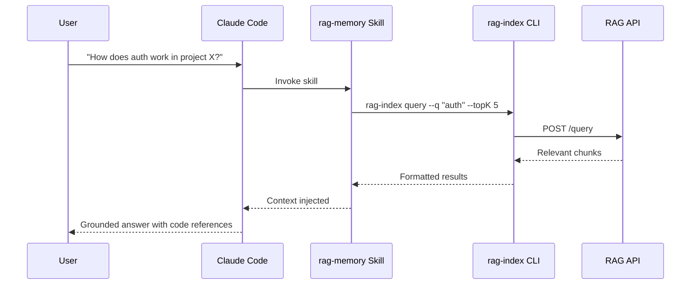

# Claude Code Skill

rag-stack includes a Claude Code skill that lets Claude query indexed repositories for relevant context.

## How It Works



## Skill Location

```
.claude/skills/rag-memory/SKILL.md
```

## Setup

### Local

If running rag-stack via Docker Compose on the same machine:

```bash
# No configuration needed — defaults work
# API at http://localhost:8080, no auth
```

### Remote

Set environment variables for your shell (or in your Claude Code configuration):

```bash
export RAG_API_URL=https://rag.example.com
export RAG_API_TOKEN=your-token-here
```

## Usage

The skill is invoked automatically when Claude determines it needs codebase context. You can also ask directly:

> "Use rag-memory to find how authentication is implemented in the fastify-docs collection"

Claude will run:
```bash
rag-index query \
  --api "${RAG_API_URL:-http://localhost:8080}" \
  --q "authentication implementation" \
  --topK 5 \
  --token "${RAG_API_TOKEN:-}"
```

## Multi-Agent Context

rag-stack is designed to be agent-agnostic. While the current skill targets Claude Code, any agent that can execute shell commands can use the CLI:

```bash
# Any agent can query
rag-index query --api <url> --q "<question>" --topK 5

# Or call the HTTP API directly
curl -X POST https://rag.example.com/query \
  -H "Content-Type: application/json" \
  -H "Authorization: Bearer <token>" \
  -d '{"query": "authentication flow", "topK": 5}'
```

The v2.0 roadmap includes native SDK/client libraries for TypeScript, Python, and Go — eliminating the CLI dependency for non-Claude agents.
