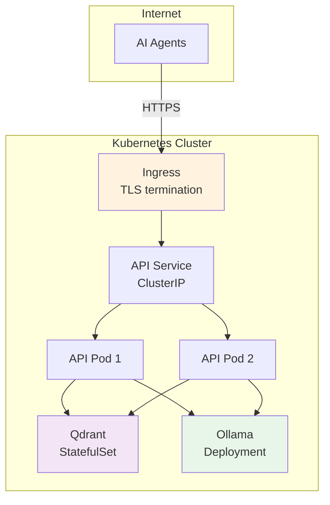

# Helm Deployment (Remote)

Deploy rag-stack to Kubernetes with Ingress and token authentication.

## Deployment Topology



## Prerequisites

- Kubernetes cluster with an Ingress controller
- `helm` CLI (v3.15+)
- Container registry access

## Build & Push Images

```bash
# API
docker build -t your-registry/rag-api:0.5.0 ./api
docker push your-registry/rag-api:0.5.0

# CLI (for in-cluster indexing)
docker build -t your-registry/rag-index:0.5.0 ./cli
docker push your-registry/rag-index:0.5.0
```

## Install

```bash
helm install rag ./chart -n rag --create-namespace \
  --set api.image.repository=your-registry/rag-api \
  --set api.image.tag=0.5.0 \
  --set api.ingress.enabled=true \
  --set api.ingress.host=rag.example.com \
  --set api.auth.enabled=true \
  --set api.auth.token=REPLACE_ME
```

## Key Values

| Value | Default | Description |
|-------|---------|-------------|
| `api.replicas` | `2` | Number of API pods |
| `api.ingress.enabled` | `false` | Enable Ingress |
| `api.ingress.host` | `rag.local` | Ingress hostname |
| `api.ingress.tls.enabled` | `false` | Enable TLS |
| `api.auth.enabled` | `true` | Enable bearer token auth |
| `api.auth.token` | `""` | Auth token (set this!) |
| `qdrant.storage.size` | `20Gi` | Qdrant persistent volume size |
| `ollama.enabled` | `true` | Deploy Ollama in-cluster |
| `ollama.storage.size` | `30Gi` | Ollama model storage size |
| `indexer.enabled` | `false` | Enable in-cluster indexing Job |

See [values.yaml](../chart/values.yaml) for the full list.

## Upgrade

```bash
helm upgrade rag ./chart -n rag \
  --set api.image.tag=0.6.0 \
  --reuse-values
```

## TLS

```bash
helm install rag ./chart -n rag --create-namespace \
  --set api.ingress.enabled=true \
  --set api.ingress.host=rag.example.com \
  --set api.ingress.tls.enabled=true \
  --set api.ingress.tls.secretName=rag-tls
```

Ensure a TLS certificate Secret exists in the `rag` namespace, or use cert-manager to provision one automatically.
