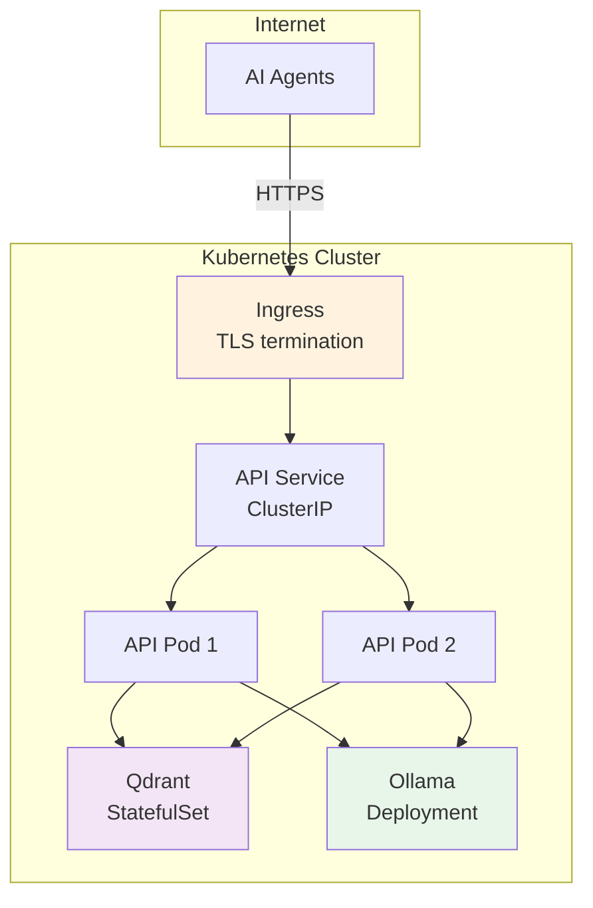
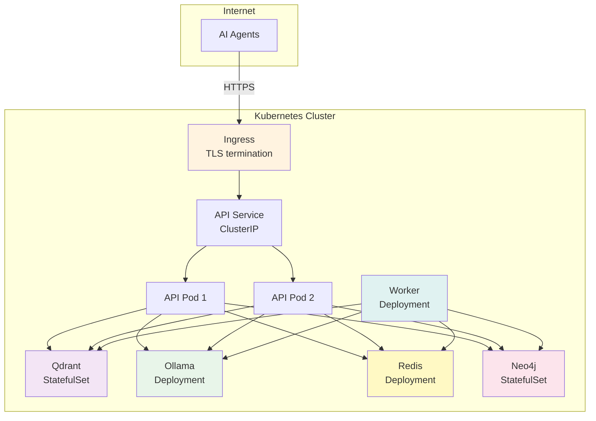

# Helm Deployment (Remote)

Deploy raged to Kubernetes with Ingress and token authentication.

## Deployment Topology

### Base Stack



### Full Stack (with Enrichment)



## Prerequisites

- Kubernetes cluster with an Ingress controller
- `helm` CLI (v3.15+)
- Container registry access

## Build & Push Images

```bash
# API
docker build -t your-registry/rag-api:0.5.0 ./api
docker push your-registry/rag-api:0.5.0

# CLI (for in-cluster indexing)
docker build -t your-registry/raged-index:0.5.0 ./cli
docker push your-registry/raged-index:0.5.0
```

## Install

### Base Stack (Vector Search Only)

```bash
helm install rag ./chart -n rag --create-namespace \
  --set api.image.repository=your-registry/rag-api \
  --set api.image.tag=0.5.0 \
  --set api.ingress.enabled=true \
  --set api.ingress.host=rag.example.com \
  --set api.auth.enabled=true \
  --set api.auth.token=REPLACE_ME
```

### Full Stack (with Enrichment & Knowledge Graph)

```bash
# Build and push worker image
docker build -t your-registry/rag-worker:0.5.0 ./worker
docker push your-registry/rag-worker:0.5.0

# Install with enrichment enabled
helm install rag ./chart -n rag --create-namespace \
  --set api.image.repository=your-registry/rag-api \
  --set api.image.tag=0.5.0 \
  --set api.ingress.enabled=true \
  --set api.ingress.host=rag.example.com \
  --set api.auth.enabled=true \
  --set api.auth.token=REPLACE_ME \
  --set enrichment.enabled=true \
  --set enrichment.worker.image.repository=your-registry/rag-worker \
  --set enrichment.worker.image.tag=0.5.0 \
  --set neo4j.auth.password=REPLACE_NEO4J_PASSWORD
```

## Key Values

### Core Configuration

| Value | Default | Description |
|-------|---------|-------------|
| `api.replicas` | `2` | Number of API pods |
| `api.ingress.enabled` | `false` | Enable Ingress |
| `api.ingress.host` | `rag.local` | Ingress hostname |
| `api.ingress.tls.enabled` | `false` | Enable TLS |
| `api.auth.enabled` | `true` | Enable bearer token auth |
| `api.auth.token` | `""` | Auth token (set this!) |
| `qdrant.storage.size` | `20Gi` | Qdrant persistent volume size |
| `ollama.enabled` | `true` | Deploy Ollama in-cluster |
| `ollama.storage.size` | `30Gi` | Ollama model storage size |
| `indexer.enabled` | `false` | Enable in-cluster indexing Job |

### Enrichment Configuration

| Value | Default | Description |
|-------|---------|-------------|
| `enrichment.enabled` | `false` | Enable enrichment stack (Redis, Neo4j, worker) |
| `enrichment.worker.replicas` | `1` | Number of enrichment worker pods |
| `enrichment.worker.concurrency` | `4` | Concurrent tasks per worker |
| `enrichment.worker.extractor.provider` | `ollama` | LLM provider: `ollama`, `anthropic`, or `openai` |
| `enrichment.worker.extractor.modelFast` | `llama3` | Fast model for high-throughput extraction |
| `enrichment.worker.extractor.modelCapable` | `llama3` | Capable model for complex extraction |
| `enrichment.worker.extractor.modelVision` | `llava` | Vision model for image-based extraction |
| `redis.enabled` | `true` (if enrichment enabled) | Deploy Redis task queue |
| `redis.storage.size` | `5Gi` | Redis persistent volume size |
| `neo4j.enabled` | `true` (if enrichment enabled) | Deploy Neo4j knowledge graph |
| `neo4j.storage.size` | `20Gi` | Neo4j persistent volume size |
| `neo4j.auth.password` | `""` | Neo4j password (set in production!) |

See [values.yaml](../chart/values.yaml) for the full list.

## Upgrade

```bash
helm upgrade rag ./chart -n rag \
  --set api.image.tag=0.6.0 \
  --reuse-values
```

## TLS

```bash
helm install rag ./chart -n rag --create-namespace \
  --set api.ingress.enabled=true \
  --set api.ingress.host=rag.example.com \
  --set api.ingress.tls.enabled=true \
  --set api.ingress.tls.secretName=rag-tls
```

Ensure a TLS certificate Secret exists in the `rag` namespace, or use cert-manager to provision one automatically.
