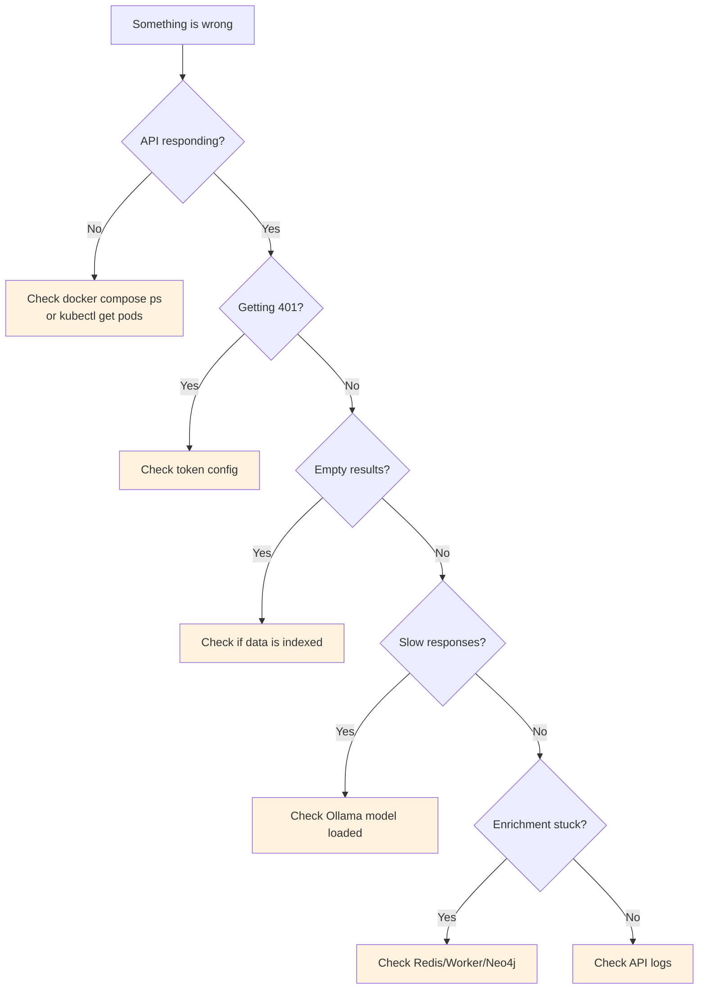

# Troubleshooting

Common issues and how to fix them.

## Decision Tree



## 401 Unauthorized

**Cause:** Token mismatch between client and server.

**Fix:**
1. Check that `RAG_API_TOKEN` is set in the API environment (Docker Compose or Helm)
2. Pass `--token <value>` to CLI commands, or set `RAG_API_TOKEN` in your shell
3. For Helm: verify `api.auth.enabled=true` and `api.auth.token` is set

```bash
# Test auth directly
curl -s http://localhost:8080/healthz
# → {"ok":true}  (healthz bypasses auth)

curl -s -H "Authorization: Bearer YOUR_TOKEN" http://localhost:8080/query \
  -H "Content-Type: application/json" \
  -d '{"query":"test","topK":1}'
```

## Empty Query Results

**Cause:** No data indexed, or wrong collection name.

**Fix:**
1. Verify data was indexed: check CLI output for `upserted` counts
2. Ensure `--collection` matches between index and query commands
3. Check Qdrant directly:

```bash
# List collections
curl -s http://localhost:6333/collections | jq '.result.collections'

# Check point count
curl -s http://localhost:6333/collections/docs | jq '.result.points_count'
```

## Ollama Connection Failed

**Cause:** Ollama not running or model not pulled.

**Fix:**
```bash
# Check Ollama is running
curl -s http://localhost:11434/api/tags | jq '.models[].name'

# Pull the model if missing
curl http://localhost:11434/api/pull -d '{"name":"nomic-embed-text"}'
```

## API Not Starting

**Cause:** Qdrant or Ollama not reachable.

**Fix:**
```bash
# Check all services are running
docker compose ps

# Check API logs
docker compose logs api --tail 50

# Restart
docker compose restart api
```

## Ingestion Too Slow

**Cause:** Large repo with many files, or Ollama embedding is slow on CPU.

**Fix:**
- Use `--include` to limit which files are indexed
- Use `--maxFiles` to cap the number of files
- Run Ollama with GPU acceleration (mount GPU in Docker Compose)
- Increase batch size in future versions

## Docker CI Builds Not Getting Faster

**Cause:** Docker layer cache in GitHub Actions is empty on the first run for a branch/scope.

**Fix:**
1. Let one successful CI run complete to warm the Buildx GHA cache
2. Re-run CI (or push a small change) and compare Docker step timings
3. If cache misses persist, check that Docker build jobs still set both `cache-from` and `cache-to` in `.github/workflows/ci.yaml`

Expected behavior: first run is slower, subsequent runs reuse layers and are faster when Dockerfile inputs are unchanged.

## Enrichment Not Processing

**Cause:** Worker not running, Redis not connected, or tasks stuck.

**Fix:**

```bash
# Check enrichment stats
curl -s http://localhost:8080/enrichment/stats | jq .

# Check worker is running
docker compose ps enrichment-worker
# or
kubectl get pods -l app=worker -n rag

# Check worker logs
docker compose logs enrichment-worker --tail 50
# or
kubectl logs -l app=worker -n rag --tail 50

# Check Redis is running
docker compose ps redis
# or
kubectl get pods -l app=redis -n rag

# Check Redis queue directly
docker compose exec redis redis-cli LLEN enrichment:pending
docker compose exec redis redis-cli LLEN enrichment:dead-letter

# Restart worker if stuck
docker compose restart enrichment-worker
# or
kubectl rollout restart deployment/worker -n rag
```

## Neo4j Connection Failed

**Cause:** Neo4j not running, wrong credentials, or network issue.

**Fix:**

```bash
# Check Neo4j is running
docker compose ps neo4j
# or
kubectl get pods -l app=neo4j -n rag

# Check Neo4j credentials in API config
docker compose exec api env | grep NEO4J

# Test Neo4j connection directly (default docker-compose uses auth=none)
docker compose exec neo4j cypher-shell "MATCH (n) RETURN count(n);"
# If auth is enabled: cypher-shell -u neo4j -p <password> "MATCH (n) RETURN count(n);"

# Check Neo4j logs
docker compose logs neo4j --tail 50
# or
kubectl logs -l app=neo4j -n rag --tail 50
```

## Enrichment Tasks Failing

**Cause:** LLM provider issues, NLP model not loaded, or bad document format.

**Fix:**

```bash
# Check dead-letter queue for failed tasks
docker compose exec redis redis-cli LRANGE enrichment:dead-letter 0 10

# Check worker logs for errors
docker compose logs enrichment-worker --tail 100 | grep -i error

# Verify extractor provider is configured
docker compose exec enrichment-worker env | grep -E "EXTRACTOR_PROVIDER|OLLAMA_URL|ANTHROPIC_API_KEY|OPENAI_API_KEY"

# If using Ollama, check LLM model is pulled
curl -s http://localhost:11434/api/tags | jq '.models[] | select(.name | contains("llama"))'

# Pull LLM model if missing
curl http://localhost:11434/api/pull -d '{"name":"llama3"}'

# Clear dead-letter queue and retry
docker compose exec redis redis-cli DEL enrichment:dead-letter
curl -s -X POST http://localhost:8080/enrichment/enqueue -H "Content-Type: application/json" -d '{"force":true}'
```

## Graph Query Returns 503

**Cause:** Neo4j not enabled or not connected.

**Fix:**

```bash
# Check if Neo4j is configured
curl -s http://localhost:8080/enrichment/stats | jq .
# (If Neo4j is disabled, this will return zero counts)

# Verify NEO4J_URL is set in API
docker compose exec api env | grep NEO4J_URL

# Enable enrichment profile to start Neo4j
docker compose --profile enrichment up -d

# Check Neo4j browser (if exposed)
open http://localhost:7474
# Default docker-compose: no auth required. For production: neo4j / <your-password>
```

## Worker High Memory Usage

**Cause:** Processing large documents or high concurrency.

**Fix:**

```bash
# Reduce worker concurrency
# In docker-compose.yml or Helm values:
WORKER_CONCURRENCY: "2"  # Default is 4

# Restart worker with new setting
docker compose restart enrichment-worker

# Monitor worker memory
docker stats enrichment-worker
# or
kubectl top pods -l app=worker -n rag
```

## URL Ingestion Failures

**Cause:** Network issues, SSRF blocks, unsupported content type, or fetch timeout.

**Fix:**

**Check error details in response:**
```bash
curl -s -X POST http://localhost:8080/ingest \
  -H "Content-Type: application/json" \
  -d '{"items":[{"url":"https://example.com/article"}]}' | jq .

# Response with errors:
# {
#   "ok": true,
#   "upserted": 0,
#   "errors": [{
#     "url": "https://example.com/article",
#     "status": 404,
#     "reason": "fetch_failed"
#   }]
# }
```

**Common error reasons:**

| Reason | Cause | Fix |
|--------|-------|-----|
| `ssrf_blocked` | URL resolves to private IP (10.x.x.x, 192.168.x.x, 127.x.x.x, loopback, link-local) | Use publicly accessible URLs only |
| `timeout` | URL took too long to respond (>30s) | Check network connectivity, try smaller content |
| `fetch_failed` | HTTP error from target server (see `status` field for HTTP code) | Verify URL is accessible, check server logs |
| `too_large` | Response body exceeds 10MB limit | Content is too large for ingestion |
| `redirect_limit` | Too many redirects (>5) | Check URL for redirect loops |
| `unsupported_content_type: <type>` | Content type not supported for extraction | Only HTML, PDF, text, markdown, JSON are supported |

**Test URL accessibility manually:**
```bash
# Check if URL is reachable
curl -I https://example.com/article

# Check DNS resolution
dig +short example.com

# Check for private IPs (will be blocked by SSRF guard)
dig +short internal-hostname.local
# → 10.0.0.5 (blocked)
```

**SSRF protection details:**
- Blocks RFC 1918 private ranges: `10.0.0.0/8`, `172.16.0.0/12`, `192.168.0.0/16`
- Blocks loopback: `127.0.0.0/8`, `::1`
- Blocks link-local: `169.254.0.0/16`, `fe80::/10`
- DNS rebinding defense: resolves hostname before the request and rejects DNS results pointing to private, loopback, or link-local IPs
- Only HTTP/HTTPS schemes allowed

## Unsupported Content Type

**Cause:** URL returns content type that cannot be extracted (e.g., images, videos, binary files).

**Fix:**

**Supported content types for URL ingestion:**
- `text/html` — Article extraction via Readability
- `application/pdf` — Text extraction via pdf-parse
- `text/plain`, `text/markdown` — Passthrough
- `application/json` — Pretty-printed JSON

**For unsupported types:** Extract content client-side and send as `text` instead of `url`:
```bash
# Instead of:
curl -X POST http://localhost:8080/ingest -d '{"items":[{"url":"https://example.com/image.png"}]}'

# Do:
# 1. Download and process the file
# 2. Send extracted text
curl -X POST http://localhost:8080/ingest \
  -H "Content-Type: application/json" \
  -d '{
    "items": [{
      "text": "Extracted or generated text here",
      "source": "https://example.com/image.png",
      "docType": "image",
      "metadata": {"originalUrl": "https://example.com/image.png"}
    }]
  }'
```
