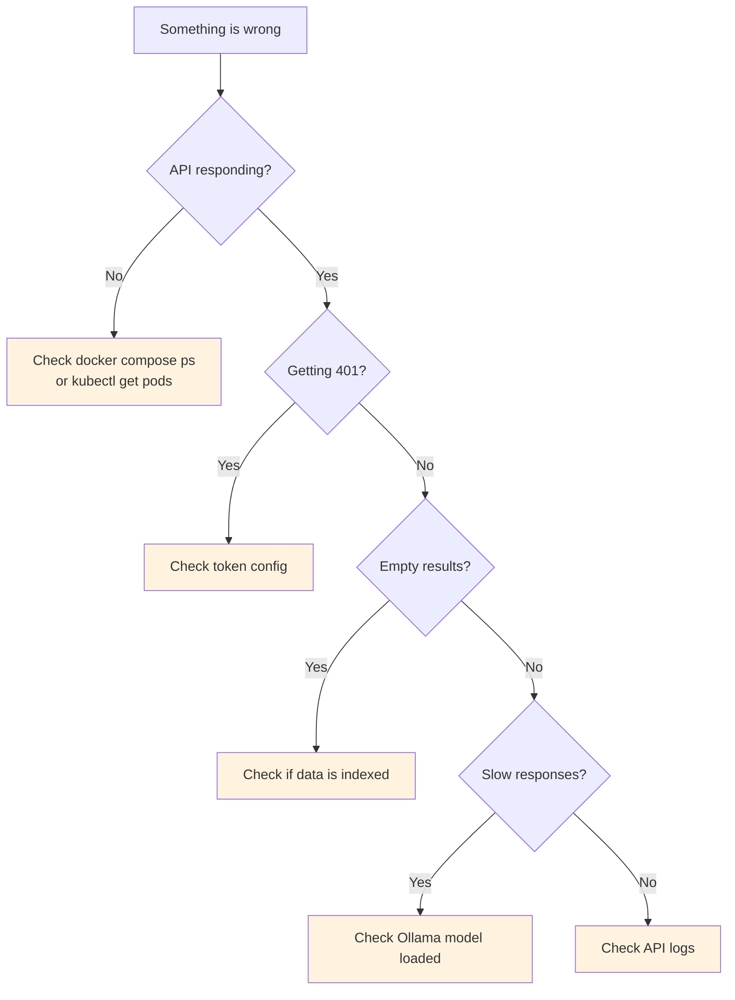

# Troubleshooting

Common issues and how to fix them.

## Decision Tree



## 401 Unauthorized

**Cause:** Token mismatch between client and server.

**Fix:**
1. Check that `RAG_API_TOKEN` is set in the API environment (Docker Compose or Helm)
2. Pass `--token <value>` to CLI commands, or set `RAG_API_TOKEN` in your shell
3. For Helm: verify `api.auth.enabled=true` and `api.auth.token` is set

```bash
# Test auth directly
curl -s http://localhost:8080/healthz
# → {"ok":true}  (healthz bypasses auth)

curl -s -H "Authorization: Bearer YOUR_TOKEN" http://localhost:8080/query \
  -H "Content-Type: application/json" \
  -d '{"query":"test","topK":1}'
```

## Empty Query Results

**Cause:** No data indexed, or wrong collection name.

**Fix:**
1. Verify data was indexed: check CLI output for `upserted` counts
2. Ensure `--collection` matches between index and query commands
3. Check Qdrant directly:

```bash
# List collections
curl -s http://localhost:6333/collections | jq '.result.collections'

# Check point count
curl -s http://localhost:6333/collections/docs | jq '.result.points_count'
```

## Ollama Connection Failed

**Cause:** Ollama not running or model not pulled.

**Fix:**
```bash
# Check Ollama is running
curl -s http://localhost:11434/api/tags | jq '.models[].name'

# Pull the model if missing
curl http://localhost:11434/api/pull -d '{"name":"nomic-embed-text"}'
```

## API Not Starting

**Cause:** Qdrant or Ollama not reachable.

**Fix:**
```bash
# Check all services are running
docker compose ps

# Check API logs
docker compose logs api --tail 50

# Restart
docker compose restart api
```

## Ingestion Too Slow

**Cause:** Large repo with many files, or Ollama embedding is slow on CPU.

**Fix:**
- Use `--include` to limit which files are indexed
- Use `--maxFiles` to cap the number of files
- Run Ollama with GPU acceleration (mount GPU in Docker Compose)
- Increase batch size in future versions
