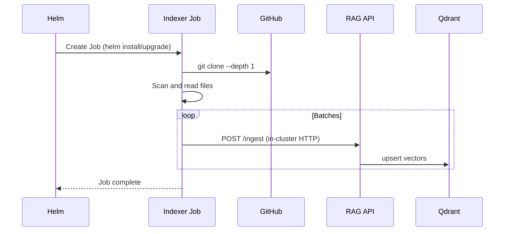

# In-Cluster Indexing

Run the indexer as a Kubernetes Job inside the cluster, close to the API and Qdrant — no need to upload repo contents from your laptop.

## How It Works



## Enable

```bash
helm upgrade --install rag ./chart -n rag --create-namespace \
  --set api.image.repository=your-registry/rag-api \
  --set api.image.tag=0.5.0 \
  --set api.auth.enabled=true \
  --set api.auth.token=REPLACE_ME \
  --set indexer.enabled=true \
  --set indexer.image.repository=your-registry/rag-index \
  --set indexer.image.tag=0.5.0 \
  --set indexer.repoUrl=https://github.com/<org>/<repo>.git \
  --set indexer.repoId=my-repo \
  --set indexer.branch=main
```

## Indexer Values

| Value | Default | Description |
|-------|---------|-------------|
| `indexer.enabled` | `false` | Create the indexer Job |
| `indexer.image.repository` | `your-registry/rag-index` | Indexer image |
| `indexer.image.tag` | `0.5.0` | Indexer image tag |
| `indexer.repoUrl` | `""` | Git repository URL to index |
| `indexer.repoId` | `""` | Stable identifier for the repo |
| `indexer.branch` | `""` | Branch to clone |
| `indexer.collection` | `docs` | Target Qdrant collection |
| `indexer.token` | `""` | API auth token |

## Benefits

- **No data transfer over the internet.** The Job clones the repo inside the cluster and talks to the API over cluster-internal networking.
- **Faster ingestion.** In-cluster HTTP calls have near-zero latency.
- **Automatable.** Trigger re-indexing by re-running the Helm upgrade or creating a CronJob.

## Private Repositories

For private repos, you need to provide Git SSH credentials to the indexer Job. This requires mounting an SSH key as a Kubernetes Secret.

**Status:** Planned for a future iteration. For now, use public repos or run the CLI locally with SSH access.

## Monitoring the Job

```bash
# Check Job status
kubectl get jobs -n rag

# View indexer logs
kubectl logs -n rag -l app=rag-stack-indexer --tail 100
```
