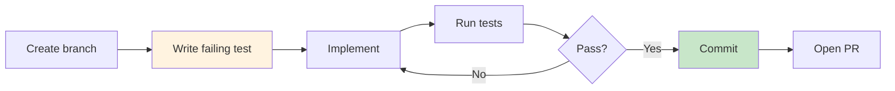

# Contributing

How to develop, test, and submit changes to raged.

## Development Setup

### Prerequisites

- Node.js 20+
- Docker and Docker Compose
- Git

### First-Time Setup

```bash
# Clone the repo
git clone https://github.com/<org>/raged.git
cd raged

# Start infrastructure
docker compose up -d

# Pull embedding model
curl http://localhost:11434/api/pull -d '{"name":"nomic-embed-text"}'

# Install and build both packages
cd api && npm install && npm run build && cd ..
cd cli && npm install && npm run build && cd ..
```

### Development Workflow



## Branch Naming

```
feat/<short-description>    # New features
fix/<short-description>     # Bug fixes
docs/<short-description>    # Documentation
refactor/<short-description> # Code improvements
test/<short-description>    # Test additions
```

## Commit Messages

Follow [Conventional Commits](https://www.conventionalcommits.org/):

```
feat: add query caching for repeated searches
fix: handle empty file during indexing
docs: add Mermaid diagram to architecture doc
refactor: extract embedding client interface
test: add unit tests for chunking module
chore: update dependencies
```

Keep the first line under 72 characters. Add a body for complex changes.

## Pull Requests

1. Branch from `main`
2. Keep PRs focused — one logical change per PR
3. Ensure CI passes (build + lint)
4. Write a clear description: what changed and why
5. Link related issues if applicable

## CI Pipeline Layout

The CI workflow is in `.github/workflows/ci.yaml`.
Use Actions → Run workflow to manually trigger `.github/workflows/changelog-generator.yml` and `.github/workflows/pages.yml` when needed.

- Node quality jobs use matrices for `api` and `cli` (`build`, `lint`)
- Worker quality jobs use the `worker-ci` matrix (`test`, `lint`)
- Docker builds are split by concern:
    - `docker-build-node` builds API and indexer images via matrix
    - `docker-build-worker` builds the worker image separately

This structure keeps jobs focused and reduces duplication.

## Worker Dependency Files

Worker dependencies are split by purpose:

- `worker/requirements.txt` → runtime dependencies
- `worker/requirements-test.txt` → test dependencies (extends runtime)
- `worker/requirements-lint.txt` → lint-only dependencies

Pinned lock files are committed and used in CI and Docker builds:

- `worker/requirements.lock`
- `worker/requirements-test.lock`
- `worker/requirements-lint.lock`

## Refreshing Worker Lock Files

When changing worker dependency inputs, regenerate lock files in `worker/`:

```bash
cd worker
python3 -m pip install pip-tools
python3 -m piptools compile requirements.txt -o requirements.lock
python3 -m piptools compile requirements-test.txt -o requirements-test.lock
python3 -m piptools compile requirements-lint.txt -o requirements-lint.lock
```

Commit both the changed input file(s) and generated lock file(s) in the same PR.

## Project Structure

```
raged/
├── api/          → Fastify RAG API (see api/AGENTS.md)
├── cli/          → CLI indexer tool (see cli/AGENTS.md)
├── chart/        → Helm chart (see chart/AGENTS.md)
├── docs/         → Documentation (see docs/AGENTS.md)
├── .claude/      → Claude Code skill definitions
├── .github/      → CI/CD workflows
└── AGENTS.md     → Project-wide coding principles
```

## Code Style

- TypeScript with strict mode
- ES modules (`import`/`export`, not `require`)
- No `any` in new code
- Named exports only (no default exports)

See [AGENTS.md](../AGENTS.md) for the full set of conventions.

## Adding a New API Endpoint

1. Add the route in `api/src/server.ts`
2. Add JSON Schema validation for input
3. Delegate logic to a service module (not inline in the handler)
4. Update `docs/09-api-reference.md`

## Adding a New CLI Command

1. Add the command handler in `cli/src/index.ts`
2. Update the `usage()` function with all flags
3. Update `docs/03-cli.md`
