# Documentation Expansion & Layered AGENTS.md — Implementation Plan

> **For Claude:** REQUIRED SUB-SKILL: Use superpowers:executing-plans to implement this plan task-by-task.

**Goal:** Create layered AGENTS.md files establishing coding principles and rules, then expand all documentation with Mermaid diagrams and vision content to reflect raged's direction as a multi-agent memory hub.

**Architecture:** AGENTS.md first (root → subfolders) to establish conventions, then documentation expansion (new docs → polish existing). Each task is one file, committed individually.

**Tech Stack:** Markdown, Mermaid diagrams, Git conventional commits

---

### Task 1: Root AGENTS.md

**Files:**
- Create: `AGENTS.md`

**Step 1: Write the root AGENTS.md**

```markdown
# AGENTS.md — raged

## Project Identity

raged is a **multi-agent memory hub**: a shared retrieval-augmented generation (RAG) layer that any AI coding agent can use to store and retrieve grounded context from indexed repositories. The API is stateless; all persistent state lives in Qdrant.

## Core Principles

### SOLID

- **Single Responsibility (SRP):** Each module does exactly one thing. `chunking.ts` chunks text. `ollama.ts` embeds text. `qdrant.ts` manages vector storage. Do not mix concerns.
- **Open/Closed:** Add new embedding providers or vector backends via new modules, not by modifying existing ones. Design for adapter patterns when the third use case appears.
- **Liskov Substitution:** If you introduce an interface, every implementation must be a drop-in replacement. No special-casing.
- **Interface Segregation:** Keep interfaces small and focused. A consumer of embeddings should not depend on chunking types.
- **Dependency Inversion:** Core logic depends on abstractions. Route handlers call service functions, not infrastructure clients directly.

### KISS

Keep it simple. If a solution requires more than one level of indirection, justify it. Prefer flat, readable code over clever abstractions. A 10-line function that's easy to follow beats a 3-line function that requires reading 4 other files.

### DRY

Extract shared logic only when it appears three or more times. Two similar blocks of code are fine — premature abstraction is worse than mild duplication. Shared TypeScript types live in a common location when used across packages.

### YAGNI

Do not build features until they are needed. Design so that future features are possible, but do not implement them. No speculative interfaces, no unused configuration options, no "just in case" parameters.

## TypeScript Conventions

- **Strict mode** is mandatory (`strict: true` in tsconfig.json)
- **ES modules** only (`"type": "module"` in package.json)
- **No `any`** in new code. Use `unknown` + type narrowing, or define proper types. Existing `any` usage should be replaced when touching that code.
- **Prefer `interface` over `type`** for public API shapes (interfaces are extensible, types are not)
- **No classes** unless there's a clear lifecycle or state management need. Prefer plain functions and objects.
- **Named exports only.** No default exports — they make refactoring harder.

## Git Conventions

- **Conventional commits:** `feat:`, `fix:`, `docs:`, `refactor:`, `test:`, `chore:`
- **Small, focused commits.** One logical change per commit. If you can't describe it in one sentence, split it.
- **No force-push to main.** Ever.
- **Branch naming:** `feat/<short-description>`, `fix/<short-description>`, `docs/<short-description>`

## Testing Philosophy

- **TDD when writing logic:** Write the failing test first, then implement.
- **Unit tests** for pure logic (chunking, filtering, text processing)
- **Integration tests** for API routes (spin up Fastify, test request/response)
- **No tests for trivial code:** Simple getters, re-exports, and type definitions don't need tests.
- **Test file location:** Co-located next to source as `<module>.test.ts`
- **Test runner:** Vitest (when added)

## Architecture Guardrails

- **Stateless API:** The Fastify API holds no state. All persistence is in Qdrant. This makes horizontal scaling trivial.
- **No ORM.** Qdrant has a first-party JS client. Use it directly.
- **Minimal dependencies.** Every new dependency must justify its existence. Prefer Node.js built-ins.
- **Environment-driven configuration.** All config via environment variables. No config files, no `.env` loading in production code.

## Security Baseline

- **Never log tokens or secrets.** Not even partially. Not even in debug mode.
- **Validate at system boundaries:** Validate all input at API route level. Internal function calls can trust their callers.
- **Timing-safe comparisons** for any secret comparison (tokens, API keys).
- **No secrets in code or defaults.** Secrets must be provided via environment variables or Kubernetes Secrets.

## File Organization

```
cli/          → CLI indexer tool (thin orchestrator)
api/          → Fastify RAG API server
chart/        → Helm chart for Kubernetes deployment
docs/         → Project documentation
.claude/      → Claude Code skill definitions
.github/      → CI/CD workflows
```
```

**Step 2: Verify the file renders correctly**

Run: `head -5 AGENTS.md`
Expected: First 5 lines of the file visible, no encoding issues.

**Step 3: Commit**

```bash
git add AGENTS.md
git commit -m "docs: add root AGENTS.md with project-wide principles"
```

---

### Task 2: API AGENTS.md

**Files:**
- Create: `api/AGENTS.md`

**Step 1: Write the API AGENTS.md**

```markdown
# AGENTS.md — api/

> Inherits all principles from the root [AGENTS.md](../AGENTS.md). This file adds API-specific rules.

## Module Structure

```
src/
  server.ts     → Fastify app setup, route registration, server start
  auth.ts       → Authentication hook (bearer token)
  chunking.ts   → Text chunking logic
  ollama.ts     → Embedding client (Ollama HTTP API)
  qdrant.ts     → Vector DB client (Qdrant REST API)
```

## Rules

### Route Handlers Stay Thin

Route handlers in `server.ts` must only: parse input, call service functions, return output. No business logic in handlers. If a handler grows beyond ~15 lines, extract the logic into a service module.

### Fastify Plugins for Cross-Cutting Concerns

Authentication, logging, and other cross-cutting concerns must be registered as Fastify hooks or plugins — not inlined into route handlers. See `auth.ts` for the pattern.

### Input Validation

Every route must validate its input. Use Fastify's built-in JSON Schema validation on route definitions. Do not validate inside handler functions.

### Single Responsibility Per Module

- `chunking.ts` — only text chunking. No embedding, no HTTP, no Qdrant.
- `ollama.ts` — only embedding via Ollama. No chunking, no Qdrant.
- `qdrant.ts` — only Qdrant collection management and client export. No embedding, no chunking.
- `auth.ts` — only authentication. No business logic.

If a new concern appears (e.g., caching, rate limiting), create a new module.

### Health Endpoint

`/healthz` must always be unauthenticated and must return `{ ok: true }`. It is used by Kubernetes liveness probes. Never add auth or heavy logic to it.

### Error Responses

Return structured JSON errors: `{ error: "<message>" }`. Use appropriate HTTP status codes. Never expose stack traces in production responses.

### Environment Variables

All configuration is via environment variables. Document every env var in this file:

| Variable | Default | Description |
|----------|---------|-------------|
| `QDRANT_URL` | `http://qdrant:6333` | Qdrant server URL |
| `OLLAMA_URL` | `http://ollama:11434` | Ollama server URL |
| `QDRANT_COLLECTION` | `docs` | Default collection name |
| `VECTOR_SIZE` | `768` | Embedding vector dimensions |
| `DISTANCE` | `Cosine` | Qdrant distance metric |
| `EMBED_MODEL` | `nomic-embed-text` | Ollama embedding model |
| `PORT` | `8080` | API listen port |
| `RAGED_API_TOKEN` | _(empty)_ | Bearer token for auth (empty = auth disabled) |
```

**Step 2: Verify**

Run: `head -5 api/AGENTS.md`
Expected: First 5 lines visible.

**Step 3: Commit**

```bash
git add api/AGENTS.md
git commit -m "docs: add api/AGENTS.md with API-specific rules"
```

---

### Task 3: CLI AGENTS.md

**Files:**
- Create: `cli/AGENTS.md`

**Step 1: Write the CLI AGENTS.md**

```markdown
# AGENTS.md — cli/

> Inherits all principles from the root [AGENTS.md](../AGENTS.md). This file adds CLI-specific rules.

## Module Structure

```
src/
  index.ts    → CLI entry point, command parsing, orchestration
```

## Rules

### Thin Orchestrator

The CLI is a coordinator, not a business logic engine. It: parses arguments, calls the RAG API over HTTP, and formats output. All heavy logic (chunking, embedding, storage) lives in the API.

### Typed HTTP Client

All HTTP calls to the RAG API should go through typed helper functions (see `ingest()` and `query()` in `index.ts`). Never construct `fetch()` calls inline in command handlers. Always type request and response shapes.

### Every Command Has Help

Every CLI command must be represented in the `usage()` function with its full flag list, defaults, and a brief description. If you add a flag, update `usage()`.

### Actionable Error Messages

Error messages must tell the user what to do, not just what failed.

- Bad: `Error: 401`
- Good: `Error: 401 Unauthorized — pass --token or set RAGED_API_TOKEN`

### File Scanning

- Respect ignore patterns: `.git`, `node_modules`, `dist`, `build`, `target`, etc.
- Skip binary files (images, archives, fonts, media)
- Respect `--include` and `--exclude` prefix filters
- Enforce `--maxFiles` and `--maxBytes` limits to prevent accidental huge ingestions

### Batch Ingestion

Ingest files in batches (currently 50 items) to avoid overwhelming the API with a single massive request. Do not send all files in one payload.

### Environment Variables

| Variable | Default | Description |
|----------|---------|-------------|
| `RAGED_API_TOKEN` | _(empty)_ | Bearer token (alternative to `--token` flag) |
```

**Step 2: Verify**

Run: `head -5 cli/AGENTS.md`
Expected: First 5 lines visible.

**Step 3: Commit**

```bash
git add cli/AGENTS.md
git commit -m "docs: add cli/AGENTS.md with CLI-specific rules"
```

---

### Task 4: Helm Chart AGENTS.md

**Files:**
- Create: `chart/AGENTS.md`

**Step 1: Write the chart AGENTS.md**

```markdown
# AGENTS.md — chart/

> Inherits all principles from the root [AGENTS.md](../AGENTS.md). This file adds Helm chart-specific rules.

## Directory Structure

```
chart/
  Chart.yaml          → Chart metadata (name, version, appVersion)
  values.yaml         → All configurable values with sensible defaults
  templates/
    _helpers.tpl      → Shared template helpers (labels, names)
    api-*.yaml        → RAG API Deployment, Service, Ingress, ConfigMap, Secret
    qdrant-*.yaml     → Qdrant StatefulSet, Service
    ollama-*.yaml     → Ollama Deployment, PVC, Service
    indexer-job.yaml  → In-cluster indexing Job
```

## Rules

### All Values Have Defaults

Every value referenced in templates must have a default in `values.yaml`. A user should be able to run `helm install rag ./chart` with zero overrides and get a working (local-dev-grade) deployment.

### Secrets Never Have Default Values

Security-sensitive values (tokens, passwords, keys) must default to empty string `""`. The templates must handle the empty case gracefully (e.g., skip auth setup if token is empty).

### Use _helpers.tpl for DRY

Repeated label blocks, name computations, and selector patterns go in `_helpers.tpl`. Do not copy-paste label blocks across templates.

### Every Template Must Lint

All templates must pass `helm lint ./chart` cleanly. Run it before committing any chart change.

### Resource Naming Convention

All Kubernetes resources use the pattern: `{{ include "raged.fullname" . }}-<component>` (e.g., `raged-api`, `raged-qdrant`).

### Conditional Components

Optional components (Ollama, Ingress, Indexer Job) must be gated behind `.enabled` flags in `values.yaml`. Templates must wrap with `{{- if .Values.<component>.enabled }}`.

### Version Tracking

- `Chart.yaml` `version` — bump for chart changes (Helm chart version)
- `Chart.yaml` `appVersion` — bump for application changes (API/CLI version)
- Keep both in sync with the actual application version
```

**Step 2: Verify**

Run: `head -5 chart/AGENTS.md`
Expected: First 5 lines visible.

**Step 3: Commit**

```bash
git add chart/AGENTS.md
git commit -m "docs: add chart/AGENTS.md with Helm chart rules"
```

---

### Task 5: Docs AGENTS.md

**Files:**
- Create: `docs/AGENTS.md`

**Step 1: Write the docs AGENTS.md**

```markdown
# AGENTS.md — docs/

> Inherits all principles from the root [AGENTS.md](../AGENTS.md). This file adds documentation-specific rules.

## Rules

### Tone and Style

- **Concise and direct.** No filler, no marketing language, no hedging.
- **Technical audience.** Assume the reader is a developer or an AI coding agent.
- **Active voice.** "Run `docker compose up`" not "The command should be run".
- **Present tense.** "The API validates input" not "The API will validate input".

### Structure

- **H1** = document title (one per file)
- **H2** = major sections
- **H3** = subsections
- Every document starts with a one-sentence summary under the H1 title.

### Mermaid Diagrams

- Every architecture or data flow explanation must include a Mermaid diagram.
- Use `graph TD` for component/topology diagrams (top-down).
- Use `sequenceDiagram` for request/response flows.
- Use `flowchart LR` for decision trees and pipelines.
- Keep diagrams simple: max 10-12 nodes. Split complex flows into multiple diagrams.
- Label all edges. Unlabeled arrows are ambiguous.

### Code Examples

- All code examples must be **copy-pasteable and complete**. No `...` or `// rest of code`.
- Include the shell prompt context (e.g., `cd cli && ...`) when directory matters.
- Show expected output when it helps understanding.

### DRY Documentation

- **Link, don't duplicate.** If a topic is covered in another doc, link to it.
- **Single source of truth.** Environment variables are documented in the relevant `AGENTS.md`, not repeated in every doc.
- Cross-reference format: `See [Architecture](01-architecture.md)` with relative paths.

### File Naming

- Numbered prefix for ordering: `00-`, `01-`, `02-`, etc.
- Lowercase, hyphenated: `01-architecture.md`, not `01_Architecture.md`
- The number determines sidebar/reading order. Leave gaps for future insertions.

### When to Update Docs

- Adding a new API endpoint → update `09-api-reference.md`
- Adding a new CLI flag → update `03-cli.md`
- Adding a new Helm value → update `05-helm-remote.md`
- Changing architecture → update `01-architecture.md` and its Mermaid diagrams
```

**Step 2: Verify**

Run: `head -5 docs/AGENTS.md`
Expected: First 5 lines visible.

**Step 3: Commit**

```bash
git add docs/AGENTS.md
git commit -m "docs: add docs/AGENTS.md with documentation rules"
```

---

### Task 6: Vision Document (new)

**Files:**
- Create: `docs/00-vision.md`

**Step 1: Write the vision document**

```markdown
# Vision

raged is a shared memory layer for AI coding agents — a retrieval-augmented generation (RAG) system that stores and retrieves grounded context from indexed repositories.

## Why

AI coding agents work best with relevant context, but stuffing entire repositories into a model's context window is wasteful and expensive. raged keeps the heavy retrieval work outside the model loop: index once, query many times, return only what's relevant.

## Architecture Overview

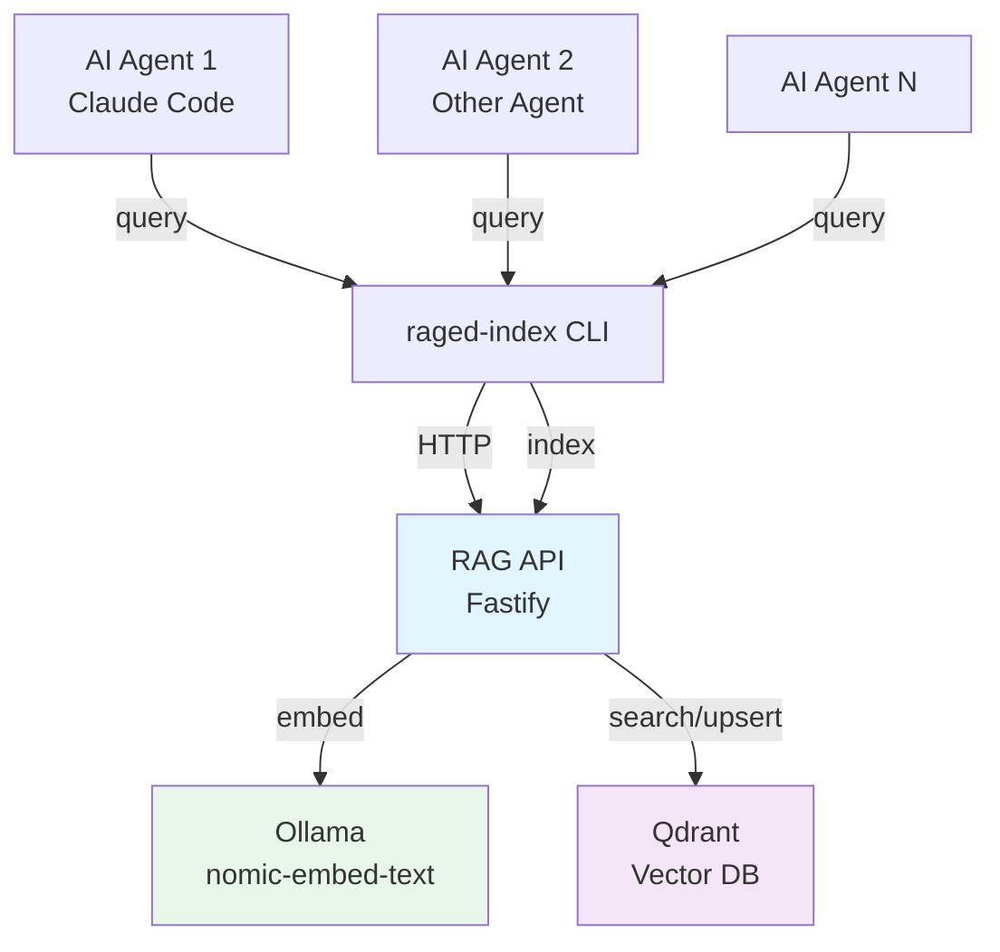

## Roadmap

### v0.5 — MVP (current)

What exists today:

- CLI indexer: clone repos, chunk files, ingest via API
- RAG API: `/ingest` and `/query` endpoints backed by Qdrant + Ollama
- Bearer token authentication
- Docker Compose for local development
- Helm chart for Kubernetes deployment
- In-cluster indexing Job
- Claude Code skill integration

### v1.0 — Production Ready

Hardening and extensibility:

- **Testing:** Unit tests for core logic, integration tests for API routes
- **Input validation:** JSON Schema on all API routes
- **Multiple embedding providers:** Adapter pattern — swap Ollama for OpenAI, Cohere, or local alternatives
- **Pluggable vector backends:** Qdrant today, Pinecone/Weaviate/pgvector via adapters
- **Rate limiting and request throttling**
- **Structured logging and health checks** (beyond `/healthz`)
- **API versioning** (`/v1/ingest`, `/v1/query`)

### v2.0 — Multi-Agent Memory Hub

The full vision:

- **Multi-tenancy:** Isolated collections per team/project with scoped tokens
- **Agent authentication:** Per-agent API keys with fine-grained permissions
- **Cross-project search:** Federated queries across multiple indexed repositories
- **Real-time sync:** Webhook-triggered re-indexing when repos change
- **Agent collaboration:** Shared memory spaces where multiple agents contribute and query
- **Observability:** Distributed tracing, query analytics, embedding cache hit rates
- **SDK/client libraries:** TypeScript, Python, Go clients (beyond CLI)

## Principles

- **Stateless API, stateful storage.** The API process holds no state. Scale it horizontally.
- **Local-first.** Docker Compose must always work. Cloud deployment is optional.
- **Agent-agnostic.** Not tied to Claude Code. Any agent that can shell out to a CLI or call HTTP can use raged.
- **Minimal dependencies.** Every dependency must justify its existence.
- **Security by default.** Auth is optional locally, mandatory in production.
```

**Step 2: Verify**

Run: `head -5 docs/00-vision.md`
Expected: First 5 lines visible.

**Step 3: Commit**

```bash
git add docs/00-vision.md
git commit -m "docs: add vision document with roadmap and architecture diagram"
```

---

### Task 7: Expand README.md

**Files:**
- Modify: `README.md`

**Step 1: Write the expanded README**

Replace the entire contents of `README.md` with:

```markdown
# raged

A shared memory layer for AI coding agents — index repositories, embed code, and retrieve relevant context via semantic search.

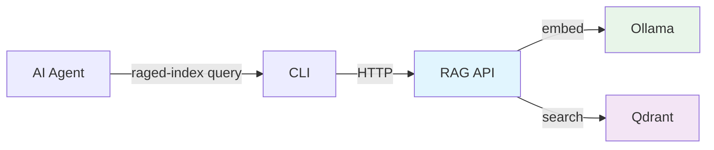

## What It Does

1. **Index** a Git repository — the CLI clones it, chunks source files, sends them to the API
2. **Embed** each chunk using a local model (Ollama + nomic-embed-text)
3. **Store** embeddings in Qdrant (vector database)
4. **Query** by natural language — the API embeds your question, finds the most similar chunks, returns them

AI agents use this to retrieve grounded context without stuffing entire repos into their context window.

## Quickstart

```bash
# Start the stack
docker compose up -d

# Pull the embedding model (first time only)
curl http://localhost:11434/api/pull -d '{"name":"nomic-embed-text"}'

# Verify
curl -s http://localhost:8080/healthz
# → {"ok":true}
```

## Index a Repository

```bash
cd cli && npm install && npm run build

node dist/index.js index \
  --repo https://github.com/<org>/<repo>.git \
  --api http://localhost:8080
```

## Query

```bash
node dist/index.js query \
  --api http://localhost:8080 \
  --q "authentication flow" \
  --topK 5
```

## Components

| Component | Role | Tech |
|-----------|------|------|
| **RAG API** | Chunk, embed, store, search | Fastify, Node.js |
| **Qdrant** | Vector storage and similarity search | Qdrant v1.10 |
| **Ollama** | Local embedding model runtime | nomic-embed-text (768d) |
| **CLI** | Index repos and query from terminal | Node.js, TypeScript |
| **Helm Chart** | Kubernetes deployment | Helm 3 |

## Documentation

| Doc | Topic |
|-----|-------|
| [Vision & Roadmap](docs/00-vision.md) | Where raged is headed |
| [Architecture](docs/01-architecture.md) | Components, data flow, security |
| [Local Development](docs/02-local-dev.md) | Docker Compose setup |
| [CLI Reference](docs/03-cli.md) | Commands, flags, examples |
| [Claude Code Skill](docs/04-claude-skills.md) | Using raged with Claude Code |
| [Helm Deployment](docs/05-helm-remote.md) | Kubernetes + Ingress + auth |
| [Troubleshooting](docs/06-troubleshooting.md) | Common issues and fixes |
| [In-Cluster Indexing](docs/07-indexing-in-cluster.md) | Indexing from inside Kubernetes |
| [Contributing](docs/08-contributing.md) | Development setup and PR process |
| [API Reference](docs/09-api-reference.md) | Endpoints, request/response formats |

## License

See [LICENSE](LICENSE).
```

**Step 2: Verify**

Run: `head -10 README.md`
Expected: Title and Mermaid block visible.

**Step 3: Commit**

```bash
git add README.md
git commit -m "docs: expand README with architecture diagram and doc links"
```

---

### Task 8: Expand Architecture Doc

**Files:**
- Modify: `docs/01-architecture.md`

**Step 1: Write the expanded architecture doc**

Replace the entire contents with:

```markdown
# Architecture

raged is a four-component system: CLI, API, vector database, and embedding runtime.

## Component Diagram

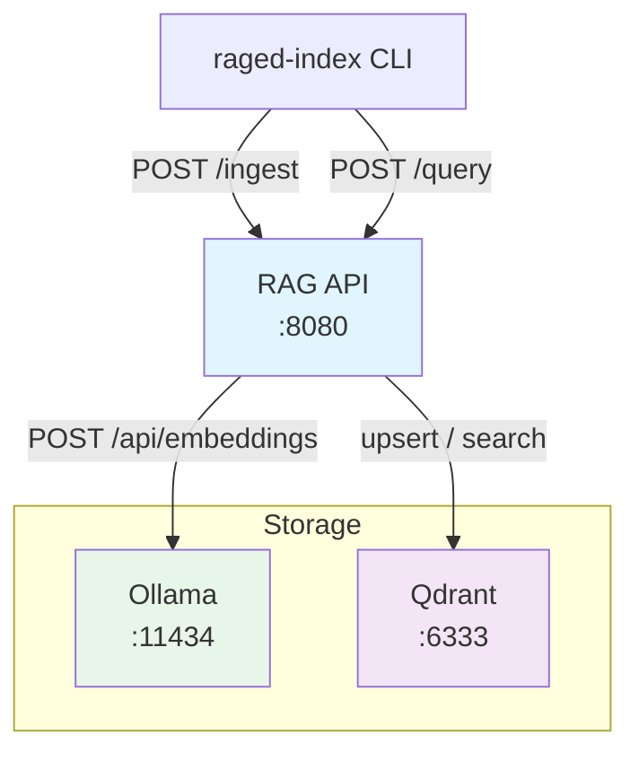

## Components

### RAG API (Fastify)

Stateless HTTP service exposing two core endpoints:

- `POST /ingest` — Receives text items, chunks them, embeds each chunk via Ollama, upserts vectors into Qdrant
- `POST /query` — Embeds the query text, performs similarity search in Qdrant, returns ranked results
- `GET /healthz` — Always unauthenticated, returns `{ ok: true }`

### Qdrant (Vector DB)

Stores embedding vectors with metadata payloads. Each collection holds vectors of a fixed dimension (768 for nomic-embed-text) using cosine distance.

Metadata payload per point:
- `text` — the original chunk text
- `source` — source URL or path
- `chunkIndex` — position of chunk within the original document
- `repoId`, `repoUrl`, `path`, `lang`, `bytes` — indexing metadata

### Ollama (Embedding Runtime)

Runs the `nomic-embed-text` model locally. The API calls Ollama's `/api/embeddings` endpoint for each text chunk. Produces 768-dimensional vectors.

### CLI (raged-index)

Command-line tool for indexing and querying. Clones Git repos to a temp directory, scans for text files, sends them in batches to the API's `/ingest` endpoint.

## Index Data Flow

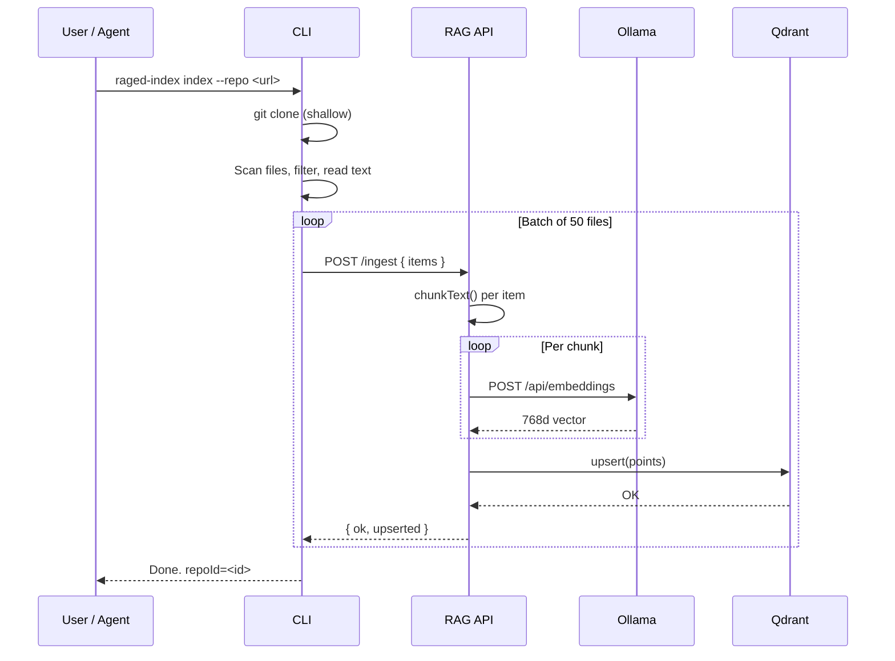

## Query Data Flow

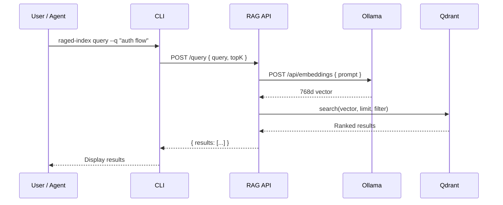

## Security Model

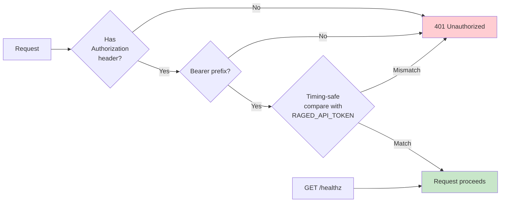

- Token auth is optional (disabled when `RAGED_API_TOKEN` is empty)
- `/healthz` always bypasses auth
- Token comparison uses timing-safe algorithm to prevent timing attacks
- Tokens are provided via environment variable, never hardcoded
```

**Step 2: Verify**

Run: `head -10 docs/01-architecture.md`
Expected: Title and component diagram opening visible.

**Step 3: Commit**

```bash
git add docs/01-architecture.md
git commit -m "docs: expand architecture doc with Mermaid diagrams for data flow and security"
```

---

### Task 9: Expand Local Dev Doc

**Files:**
- Modify: `docs/02-local-dev.md`

**Step 1: Write the expanded local dev doc**

Replace the entire contents with:

```markdown
# Local Development

Run the full raged locally using Docker Compose. No cloud services required.

## Startup

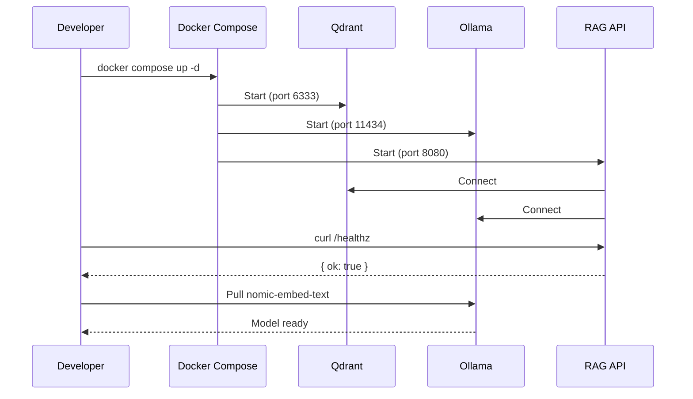

## Steps

```bash
# 1. Start all services
docker compose up -d

# 2. Verify the API is running
curl -s http://localhost:8080/healthz
# → {"ok":true}

# 3. Pull the embedding model (first time only)
curl http://localhost:11434/api/pull -d '{"name":"nomic-embed-text"}'
```

## Services

| Service | Port | Purpose |
|---------|------|---------|
| `api` | 8080 | RAG API (Fastify) |
| `qdrant` | 6333 | Vector database |
| `ollama` | 11434 | Embedding model runtime |

## Optional: Enable Auth Locally

Set `RAGED_API_TOKEN` in `docker-compose.yml` under the `api` service:

```yaml
environment:
  RAGED_API_TOKEN: "my-dev-token"
```

Then pass `--token my-dev-token` to CLI commands (or set `RAGED_API_TOKEN` env var).

## Tear Down

```bash
# Stop services (keep data)
docker compose down

# Stop services and delete data volumes
docker compose down -v
```

## Developing the API

For hot-reload during API development:

```bash
cd api
npm install
QDRANT_URL=http://localhost:6333 OLLAMA_URL=http://localhost:11434 npm run dev
```

This runs the API directly on your machine while Qdrant and Ollama run in Docker.

## Developing the CLI

```bash
cd cli
npm install
npm run dev -- index --repo <url> --api http://localhost:8080
```
```

**Step 2: Verify**

Run: `head -10 docs/02-local-dev.md`
Expected: Title and sequence diagram opening visible.

**Step 3: Commit**

```bash
git add docs/02-local-dev.md
git commit -m "docs: expand local dev doc with startup diagram and development instructions"
```

---

### Task 10: Expand CLI Doc

**Files:**
- Modify: `docs/03-cli.md`

**Step 1: Write the expanded CLI doc**

Replace the entire contents with:

```markdown
# CLI (raged-index)

Command-line tool for indexing Git repositories and querying the RAG API.

## Build

```bash
cd cli
npm install
npm run build
```

## Commands

### index

Clone a Git repository, scan for text files, and ingest them into the RAG API.

```bash
node dist/index.js index --repo <git-url> [options]
```

| Flag | Default | Description |
|------|---------|-------------|
| `--repo` | _(required)_ | Git URL to clone |
| `--api` | `http://localhost:8080` | RAG API URL |
| `--collection` | `docs` | Qdrant collection name |
| `--branch` | _(default branch)_ | Git branch to clone |
| `--repoId` | _(repo URL)_ | Stable identifier for this repo |
| `--token` | _(env `RAGED_API_TOKEN`)_ | Bearer token for auth |
| `--include` | _(all)_ | Only index files matching this path prefix |
| `--exclude` | _(none)_ | Skip files matching this path prefix |
| `--maxFiles` | `4000` | Maximum files to process |
| `--maxBytes` | `500000` | Maximum file size in bytes |
| `--keep` | `false` | Keep the cloned temp directory |

### query

Search the RAG API for relevant chunks.

```bash
node dist/index.js query --q "<search text>" [options]
```

| Flag | Default | Description |
|------|---------|-------------|
| `--q` / `--query` | _(required)_ | Search query text |
| `--api` | `http://localhost:8080` | RAG API URL |
| `--collection` | `docs` | Qdrant collection name |
| `--topK` | `8` | Number of results to return |
| `--repoId` | _(none)_ | Filter by repository ID |
| `--pathPrefix` | _(none)_ | Filter by file path prefix |
| `--lang` | _(none)_ | Filter by language |
| `--token` | _(env `RAGED_API_TOKEN`)_ | Bearer token for auth |

## Index Lifecycle

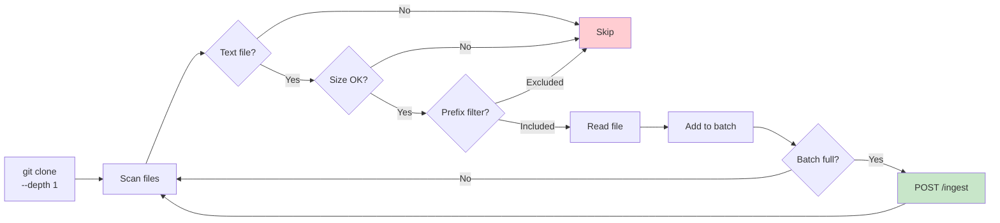

## Authentication

Two ways to provide the auth token:

1. **Flag:** `--token my-token`
2. **Environment variable:** `export RAGED_API_TOKEN=my-token`

The flag takes precedence over the environment variable.

## Examples

Index a public repo:
```bash
node dist/index.js index \
  --repo https://github.com/fastify/fastify.git \
  --api http://localhost:8080 \
  --collection fastify-docs \
  --include docs/
```

Query with filters:
```bash
node dist/index.js query \
  --api http://localhost:8080 \
  --q "request validation" \
  --topK 5 \
  --collection fastify-docs \
  --lang md
```
```

**Step 2: Verify**

Run: `head -10 docs/03-cli.md`
Expected: Title and build section visible.

**Step 3: Commit**

```bash
git add docs/03-cli.md
git commit -m "docs: expand CLI doc with flag tables, lifecycle diagram, and examples"
```

---

### Task 11: Expand Claude Skills Doc

**Files:**
- Modify: `docs/04-claude-skills.md`

**Step 1: Write the expanded Claude Skills doc**

Replace the entire contents with:

```markdown
# Claude Code Skill

raged includes a Claude Code skill that lets Claude query indexed repositories for relevant context.

## How It Works

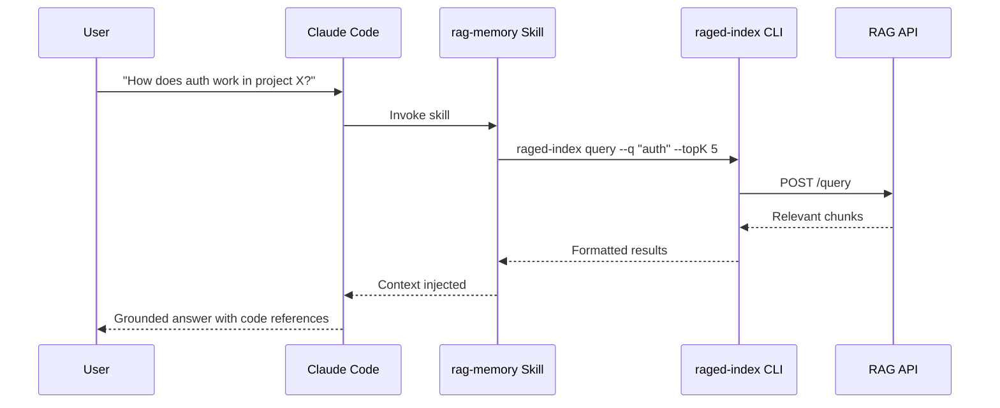

## Skill Location

```
.claude/skills/rag-memory/SKILL.md
```

## Setup

### Local

If running raged via Docker Compose on the same machine:

```bash
# No configuration needed — defaults work
# API at http://localhost:8080, no auth
```

### Remote

Set environment variables for your shell (or in your Claude Code configuration):

```bash
export RAGED_URL=https://rag.example.com
export RAGED_API_TOKEN=your-token-here
```

## Usage

The skill is invoked automatically when Claude determines it needs codebase context. You can also ask directly:

> "Use rag-memory to find how authentication is implemented in the fastify-docs collection"

Claude will run:
```bash
raged-index query \
  --api "${RAGED_URL:-http://localhost:8080}" \
  --q "authentication implementation" \
  --topK 5 \
  --token "${RAGED_API_TOKEN:-}"
```

## Multi-Agent Context

raged is designed to be agent-agnostic. While the current skill targets Claude Code, any agent that can execute shell commands can use the CLI:

```bash
# Any agent can query
raged-index query --api <url> --q "<question>" --topK 5

# Or call the HTTP API directly
curl -X POST https://rag.example.com/query \
  -H "Content-Type: application/json" \
  -H "Authorization: Bearer <token>" \
  -d '{"query": "authentication flow", "topK": 5}'
```

The v2.0 roadmap includes native SDK/client libraries for TypeScript, Python, and Go — eliminating the CLI dependency for non-Claude agents.
```

**Step 2: Verify**

Run: `head -10 docs/04-claude-skills.md`
Expected: Title and sequence diagram opening visible.

**Step 3: Commit**

```bash
git add docs/04-claude-skills.md
git commit -m "docs: expand Claude skills doc with sequence diagram and multi-agent context"
```

---

### Task 12: Expand Helm Remote Doc

**Files:**
- Modify: `docs/05-helm-remote.md`

**Step 1: Write the expanded Helm doc**

Replace the entire contents with:

```markdown
# Helm Deployment (Remote)

Deploy raged to Kubernetes with Ingress and token authentication.

## Deployment Topology

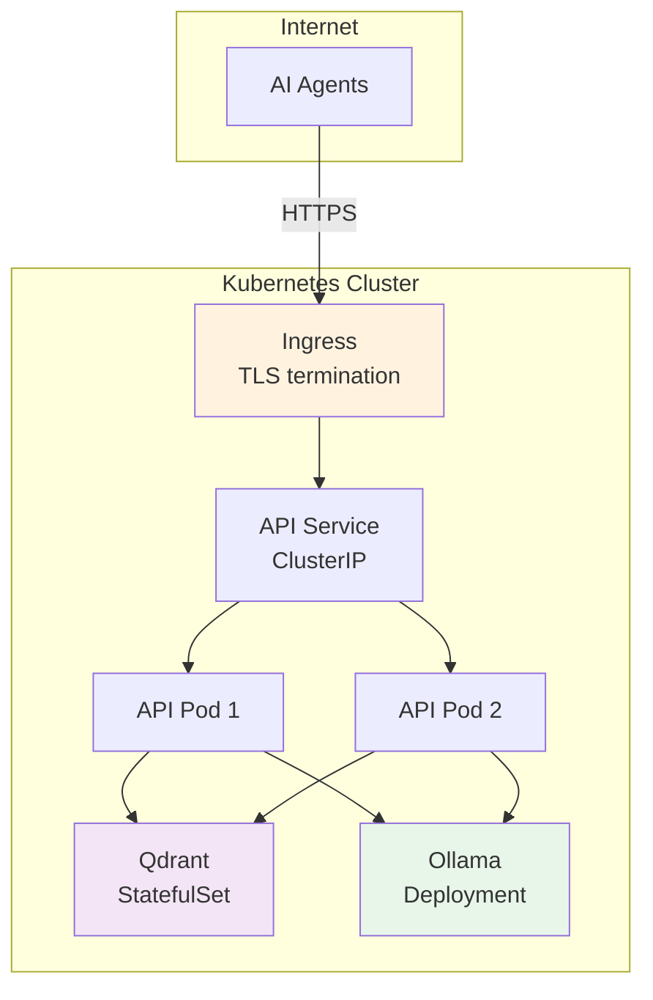

## Prerequisites

- Kubernetes cluster with an Ingress controller
- `helm` CLI (v3.15+)
- Container registry access

## Build & Push Images

```bash
# API
docker build -t your-registry/rag-api:0.5.0 ./api
docker push your-registry/rag-api:0.5.0

# CLI (for in-cluster indexing)
docker build -t your-registry/raged-index:0.5.0 ./cli
docker push your-registry/raged-index:0.5.0
```

## Install

```bash
helm install rag ./chart -n rag --create-namespace \
  --set api.image.repository=your-registry/rag-api \
  --set api.image.tag=0.5.0 \
  --set api.ingress.enabled=true \
  --set api.ingress.host=rag.example.com \
  --set api.auth.enabled=true \
  --set api.auth.token=REPLACE_ME
```

## Key Values

| Value | Default | Description |
|-------|---------|-------------|
| `api.replicas` | `2` | Number of API pods |
| `api.ingress.enabled` | `false` | Enable Ingress |
| `api.ingress.host` | `rag.local` | Ingress hostname |
| `api.ingress.tls.enabled` | `false` | Enable TLS |
| `api.auth.enabled` | `true` | Enable bearer token auth |
| `api.auth.token` | `""` | Auth token (set this!) |
| `qdrant.storage.size` | `20Gi` | Qdrant persistent volume size |
| `ollama.enabled` | `true` | Deploy Ollama in-cluster |
| `ollama.storage.size` | `30Gi` | Ollama model storage size |
| `indexer.enabled` | `false` | Enable in-cluster indexing Job |

See [values.yaml](../chart/values.yaml) for the full list.

## Upgrade

```bash
helm upgrade rag ./chart -n rag \
  --set api.image.tag=0.6.0 \
  --reuse-values
```

## TLS

```bash
helm install rag ./chart -n rag --create-namespace \
  --set api.ingress.enabled=true \
  --set api.ingress.host=rag.example.com \
  --set api.ingress.tls.enabled=true \
  --set api.ingress.tls.secretName=rag-tls
```

Ensure a TLS certificate Secret exists in the `rag` namespace, or use cert-manager to provision one automatically.
```

**Step 2: Verify**

Run: `head -10 docs/05-helm-remote.md`
Expected: Title and deployment topology diagram opening visible.

**Step 3: Commit**

```bash
git add docs/05-helm-remote.md
git commit -m "docs: expand Helm doc with deployment topology diagram and values table"
```

---

### Task 13: Expand Troubleshooting Doc

**Files:**
- Modify: `docs/06-troubleshooting.md`

**Step 1: Write the expanded troubleshooting doc**

Replace the entire contents with:

```markdown
# Troubleshooting

Common issues and how to fix them.

## Decision Tree

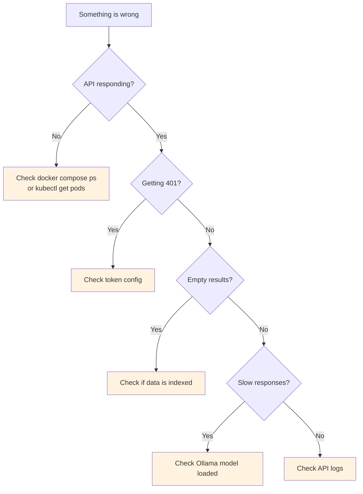

## 401 Unauthorized

**Cause:** Token mismatch between client and server.

**Fix:**
1. Check that `RAGED_API_TOKEN` is set in the API environment (Docker Compose or Helm)
2. Pass `--token <value>` to CLI commands, or set `RAGED_API_TOKEN` in your shell
3. For Helm: verify `api.auth.enabled=true` and `api.auth.token` is set

```bash
# Test auth directly
curl -s http://localhost:8080/healthz
# → {"ok":true}  (healthz bypasses auth)

curl -s -H "Authorization: Bearer YOUR_TOKEN" http://localhost:8080/query \
  -H "Content-Type: application/json" \
  -d '{"query":"test","topK":1}'
```

## Empty Query Results

**Cause:** No data indexed, or wrong collection name.

**Fix:**
1. Verify data was indexed: check CLI output for `upserted` counts
2. Ensure `--collection` matches between index and query commands
3. Check Qdrant directly:

```bash
# List collections
curl -s http://localhost:6333/collections | jq '.result.collections'

# Check point count
curl -s http://localhost:6333/collections/docs | jq '.result.points_count'
```

## Ollama Connection Failed

**Cause:** Ollama not running or model not pulled.

**Fix:**
```bash
# Check Ollama is running
curl -s http://localhost:11434/api/tags | jq '.models[].name'

# Pull the model if missing
curl http://localhost:11434/api/pull -d '{"name":"nomic-embed-text"}'
```

## API Not Starting

**Cause:** Qdrant or Ollama not reachable.

**Fix:**
```bash
# Check all services are running
docker compose ps

# Check API logs
docker compose logs api --tail 50

# Restart
docker compose restart api
```

## Ingestion Too Slow

**Cause:** Large repo with many files, or Ollama embedding is slow on CPU.

**Fix:**
- Use `--include` to limit which files are indexed
- Use `--maxFiles` to cap the number of files
- Run Ollama with GPU acceleration (mount GPU in Docker Compose)
- Increase batch size in future versions
```

**Step 2: Verify**

Run: `head -10 docs/06-troubleshooting.md`
Expected: Title and decision tree diagram opening visible.

**Step 3: Commit**

```bash
git add docs/06-troubleshooting.md
git commit -m "docs: expand troubleshooting doc with decision tree diagram and more scenarios"
```

---

### Task 14: Expand In-Cluster Indexing Doc

**Files:**
- Modify: `docs/07-indexing-in-cluster.md`

**Step 1: Write the expanded in-cluster indexing doc**

Replace the entire contents with:

```markdown
# In-Cluster Indexing

Run the indexer as a Kubernetes Job inside the cluster, close to the API and Qdrant — no need to upload repo contents from your laptop.

## How It Works

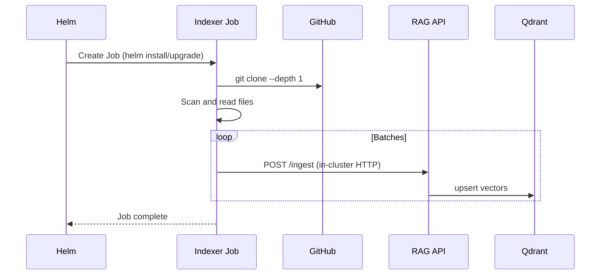

## Enable

```bash
helm upgrade --install rag ./chart -n rag --create-namespace \
  --set api.image.repository=your-registry/rag-api \
  --set api.image.tag=0.5.0 \
  --set api.auth.enabled=true \
  --set api.auth.token=REPLACE_ME \
  --set indexer.enabled=true \
  --set indexer.image.repository=your-registry/raged-index \
  --set indexer.image.tag=0.5.0 \
  --set indexer.repoUrl=https://github.com/<org>/<repo>.git \
  --set indexer.repoId=my-repo \
  --set indexer.branch=main
```

## Indexer Values

| Value | Default | Description |
|-------|---------|-------------|
| `indexer.enabled` | `false` | Create the indexer Job |
| `indexer.image.repository` | `your-registry/raged-index` | Indexer image |
| `indexer.image.tag` | `0.5.0` | Indexer image tag |
| `indexer.repoUrl` | `""` | Git repository URL to index |
| `indexer.repoId` | `""` | Stable identifier for the repo |
| `indexer.branch` | `""` | Branch to clone |
| `indexer.collection` | `docs` | Target Qdrant collection |
| `indexer.token` | `""` | API auth token |

## Benefits

- **No data transfer over the internet.** The Job clones the repo inside the cluster and talks to the API over cluster-internal networking.
- **Faster ingestion.** In-cluster HTTP calls have near-zero latency.
- **Automatable.** Trigger re-indexing by re-running the Helm upgrade or creating a CronJob.

## Private Repositories

For private repos, you need to provide Git SSH credentials to the indexer Job. This requires mounting an SSH key as a Kubernetes Secret.

**Status:** Planned for a future iteration. For now, use public repos or run the CLI locally with SSH access.

## Monitoring the Job

```bash
# Check Job status
kubectl get jobs -n rag

# View indexer logs
kubectl logs -n rag -l app=raged-indexer --tail 100
```
```

**Step 2: Verify**

Run: `head -10 docs/07-indexing-in-cluster.md`
Expected: Title and sequence diagram opening visible.

**Step 3: Commit**

```bash
git add docs/07-indexing-in-cluster.md
git commit -m "docs: expand in-cluster indexing doc with sequence diagram and values table"
```

---

### Task 15: Contributing Guide (new)

**Files:**
- Create: `docs/08-contributing.md`

**Step 1: Write the contributing guide**

```markdown
# Contributing

How to develop, test, and submit changes to raged.

## Development Setup

### Prerequisites

- Node.js 20+
- Docker and Docker Compose
- Git

### First-Time Setup

```bash
# Clone the repo
git clone https://github.com/<org>/raged.git
cd raged

# Start infrastructure
docker compose up -d

# Pull embedding model
curl http://localhost:11434/api/pull -d '{"name":"nomic-embed-text"}'

# Install and build both packages
cd api && npm install && npm run build && cd ..
cd cli && npm install && npm run build && cd ..
```

### Development Workflow

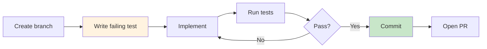

## Branch Naming

```
feat/<short-description>    # New features
fix/<short-description>     # Bug fixes
docs/<short-description>    # Documentation
refactor/<short-description> # Code improvements
test/<short-description>    # Test additions
```

## Commit Messages

Follow [Conventional Commits](https://www.conventionalcommits.org/):

```
feat: add query caching for repeated searches
fix: handle empty file during indexing
docs: add Mermaid diagram to architecture doc
refactor: extract embedding client interface
test: add unit tests for chunking module
chore: update dependencies
```

Keep the first line under 72 characters. Add a body for complex changes.

## Pull Requests

1. Branch from `main`
2. Keep PRs focused — one logical change per PR
3. Ensure CI passes (build + lint)
4. Write a clear description: what changed and why
5. Link related issues if applicable

## Project Structure

```
raged/
├── api/          → Fastify RAG API (see api/AGENTS.md)
├── cli/          → CLI indexer tool (see cli/AGENTS.md)
├── chart/        → Helm chart (see chart/AGENTS.md)
├── docs/         → Documentation (see docs/AGENTS.md)
├── .claude/      → Claude Code skill definitions
├── .github/      → CI/CD workflows
└── AGENTS.md     → Project-wide coding principles
```

## Code Style

- TypeScript with strict mode
- ES modules (`import`/`export`, not `require`)
- No `any` in new code
- Named exports only (no default exports)

See [AGENTS.md](../AGENTS.md) for the full set of conventions.

## Adding a New API Endpoint

1. Add the route in `api/src/server.ts`
2. Add JSON Schema validation for input
3. Delegate logic to a service module (not inline in the handler)
4. Update `docs/09-api-reference.md`

## Adding a New CLI Command

1. Add the command handler in `cli/src/index.ts`
2. Update the `usage()` function with all flags
3. Update `docs/03-cli.md`
```

**Step 2: Verify**

Run: `head -10 docs/08-contributing.md`
Expected: Title and first section visible.

**Step 3: Commit**

```bash
git add docs/08-contributing.md
git commit -m "docs: add contributing guide with workflow diagram and conventions"
```

---

### Task 16: API Reference (new)

**Files:**
- Create: `docs/09-api-reference.md`

**Step 1: Write the API reference**

```markdown
# API Reference

HTTP API for the raged RAG service.

**Base URL:** `http://localhost:8080` (local) or your Ingress hostname (remote)

## Authentication

When `RAGED_API_TOKEN` is set on the server, all endpoints except `/healthz` require a bearer token:

```
Authorization: Bearer <token>
```

## Endpoints

### GET /healthz

Health check. Always unauthenticated.

**Response:**
```json
{ "ok": true }
```

---

### POST /ingest

Chunk, embed, and store text items in a Qdrant collection.

**Request:**
```json
{
  "collection": "docs",
  "items": [
    {
      "id": "my-repo:src/auth.ts",
      "text": "import { FastifyInstance } from 'fastify';\n...",
      "source": "https://github.com/org/repo#src/auth.ts",
      "metadata": {
        "repoId": "my-repo",
        "path": "src/auth.ts",
        "lang": "ts",
        "bytes": 1234
      }
    }
  ]
}
```

| Field | Type | Required | Description |
|-------|------|----------|-------------|
| `collection` | string | No | Qdrant collection name (default: `docs`) |
| `items` | array | Yes | Items to ingest |
| `items[].id` | string | No | Base ID for chunks (auto-generated UUID if omitted) |
| `items[].text` | string | Yes | Full text content to chunk and embed |
| `items[].source` | string | Yes | Source identifier (URL, path, etc.) |
| `items[].metadata` | object | No | Additional metadata stored with each chunk |

**Response:**
```json
{
  "ok": true,
  "upserted": 12
}
```

| Field | Type | Description |
|-------|------|-------------|
| `ok` | boolean | Success indicator |
| `upserted` | number | Total chunks upserted (items × chunks per item) |

**Behavior:**
1. Creates the collection if it doesn't exist (768d vectors, cosine distance)
2. Splits each item's text into chunks (~1800 characters, split on line boundaries)
3. Embeds each chunk via Ollama
4. Upserts all chunks into Qdrant with payload: `{ text, source, chunkIndex, ...metadata }`
5. Chunk IDs follow the pattern `<baseId>:<chunkIndex>`

---

### POST /query

Embed a query and search for similar chunks.

**Request:**
```json
{
  "collection": "docs",
  "query": "authentication flow",
  "topK": 5,
  "filter": {
    "must": [
      { "key": "repoId", "match": { "value": "my-repo" } },
      { "key": "lang", "match": { "value": "ts" } }
    ]
  }
}
```

| Field | Type | Required | Description |
|-------|------|----------|-------------|
| `collection` | string | No | Qdrant collection name (default: `docs`) |
| `query` | string | Yes | Search query text |
| `topK` | number | No | Number of results (default: `8`) |
| `filter` | object | No | Qdrant filter object |

**Response:**
```json
{
  "ok": true,
  "results": [
    {
      "id": "my-repo:src/auth.ts:0",
      "score": 0.87,
      "source": "https://github.com/org/repo#src/auth.ts",
      "text": "import { FastifyInstance } from 'fastify';\n...",
      "payload": {
        "text": "...",
        "source": "...",
        "chunkIndex": 0,
        "repoId": "my-repo",
        "lang": "ts"
      }
    }
  ]
}
```

| Field | Type | Description |
|-------|------|-------------|
| `results[].id` | string | Chunk ID (`<baseId>:<chunkIndex>`) |
| `results[].score` | number | Cosine similarity score (0-1, higher = more similar) |
| `results[].source` | string | Source identifier |
| `results[].text` | string | Chunk text content |
| `results[].payload` | object | Full metadata payload |

**Filter Examples:**

Filter by repository:
```json
{ "must": [{ "key": "repoId", "match": { "value": "my-repo" } }] }
```

Filter by language:
```json
{ "must": [{ "key": "lang", "match": { "value": "ts" } }] }
```

Filter by path prefix:
```json
{ "must": [{ "key": "path", "match": { "text": "src/api/" } }] }
```

Combine filters:
```json
{
  "must": [
    { "key": "repoId", "match": { "value": "my-repo" } },
    { "key": "lang", "match": { "value": "ts" } },
    { "key": "path", "match": { "text": "src/" } }
  ]
}
```
```

**Step 2: Verify**

Run: `head -10 docs/09-api-reference.md`
Expected: Title and authentication section visible.

**Step 3: Commit**

```bash
git add docs/09-api-reference.md
git commit -m "docs: add API reference with endpoint docs and filter examples"
```

---

## Summary

| Task | File | Type |
|------|------|------|
| 1 | `AGENTS.md` | Create |
| 2 | `api/AGENTS.md` | Create |
| 3 | `cli/AGENTS.md` | Create |
| 4 | `chart/AGENTS.md` | Create |
| 5 | `docs/AGENTS.md` | Create |
| 6 | `docs/00-vision.md` | Create |
| 7 | `README.md` | Modify |
| 8 | `docs/01-architecture.md` | Modify |
| 9 | `docs/02-local-dev.md` | Modify |
| 10 | `docs/03-cli.md` | Modify |
| 11 | `docs/04-claude-skills.md` | Modify |
| 12 | `docs/05-helm-remote.md` | Modify |
| 13 | `docs/06-troubleshooting.md` | Modify |
| 14 | `docs/07-indexing-in-cluster.md` | Modify |
| 15 | `docs/08-contributing.md` | Create |
| 16 | `docs/09-api-reference.md` | Create |

**16 tasks, 16 commits.** Each task is one file with complete content.
