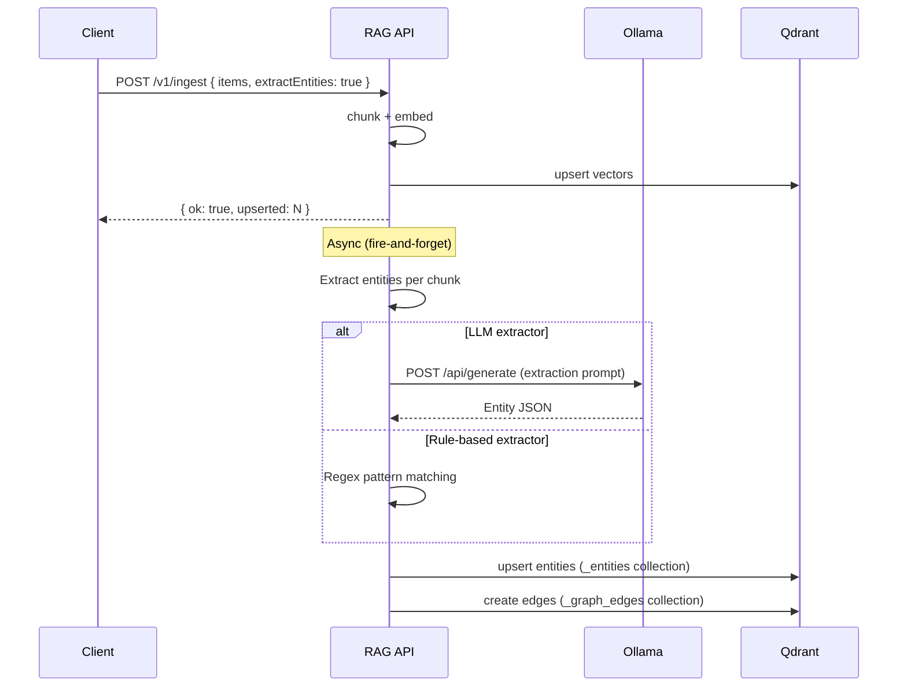
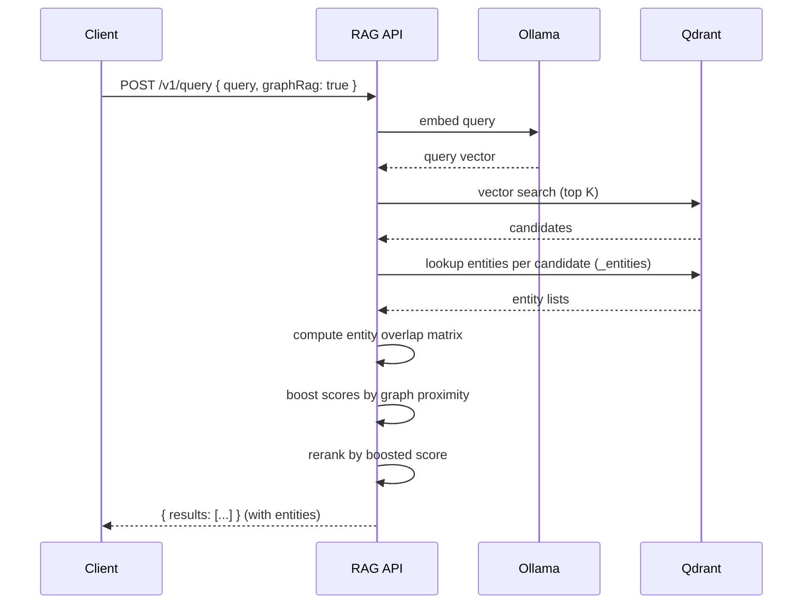

# v2.0 Knowledge Graph Implementation Plan

> **For Claude:** REQUIRED SUB-SKILL: Use superpowers:executing-plans to implement this plan task-by-task.

**Goal:** Add automatic entity extraction, relation discovery, and GraphRAG hybrid retrieval to rag-stack — transforming it from manual relationship tracking (v1.0) to an intelligent knowledge graph that discovers connections automatically.

**Architecture:** Add an entity extraction pipeline that runs during ingestion (using LLM or rule-based NER). Extracted entities become graph nodes with edges discovered from co-occurrence and semantic proximity. GraphRAG reranks vector search results by boosting hits that are graph-neighbors of other relevant results. The extraction pipeline is async (runs after ingest returns) to avoid blocking ingestion.

**Tech Stack:** TypeScript, Fastify, Qdrant, Vitest, Ollama (for LLM-based extraction), compromise (for rule-based NER fallback)

**Depends on:** v1.0 Graph Layer plan must be complete (GraphStore interface, edge storage, graph-expanded queries).

---

### Task 1: Define entity types and interfaces

**Files:**
- Create: `api/src/interfaces/entity.ts`
- Create: `api/src/interfaces/entity.test.ts`

**Step 1: Write the failing type-level test**

Create `api/src/interfaces/entity.test.ts`:

```typescript
import { describe, it, expectTypeOf } from "vitest";
import type { EntityType, Entity, EntityExtractor } from "./entity.js";

describe("entity types", () => {
  it("EntityType accepts all valid values", () => {
    const valid: EntityType[] = [
      "function",
      "class",
      "person",
      "project",
      "concept",
      "file",
      "library",
      "api-endpoint",
    ];
    expectTypeOf(valid).toEqualTypeOf<EntityType[]>();
  });

  it("Entity has required fields", () => {
    expectTypeOf<Entity>().toHaveProperty("id");
    expectTypeOf<Entity>().toHaveProperty("name");
    expectTypeOf<Entity>().toHaveProperty("type");
    expectTypeOf<Entity>().toHaveProperty("sourceChunkIds");
  });

  it("Entity.id is a string", () => {
    expectTypeOf<Entity["id"]>().toBeString();
  });

  it("Entity.name is a string", () => {
    expectTypeOf<Entity["name"]>().toBeString();
  });

  it("Entity.type is EntityType", () => {
    expectTypeOf<Entity["type"]>().toEqualTypeOf<EntityType>();
  });

  it("Entity.sourceChunkIds is string[]", () => {
    expectTypeOf<Entity["sourceChunkIds"]>().toEqualTypeOf<string[]>();
  });

  it("Entity.metadata is optional Record<string, unknown>", () => {
    expectTypeOf<Entity["metadata"]>().toEqualTypeOf<
      Record<string, unknown> | undefined
    >();
  });

  it("EntityExtractor has extract method", () => {
    expectTypeOf<EntityExtractor>().toHaveProperty("extract");
  });

  it("EntityExtractor has name property", () => {
    expectTypeOf<EntityExtractor>().toHaveProperty("name");
  });

  it("EntityExtractor.extract returns Promise<Entity[]>", () => {
    expectTypeOf<EntityExtractor["extract"]>().returns.resolves.toEqualTypeOf<
      Entity[]
    >();
  });

  it("EntityExtractor.name is a string", () => {
    expectTypeOf<EntityExtractor["name"]>().toBeString();
  });
});
```

Run:

```bash
cd api && npx vitest run src/interfaces/entity.test.ts
```

Expected: **FAIL** -- module `./entity.js` does not exist.

**Step 2: Implement the entity types**

Create `api/src/interfaces/entity.ts`:

```typescript
/**
 * Supported entity types extracted from ingested content.
 *
 * - "function"     -- a named function or method
 * - "class"        -- a class definition
 * - "person"       -- a person's name
 * - "project"      -- a project or repository name
 * - "concept"      -- a domain concept or topic
 * - "file"         -- a file path reference
 * - "library"      -- an external library or package
 * - "api-endpoint" -- an HTTP API endpoint (e.g., GET /users)
 */
export type EntityType =
  | "function"
  | "class"
  | "person"
  | "project"
  | "concept"
  | "file"
  | "library"
  | "api-endpoint";

/** All valid entity types as an array, useful for validation. */
export const ENTITY_TYPES: readonly EntityType[] = [
  "function",
  "class",
  "person",
  "project",
  "concept",
  "file",
  "library",
  "api-endpoint",
] as const;

/** Type guard for EntityType validation. */
export function isEntityType(value: unknown): value is EntityType {
  return (
    typeof value === "string" &&
    (ENTITY_TYPES as readonly string[]).includes(value)
  );
}

/**
 * An entity extracted from ingested content. Entities become nodes
 * in the knowledge graph.
 */
export interface Entity {
  /** Deterministic ID: `entity:${type}:${normalizedName}` */
  id: string;
  /** Human-readable entity name */
  name: string;
  /** Classification of the entity */
  type: EntityType;
  /** IDs of chunks where this entity was found */
  sourceChunkIds: string[];
  /** Optional metadata (e.g., file extension, HTTP method) */
  metadata?: Record<string, unknown>;
}

/**
 * Contract for entity extractors. Implementations: RuleBasedExtractor,
 * LlmExtractor, NoOpExtractor.
 */
export interface EntityExtractor {
  /** Extract entities from a text chunk. Source is optional context (e.g., file path). */
  extract(text: string, source?: string): Promise<Entity[]>;
  /** Human-readable extractor name (e.g., "rule-based", "llm", "none"). */
  readonly name: string;
}

/**
 * Generate a deterministic entity ID from type and name.
 * Normalizes the name: lowercase, trim, collapse whitespace.
 */
export function entityId(type: EntityType, name: string): string {
  const normalized = name.toLowerCase().trim().replace(/\s+/g, "-");
  return `entity:${type}:${normalized}`;
}
```

Run:

```bash
cd api && npx vitest run src/interfaces/entity.test.ts
```

Expected: **PASS** -- all type-level tests pass.

**Step 3: Add runtime tests for entityId and isEntityType**

Replace `api/src/interfaces/entity.test.ts` with the full version (type tests + runtime tests):

```typescript
import { describe, it, expect, expectTypeOf } from "vitest";
import type { EntityType, Entity, EntityExtractor } from "./entity.js";
import { entityId, isEntityType, ENTITY_TYPES } from "./entity.js";

describe("entity types", () => {
  it("EntityType accepts all valid values", () => {
    const valid: EntityType[] = [
      "function",
      "class",
      "person",
      "project",
      "concept",
      "file",
      "library",
      "api-endpoint",
    ];
    expectTypeOf(valid).toEqualTypeOf<EntityType[]>();
  });

  it("Entity has required fields", () => {
    expectTypeOf<Entity>().toHaveProperty("id");
    expectTypeOf<Entity>().toHaveProperty("name");
    expectTypeOf<Entity>().toHaveProperty("type");
    expectTypeOf<Entity>().toHaveProperty("sourceChunkIds");
  });

  it("Entity.id is a string", () => {
    expectTypeOf<Entity["id"]>().toBeString();
  });

  it("Entity.name is a string", () => {
    expectTypeOf<Entity["name"]>().toBeString();
  });

  it("Entity.type is EntityType", () => {
    expectTypeOf<Entity["type"]>().toEqualTypeOf<EntityType>();
  });

  it("Entity.sourceChunkIds is string[]", () => {
    expectTypeOf<Entity["sourceChunkIds"]>().toEqualTypeOf<string[]>();
  });

  it("Entity.metadata is optional Record<string, unknown>", () => {
    expectTypeOf<Entity["metadata"]>().toEqualTypeOf<
      Record<string, unknown> | undefined
    >();
  });

  it("EntityExtractor has extract method", () => {
    expectTypeOf<EntityExtractor>().toHaveProperty("extract");
  });

  it("EntityExtractor has name property", () => {
    expectTypeOf<EntityExtractor>().toHaveProperty("name");
  });

  it("EntityExtractor.extract returns Promise<Entity[]>", () => {
    expectTypeOf<EntityExtractor["extract"]>().returns.resolves.toEqualTypeOf<
      Entity[]
    >();
  });

  it("EntityExtractor.name is a string", () => {
    expectTypeOf<EntityExtractor["name"]>().toBeString();
  });
});

describe("entityId", () => {
  it("generates deterministic ID from type and name", () => {
    expect(entityId("function", "handleAuth")).toBe(
      "entity:function:handleauth"
    );
  });

  it("normalizes whitespace to hyphens", () => {
    expect(entityId("concept", "rate  limiting")).toBe(
      "entity:concept:rate-limiting"
    );
  });

  it("trims leading and trailing whitespace", () => {
    expect(entityId("class", "  UserService  ")).toBe(
      "entity:class:userservice"
    );
  });

  it("lowercases the name", () => {
    expect(entityId("library", "FastifyAuth")).toBe(
      "entity:library:fastifyauth"
    );
  });
});

describe("isEntityType", () => {
  it("returns true for valid entity types", () => {
    for (const t of ENTITY_TYPES) {
      expect(isEntityType(t)).toBe(true);
    }
  });

  it("returns false for invalid strings", () => {
    expect(isEntityType("invalid")).toBe(false);
    expect(isEntityType("")).toBe(false);
  });

  it("returns false for non-strings", () => {
    expect(isEntityType(42)).toBe(false);
    expect(isEntityType(null)).toBe(false);
    expect(isEntityType(undefined)).toBe(false);
  });
});
```

Run:

```bash
cd api && npx vitest run src/interfaces/entity.test.ts
```

Expected: **PASS** -- all tests pass.

**Step 4: Commit**

```bash
git add api/src/interfaces/entity.ts api/src/interfaces/entity.test.ts
git commit -m "feat: define entity types, EntityExtractor interface, and entityId helper"
```

---

### Task 2: Implement rule-based entity extractor

**Files:**
- Create: `api/src/extractors/rule-based.test.ts`
- Create: `api/src/extractors/rule-based.ts`

**Step 1: Write the failing tests**

Create `api/src/extractors/rule-based.test.ts`:

```typescript
import { describe, it, expect } from "vitest";
import { createRuleBasedExtractor } from "./rule-based.js";

const extractor = createRuleBasedExtractor();

describe("RuleBasedExtractor", () => {
  it("has name 'rule-based'", () => {
    expect(extractor.name).toBe("rule-based");
  });

  describe("function extraction", () => {
    it("extracts function declarations", async () => {
      const text = "function handleAuth(req, res) { return true; }";
      const entities = await extractor.extract(text);
      const fns = entities.filter((e) => e.type === "function");
      expect(fns).toHaveLength(1);
      expect(fns[0].name).toBe("handleAuth");
    });

    it("extracts arrow function assignments", async () => {
      const text = "const processData = (input) => { return input; };";
      const entities = await extractor.extract(text);
      const fns = entities.filter((e) => e.type === "function");
      expect(fns).toHaveLength(1);
      expect(fns[0].name).toBe("processData");
    });

    it("extracts named const function expressions", async () => {
      const text =
        'const validate = function checkInput(data) { return data !== null; };';
      const entities = await extractor.extract(text);
      const fns = entities.filter((e) => e.type === "function");
      expect(fns.some((f) => f.name === "checkInput")).toBe(true);
    });

    it("extracts async function declarations", async () => {
      const text = "async function fetchUser(id) { return await db.get(id); }";
      const entities = await extractor.extract(text);
      const fns = entities.filter((e) => e.type === "function");
      expect(fns.some((f) => f.name === "fetchUser")).toBe(true);
    });

    it("extracts export function declarations", async () => {
      const text = "export function createServer() { return Fastify(); }";
      const entities = await extractor.extract(text);
      const fns = entities.filter((e) => e.type === "function");
      expect(fns.some((f) => f.name === "createServer")).toBe(true);
    });
  });

  describe("class extraction", () => {
    it("extracts class declarations", async () => {
      const text = "class UserService { constructor() {} }";
      const entities = await extractor.extract(text);
      const classes = entities.filter((e) => e.type === "class");
      expect(classes).toHaveLength(1);
      expect(classes[0].name).toBe("UserService");
    });

    it("extracts exported class declarations", async () => {
      const text = "export class AuthHandler extends BaseHandler {}";
      const entities = await extractor.extract(text);
      const classes = entities.filter((e) => e.type === "class");
      expect(classes.some((c) => c.name === "AuthHandler")).toBe(true);
    });
  });

  describe("file path extraction", () => {
    it("extracts file paths from imports", async () => {
      const text = 'import { foo } from "./services/auth.ts";';
      const entities = await extractor.extract(text);
      const files = entities.filter((e) => e.type === "file");
      expect(files.some((f) => f.name === "./services/auth.ts")).toBe(true);
    });

    it("extracts Unix-style file paths", async () => {
      const text = "The config is at src/config/database.ts in the project.";
      const entities = await extractor.extract(text);
      const files = entities.filter((e) => e.type === "file");
      expect(
        files.some((f) => f.name === "src/config/database.ts")
      ).toBe(true);
    });
  });

  describe("API endpoint extraction", () => {
    it("extracts GET endpoints", async () => {
      const text = "The GET /v1/users endpoint returns a list of users.";
      const entities = await extractor.extract(text);
      const endpoints = entities.filter((e) => e.type === "api-endpoint");
      expect(endpoints.some((ep) => ep.name === "GET /v1/users")).toBe(true);
    });

    it("extracts POST endpoints", async () => {
      const text = "Call POST /v1/ingest to store new documents.";
      const entities = await extractor.extract(text);
      const endpoints = entities.filter((e) => e.type === "api-endpoint");
      expect(endpoints.some((ep) => ep.name === "POST /v1/ingest")).toBe(true);
    });

    it("extracts DELETE endpoints", async () => {
      const text = "Use DELETE /v1/link to remove a relationship.";
      const entities = await extractor.extract(text);
      const endpoints = entities.filter((e) => e.type === "api-endpoint");
      expect(
        endpoints.some((ep) => ep.name === "DELETE /v1/link")
      ).toBe(true);
    });
  });

  describe("library extraction", () => {
    it("extracts npm package imports", async () => {
      const text = 'import Fastify from "fastify";';
      const entities = await extractor.extract(text);
      const libs = entities.filter((e) => e.type === "library");
      expect(libs.some((l) => l.name === "fastify")).toBe(true);
    });

    it("extracts scoped npm package imports", async () => {
      const text =
        'import { QdrantClient } from "@qdrant/js-client-rest";';
      const entities = await extractor.extract(text);
      const libs = entities.filter((e) => e.type === "library");
      expect(
        libs.some((l) => l.name === "@qdrant/js-client-rest")
      ).toBe(true);
    });

    it("does not extract relative imports as libraries", async () => {
      const text = 'import { foo } from "./utils.js";';
      const entities = await extractor.extract(text);
      const libs = entities.filter((e) => e.type === "library");
      expect(libs).toHaveLength(0);
    });
  });

  describe("deduplication", () => {
    it("deduplicates entities with the same ID", async () => {
      const text = `
        function handleAuth(req) { return true; }
        // Later: handleAuth is called again
        const result = handleAuth(request);
      `;
      const entities = await extractor.extract(text);
      const authFns = entities.filter(
        (e) => e.type === "function" && e.name === "handleAuth"
      );
      expect(authFns).toHaveLength(1);
    });
  });

  describe("source chunk tracking", () => {
    it("includes provided chunkId in sourceChunkIds when source given", async () => {
      const text = "function myHelper() {}";
      const entities = await extractor.extract(text, "chunk-42");
      const fn = entities.find((e) => e.name === "myHelper");
      expect(fn?.sourceChunkIds).toContain("chunk-42");
    });
  });
});
```

Run:

```bash
cd api && npx vitest run src/extractors/rule-based.test.ts
```

Expected: **FAIL** -- module `./rule-based.js` does not exist.

**Step 2: Implement the rule-based extractor**

Create `api/src/extractors/rule-based.ts`:

```typescript
import type { Entity, EntityExtractor, EntityType } from "../interfaces/entity.js";
import { entityId } from "../interfaces/entity.js";

interface PatternDef {
  type: EntityType;
  pattern: RegExp;
  nameGroup: number;
}

/**
 * Regex patterns for extracting entities from source code and prose.
 * Each pattern has a capture group index for the entity name.
 */
const PATTERNS: PatternDef[] = [
  // function declarations: function foo(, async function foo(, export function foo(
  {
    type: "function",
    pattern:
      /(?:export\s+)?(?:async\s+)?function\s+([a-zA-Z_$][a-zA-Z0-9_$]*)\s*\(/g,
    nameGroup: 1,
  },
  // arrow / const function: const foo = (...) =>, const foo = function(
  {
    type: "function",
    pattern:
      /(?:const|let|var)\s+([a-zA-Z_$][a-zA-Z0-9_$]*)\s*=\s*(?:async\s+)?(?:\([^)]*\)|[a-zA-Z_$][a-zA-Z0-9_$]*)\s*=>/g,
    nameGroup: 1,
  },
  // named function expressions: const x = function myName(
  {
    type: "function",
    pattern: /=\s*function\s+([a-zA-Z_$][a-zA-Z0-9_$]*)\s*\(/g,
    nameGroup: 1,
  },
  // class declarations: class Foo, export class Foo
  {
    type: "class",
    pattern: /(?:export\s+)?class\s+([a-zA-Z_$][a-zA-Z0-9_$]*)/g,
    nameGroup: 1,
  },
  // API endpoints: GET /path, POST /path, PUT /path, DELETE /path, PATCH /path
  {
    type: "api-endpoint",
    pattern: /((?:GET|POST|PUT|DELETE|PATCH)\s+\/[a-zA-Z0-9/_:.-]+)/g,
    nameGroup: 1,
  },
  // npm package imports (non-relative): import ... from "package"
  {
    type: "library",
    pattern:
      /from\s+["'](@[a-zA-Z0-9_-]+\/[a-zA-Z0-9_.-]+|[a-zA-Z][a-zA-Z0-9_.-]*)["']/g,
    nameGroup: 1,
  },
  // file paths in imports (relative): import ... from "./path/file.ts"
  {
    type: "file",
    pattern: /from\s+["'](\.\.?\/[a-zA-Z0-9_/.@-]+)["']/g,
    nameGroup: 1,
  },
  // file paths in prose: word/word.ext patterns (at least one slash, ends with extension)
  {
    type: "file",
    pattern:
      /(?:^|\s)((?:[a-zA-Z0-9_.-]+\/)+[a-zA-Z0-9_.-]+\.[a-zA-Z]{1,10})(?:\s|$|[,;:)])/gm,
    nameGroup: 1,
  },
];

/**
 * Create a rule-based entity extractor that uses regex patterns.
 * No external dependencies required.
 */
export function createRuleBasedExtractor(): EntityExtractor {
  return {
    name: "rule-based",

    async extract(text: string, source?: string): Promise<Entity[]> {
      const seen = new Map<string, Entity>();

      for (const { type, pattern, nameGroup } of PATTERNS) {
        // Reset lastIndex for global regex reuse
        const regex = new RegExp(pattern.source, pattern.flags);
        let match: RegExpExecArray | null;

        while ((match = regex.exec(text)) !== null) {
          const name = match[nameGroup]?.trim();
          if (!name || name.length < 2) continue;

          const id = entityId(type, name);

          if (seen.has(id)) {
            // Add source to existing entity if provided
            const existing = seen.get(id)!;
            if (source && !existing.sourceChunkIds.includes(source)) {
              existing.sourceChunkIds.push(source);
            }
          } else {
            seen.set(id, {
              id,
              name,
              type,
              sourceChunkIds: source ? [source] : [],
            });
          }
        }
      }

      return Array.from(seen.values());
    },
  };
}
```

Run:

```bash
cd api && npx vitest run src/extractors/rule-based.test.ts
```

Expected: **PASS** -- all tests pass.

**Step 3: Commit**

```bash
git add api/src/extractors/rule-based.ts api/src/extractors/rule-based.test.ts
git commit -m "feat: implement rule-based entity extractor with regex patterns"
```

---

### Task 3: Implement LLM-based entity extractor

**Files:**
- Create: `api/src/extractors/llm-based.test.ts`
- Create: `api/src/extractors/llm-based.ts`

**Step 1: Write the failing tests**

Create `api/src/extractors/llm-based.test.ts`:

```typescript
import { describe, it, expect, vi } from "vitest";
import { createLlmExtractor } from "./llm-based.js";

/** Helper to build a mock fetch that returns a fixed Ollama response. */
function mockOllamaFetch(responseBody: unknown): typeof globalThis.fetch {
  return vi.fn().mockResolvedValue({
    ok: true,
    json: async () => responseBody,
  }) as unknown as typeof globalThis.fetch;
}

/** Helper to build a mock fetch that fails. */
function mockFailingFetch(status = 500): typeof globalThis.fetch {
  return vi.fn().mockResolvedValue({
    ok: false,
    status,
    text: async () => "Internal Server Error",
  }) as unknown as typeof globalThis.fetch;
}

/** Helper to build a mock fetch that throws (network error). */
function mockNetworkErrorFetch(): typeof globalThis.fetch {
  return vi.fn().mockRejectedValue(
    new Error("ECONNREFUSED")
  ) as unknown as typeof globalThis.fetch;
}

describe("LlmExtractor", () => {
  it("has name 'llm'", () => {
    const extractor = createLlmExtractor({
      fetchFn: mockOllamaFetch({ response: "[]" }),
    });
    expect(extractor.name).toBe("llm");
  });

  it("sends text to Ollama and parses entity JSON response", async () => {
    const ollamaResponse = {
      response: JSON.stringify([
        { name: "handleAuth", type: "function" },
        { name: "UserService", type: "class" },
        { name: "fastify", type: "library" },
      ]),
    };
    const fetchFn = mockOllamaFetch(ollamaResponse);
    const extractor = createLlmExtractor({ fetchFn });

    const entities = await extractor.extract(
      "function handleAuth() {} class UserService {}",
      "chunk-1"
    );

    expect(entities).toHaveLength(3);
    expect(entities[0].name).toBe("handleAuth");
    expect(entities[0].type).toBe("function");
    expect(entities[0].sourceChunkIds).toContain("chunk-1");
    expect(entities[1].name).toBe("UserService");
    expect(entities[1].type).toBe("class");
    expect(entities[2].name).toBe("fastify");
    expect(entities[2].type).toBe("library");
  });

  it("calls Ollama with the correct URL and model", async () => {
    const fetchFn = mockOllamaFetch({ response: "[]" });
    const extractor = createLlmExtractor({
      fetchFn,
      ollamaUrl: "http://custom:11434",
      model: "llama3",
    });

    await extractor.extract("some text");

    expect(fetchFn).toHaveBeenCalledWith(
      "http://custom:11434/api/generate",
      expect.objectContaining({
        method: "POST",
        headers: { "content-type": "application/json" },
      })
    );

    const callBody = JSON.parse(
      (fetchFn as ReturnType<typeof vi.fn>).mock.calls[0][1].body
    );
    expect(callBody.model).toBe("llama3");
    expect(callBody.stream).toBe(false);
  });

  it("filters out entities with invalid types", async () => {
    const ollamaResponse = {
      response: JSON.stringify([
        { name: "handleAuth", type: "function" },
        { name: "SomeWidget", type: "widget" },
      ]),
    };
    const extractor = createLlmExtractor({
      fetchFn: mockOllamaFetch(ollamaResponse),
    });

    const entities = await extractor.extract("some text");

    expect(entities).toHaveLength(1);
    expect(entities[0].name).toBe("handleAuth");
  });

  it("filters out entities with missing name or type", async () => {
    const ollamaResponse = {
      response: JSON.stringify([
        { name: "", type: "function" },
        { name: "validFunc", type: "function" },
        { type: "class" },
        { name: "validClass" },
      ]),
    };
    const extractor = createLlmExtractor({
      fetchFn: mockOllamaFetch(ollamaResponse),
    });

    const entities = await extractor.extract("text");

    expect(entities).toHaveLength(1);
    expect(entities[0].name).toBe("validFunc");
  });

  it("returns empty array when Ollama returns invalid JSON", async () => {
    const ollamaResponse = { response: "This is not JSON at all." };
    const extractor = createLlmExtractor({
      fetchFn: mockOllamaFetch(ollamaResponse),
    });

    const entities = await extractor.extract("some code");

    expect(entities).toEqual([]);
  });

  it("returns empty array when Ollama returns non-200", async () => {
    const extractor = createLlmExtractor({
      fetchFn: mockFailingFetch(503),
    });

    const entities = await extractor.extract("some text");

    expect(entities).toEqual([]);
  });

  it("returns empty array when network error occurs", async () => {
    const extractor = createLlmExtractor({
      fetchFn: mockNetworkErrorFetch(),
    });

    const entities = await extractor.extract("some text");

    expect(entities).toEqual([]);
  });

  it("deduplicates entities by ID", async () => {
    const ollamaResponse = {
      response: JSON.stringify([
        { name: "handleAuth", type: "function" },
        { name: "handleAuth", type: "function" },
      ]),
    };
    const extractor = createLlmExtractor({
      fetchFn: mockOllamaFetch(ollamaResponse),
    });

    const entities = await extractor.extract("text");

    expect(entities).toHaveLength(1);
  });

  it("extracts JSON from markdown code fences in LLM response", async () => {
    const ollamaResponse = {
      response:
        '```json\n[{"name": "fetchUser", "type": "function"}]\n```',
    };
    const extractor = createLlmExtractor({
      fetchFn: mockOllamaFetch(ollamaResponse),
    });

    const entities = await extractor.extract("async function fetchUser() {}");

    expect(entities).toHaveLength(1);
    expect(entities[0].name).toBe("fetchUser");
  });
});
```

Run:

```bash
cd api && npx vitest run src/extractors/llm-based.test.ts
```

Expected: **FAIL** -- module `./llm-based.js` does not exist.

**Step 2: Implement the LLM-based extractor**

Create `api/src/extractors/llm-based.ts`:

```typescript
import type {
  Entity,
  EntityExtractor,
  EntityType,
} from "../interfaces/entity.js";
import { entityId, isEntityType } from "../interfaces/entity.js";

const EXTRACTION_PROMPT = `You are an entity extraction system. Extract named entities from the following text.

Return ONLY a JSON array of objects with "name" and "type" fields. Valid types are:
"function", "class", "person", "project", "concept", "file", "library", "api-endpoint"

Example output:
[{"name": "handleAuth", "type": "function"}, {"name": "fastify", "type": "library"}]

If no entities are found, return an empty array: []

Text to analyze:
`;

interface LlmExtractorOptions {
  /** Custom fetch function (for testing). Defaults to globalThis.fetch. */
  fetchFn?: typeof globalThis.fetch;
  /** Ollama base URL. Defaults to OLLAMA_URL env or http://ollama:11434. */
  ollamaUrl?: string;
  /** Model name for generation. Defaults to EXTRACT_MODEL env or "llama3.2". */
  model?: string;
}

interface RawEntity {
  name?: unknown;
  type?: unknown;
}

/**
 * Try to extract a JSON array from text that may contain markdown code fences.
 */
function extractJsonArray(text: string): unknown[] | null {
  // Try direct parse first
  try {
    const parsed = JSON.parse(text);
    if (Array.isArray(parsed)) return parsed;
  } catch {
    // Not direct JSON, try extracting from code fences
  }

  // Try extracting from ```json ... ``` or ``` ... ``` blocks
  const fenceMatch = text.match(/```(?:json)?\s*\n?([\s\S]*?)\n?```/);
  if (fenceMatch) {
    try {
      const parsed = JSON.parse(fenceMatch[1]);
      if (Array.isArray(parsed)) return parsed;
    } catch {
      // Invalid JSON in fence
    }
  }

  // Try finding a JSON array anywhere in the text
  const arrayMatch = text.match(/\[[\s\S]*\]/);
  if (arrayMatch) {
    try {
      const parsed = JSON.parse(arrayMatch[0]);
      if (Array.isArray(parsed)) return parsed;
    } catch {
      // Not valid JSON
    }
  }

  return null;
}

/**
 * Create an LLM-based entity extractor that uses Ollama's generate API.
 * Falls back gracefully: returns empty array on any LLM failure.
 */
export function createLlmExtractor(
  options: LlmExtractorOptions = {}
): EntityExtractor {
  const fetchFn = options.fetchFn ?? globalThis.fetch;
  const ollamaUrl =
    options.ollamaUrl ??
    process.env.OLLAMA_URL ??
    "http://ollama:11434";
  const model =
    options.model ?? process.env.EXTRACT_MODEL ?? "llama3.2";

  return {
    name: "llm",

    async extract(text: string, source?: string): Promise<Entity[]> {
      try {
        const response = await fetchFn(`${ollamaUrl}/api/generate`, {
          method: "POST",
          headers: { "content-type": "application/json" },
          body: JSON.stringify({
            model,
            prompt: EXTRACTION_PROMPT + text,
            stream: false,
          }),
        });

        if (!response.ok) {
          return [];
        }

        const json = (await response.json()) as { response?: string };
        const responseText = json.response ?? "";

        const rawEntities = extractJsonArray(responseText);
        if (!rawEntities) {
          return [];
        }

        const seen = new Map<string, Entity>();

        for (const raw of rawEntities as RawEntity[]) {
          const name =
            typeof raw.name === "string" ? raw.name.trim() : "";
          const type = typeof raw.type === "string" ? raw.type : "";

          if (!name || !isEntityType(type)) continue;

          const id = entityId(type as EntityType, name);

          if (!seen.has(id)) {
            seen.set(id, {
              id,
              name,
              type: type as EntityType,
              sourceChunkIds: source ? [source] : [],
            });
          }
        }

        return Array.from(seen.values());
      } catch {
        // Network errors, JSON parse errors, etc.
        return [];
      }
    },
  };
}
```

Run:

```bash
cd api && npx vitest run src/extractors/llm-based.test.ts
```

Expected: **PASS** -- all tests pass.

**Step 3: Commit**

```bash
git add api/src/extractors/llm-based.ts api/src/extractors/llm-based.test.ts
git commit -m "feat: implement LLM-based entity extractor with Ollama generate API"
```

---

### Task 4: Entity extractor factory

**Files:**
- Create: `api/src/extractors/factory.test.ts`
- Create: `api/src/extractors/factory.ts`

**Step 1: Write the failing tests**

Create `api/src/extractors/factory.test.ts`:

```typescript
import { describe, it, expect, afterEach } from "vitest";
import { createEntityExtractor } from "./factory.js";

describe("createEntityExtractor factory", () => {
  const originalEnv = process.env.ENTITY_EXTRACTOR;

  afterEach(() => {
    if (originalEnv === undefined) {
      delete process.env.ENTITY_EXTRACTOR;
    } else {
      process.env.ENTITY_EXTRACTOR = originalEnv;
    }
  });

  it("returns no-op extractor when ENTITY_EXTRACTOR is unset", () => {
    delete process.env.ENTITY_EXTRACTOR;
    const extractor = createEntityExtractor();
    expect(extractor.name).toBe("none");
  });

  it("returns no-op extractor when ENTITY_EXTRACTOR is 'none'", () => {
    process.env.ENTITY_EXTRACTOR = "none";
    const extractor = createEntityExtractor();
    expect(extractor.name).toBe("none");
  });

  it("no-op extractor always returns empty array", async () => {
    delete process.env.ENTITY_EXTRACTOR;
    const extractor = createEntityExtractor();
    const entities = await extractor.extract("function foo() {}");
    expect(entities).toEqual([]);
  });

  it("returns rule-based extractor when ENTITY_EXTRACTOR is 'rules'", () => {
    process.env.ENTITY_EXTRACTOR = "rules";
    const extractor = createEntityExtractor();
    expect(extractor.name).toBe("rule-based");
  });

  it("rule-based extractor actually extracts entities", async () => {
    process.env.ENTITY_EXTRACTOR = "rules";
    const extractor = createEntityExtractor();
    const entities = await extractor.extract("function handleAuth() {}");
    expect(entities.length).toBeGreaterThan(0);
  });

  it("returns LLM extractor when ENTITY_EXTRACTOR is 'llm'", () => {
    process.env.ENTITY_EXTRACTOR = "llm";
    const extractor = createEntityExtractor();
    expect(extractor.name).toBe("llm");
  });

  it("returns no-op extractor for unknown values", () => {
    process.env.ENTITY_EXTRACTOR = "banana";
    const extractor = createEntityExtractor();
    expect(extractor.name).toBe("none");
  });
});
```

Run:

```bash
cd api && npx vitest run src/extractors/factory.test.ts
```

Expected: **FAIL** -- module `./factory.js` does not exist.

**Step 2: Implement the factory**

Create `api/src/extractors/factory.ts`:

```typescript
import type { Entity, EntityExtractor } from "../interfaces/entity.js";
import { createRuleBasedExtractor } from "./rule-based.js";
import { createLlmExtractor } from "./llm-based.js";

/**
 * No-op extractor that always returns an empty array.
 * Used when entity extraction is disabled (default).
 */
function createNoOpExtractor(): EntityExtractor {
  return {
    name: "none",
    async extract(): Promise<Entity[]> {
      return [];
    },
  };
}

/**
 * Factory that creates the configured entity extractor.
 *
 * Reads ENTITY_EXTRACTOR env var:
 * - "llm"   -> LLM-based extractor (Ollama)
 * - "rules" -> Rule-based regex extractor
 * - "none"  -> No-op extractor (default, backward compatible)
 */
export function createEntityExtractor(): EntityExtractor {
  const strategy = (
    process.env.ENTITY_EXTRACTOR ?? "none"
  ).toLowerCase();

  switch (strategy) {
    case "llm":
      return createLlmExtractor();
    case "rules":
      return createRuleBasedExtractor();
    case "none":
      return createNoOpExtractor();
    default:
      return createNoOpExtractor();
  }
}
```

Run:

```bash
cd api && npx vitest run src/extractors/factory.test.ts
```

Expected: **PASS** -- all tests pass.

**Step 3: Commit**

```bash
git add api/src/extractors/factory.ts api/src/extractors/factory.test.ts
git commit -m "feat: add entity extractor factory with env-driven strategy selection"
```

---

### Task 5: Entity storage in Qdrant

**Files:**
- Create: `api/src/graph/entity-store.test.ts`
- Create: `api/src/graph/entity-store.ts`

**Step 1: Write the failing tests**

Create `api/src/graph/entity-store.test.ts`:

```typescript
import { describe, it, expect, vi, beforeEach } from "vitest";
import { createEntityStore } from "./entity-store.js";
import type { Entity } from "../interfaces/entity.js";
import type { VectorStore } from "../interfaces/vector-store.js";
import type { EmbeddingProvider } from "../interfaces/embedding.js";

/** Mock VectorStore that stores points in memory. */
function createMockVectorStore(): VectorStore & {
  points: Map<string, { id: string; vector: number[]; payload: Record<string, unknown> }>;
} {
  const points = new Map<
    string,
    { id: string; vector: number[]; payload: Record<string, unknown> }
  >();

  return {
    points,

    async ensureCollection(): Promise<void> {},

    async upsert(
      _collection: string,
      items: Array<{
        id: string;
        vector: number[];
        payload: Record<string, unknown>;
      }>
    ): Promise<void> {
      for (const item of items) {
        points.set(item.id, item);
      }
    },

    async search(
      _collection: string,
      _vector: number[],
      limit: number,
      filter?: Record<string, unknown>
    ): Promise<
      Array<{
        id: string;
        score: number;
        payload: Record<string, unknown>;
      }>
    > {
      const results = Array.from(points.values());
      const filtered = filter
        ? results.filter((p) => {
            const must = (
              filter as {
                must?: Array<{ key: string; match: { value: unknown } }>;
              }
            ).must;
            if (!must) return true;
            return must.every(
              (condition) =>
                p.payload[condition.key] === condition.match.value
            );
          })
        : results;

      return filtered.slice(0, limit).map((p) => ({
        id: p.id,
        score: 0.9,
        payload: p.payload,
      }));
    },
  };
}

/** Mock EmbeddingProvider that returns fixed vectors. */
function createMockEmbedder(): EmbeddingProvider {
  return {
    name: "mock",
    dimensions: 3,
    async embed(texts: string[]): Promise<number[][]> {
      return texts.map(() => [0.1, 0.2, 0.3]);
    },
  };
}

describe("EntityStore", () => {
  let vectorStore: ReturnType<typeof createMockVectorStore>;
  let embedder: ReturnType<typeof createMockEmbedder>;

  beforeEach(() => {
    vectorStore = createMockVectorStore();
    embedder = createMockEmbedder();
  });

  describe("upsertEntity", () => {
    it("stores an entity as a Qdrant point", async () => {
      const store = createEntityStore({ vectorStore, embedder });
      const entity: Entity = {
        id: "entity:function:handleauth",
        name: "handleAuth",
        type: "function",
        sourceChunkIds: ["chunk-1"],
      };

      await store.upsertEntity(entity);

      expect(vectorStore.points.has("entity:function:handleauth")).toBe(true);
      const point = vectorStore.points.get("entity:function:handleauth")!;
      expect(point.payload.name).toBe("handleAuth");
      expect(point.payload.entityType).toBe("function");
      expect(point.payload.sourceChunkIds).toEqual(["chunk-1"]);
    });

    it("embeds the entity name for semantic search", async () => {
      const store = createEntityStore({ vectorStore, embedder });
      const embedSpy = vi.spyOn(embedder, "embed");

      await store.upsertEntity({
        id: "entity:class:userservice",
        name: "UserService",
        type: "class",
        sourceChunkIds: [],
      });

      expect(embedSpy).toHaveBeenCalledWith(["UserService"]);
    });

    it("merges sourceChunkIds on upsert of existing entity", async () => {
      const store = createEntityStore({ vectorStore, embedder });

      await store.upsertEntity({
        id: "entity:function:foo",
        name: "foo",
        type: "function",
        sourceChunkIds: ["chunk-1"],
      });

      await store.upsertEntity({
        id: "entity:function:foo",
        name: "foo",
        type: "function",
        sourceChunkIds: ["chunk-2"],
      });

      const point = vectorStore.points.get("entity:function:foo")!;
      expect(point.payload.sourceChunkIds).toEqual(["chunk-1", "chunk-2"]);
    });
  });

  describe("findEntitiesByName", () => {
    it("searches for entities by embedded name", async () => {
      const store = createEntityStore({ vectorStore, embedder });
      await store.upsertEntity({
        id: "entity:function:handleauth",
        name: "handleAuth",
        type: "function",
        sourceChunkIds: ["chunk-1"],
      });

      const results = await store.findEntitiesByName("auth handler", 5);

      expect(results.length).toBeGreaterThanOrEqual(1);
      expect(results[0].name).toBe("handleAuth");
    });
  });

  describe("findEntitiesInChunk", () => {
    it("returns entities that reference a specific chunk ID", async () => {
      const store = createEntityStore({ vectorStore, embedder });
      await store.upsertEntity({
        id: "entity:function:foo",
        name: "foo",
        type: "function",
        sourceChunkIds: ["chunk-1"],
      });
      await store.upsertEntity({
        id: "entity:class:bar",
        name: "Bar",
        type: "class",
        sourceChunkIds: ["chunk-2"],
      });

      const results = await store.findEntitiesInChunk("chunk-1");

      expect(results).toHaveLength(1);
      expect(results[0].name).toBe("foo");
    });
  });

  describe("getEntity", () => {
    it("returns entity by ID", async () => {
      const store = createEntityStore({ vectorStore, embedder });
      await store.upsertEntity({
        id: "entity:function:handleauth",
        name: "handleAuth",
        type: "function",
        sourceChunkIds: ["chunk-1"],
      });

      const entity = await store.getEntity("entity:function:handleauth");

      expect(entity).not.toBeNull();
      expect(entity!.name).toBe("handleAuth");
    });

    it("returns null for non-existent entity", async () => {
      const store = createEntityStore({ vectorStore, embedder });
      const entity = await store.getEntity("entity:function:nonexistent");
      expect(entity).toBeNull();
    });
  });
});
```

Run:

```bash
cd api && npx vitest run src/graph/entity-store.test.ts
```

Expected: **FAIL** -- module `./entity-store.js` does not exist.

**Step 2: Implement the entity store**

Create `api/src/graph/entity-store.ts`:

```typescript
import type { Entity, EntityType } from "../interfaces/entity.js";
import type { VectorStore } from "../interfaces/vector-store.js";
import type { EmbeddingProvider } from "../interfaces/embedding.js";

const ENTITY_COLLECTION = "_entities";

interface EntityStoreOptions {
  vectorStore: VectorStore;
  embedder: EmbeddingProvider;
  collection?: string;
}

export interface EntityStore {
  /** Upsert an entity. Merges sourceChunkIds if entity already exists. */
  upsertEntity(entity: Entity): Promise<void>;
  /** Find entities by semantic name search. */
  findEntitiesByName(query: string, limit: number): Promise<Entity[]>;
  /** Find all entities that appear in a specific chunk. */
  findEntitiesInChunk(chunkId: string): Promise<Entity[]>;
  /** Get a single entity by its ID. Returns null if not found. */
  getEntity(id: string): Promise<Entity | null>;
}

function payloadToEntity(
  id: string,
  payload: Record<string, unknown>
): Entity {
  return {
    id,
    name: payload.name as string,
    type: payload.entityType as EntityType,
    sourceChunkIds: (payload.sourceChunkIds as string[]) ?? [],
    metadata: payload.metadata as Record<string, unknown> | undefined,
  };
}

/**
 * Create an entity store backed by a VectorStore (Qdrant).
 * Entities are stored as points in a dedicated `_entities` collection,
 * with the entity name embedded for semantic search.
 */
export function createEntityStore(options: EntityStoreOptions): EntityStore {
  const { vectorStore, embedder } = options;
  const collection = options.collection ?? ENTITY_COLLECTION;
  let collectionReady = false;

  async function ensureReady(): Promise<void> {
    if (!collectionReady) {
      await vectorStore.ensureCollection(collection);
      collectionReady = true;
    }
  }

  // In-memory cache for merging sourceChunkIds across upserts.
  // In production, this would read from the store before merging.
  const chunkIdCache = new Map<string, string[]>();

  return {
    async upsertEntity(entity: Entity): Promise<void> {
      await ensureReady();

      // Merge sourceChunkIds with any previously known ones
      const existing = chunkIdCache.get(entity.id) ?? [];
      const merged = [...new Set([...existing, ...entity.sourceChunkIds])];
      chunkIdCache.set(entity.id, merged);

      const [vector] = await embedder.embed([entity.name]);

      await vectorStore.upsert(collection, [
        {
          id: entity.id,
          vector,
          payload: {
            name: entity.name,
            entityType: entity.type,
            sourceChunkIds: merged,
            ...(entity.metadata ? { metadata: entity.metadata } : {}),
          },
        },
      ]);
    },

    async findEntitiesByName(
      query: string,
      limit: number
    ): Promise<Entity[]> {
      await ensureReady();
      const [vector] = await embedder.embed([query]);
      const results = await vectorStore.search(collection, vector, limit);
      return results.map((r) => payloadToEntity(r.id as string, r.payload));
    },

    async findEntitiesInChunk(chunkId: string): Promise<Entity[]> {
      await ensureReady();

      // Find entities whose sourceChunkIds contain this chunk.
      // Uses the in-memory cache for fast lookup.
      const matchingIds = Array.from(chunkIdCache.entries())
        .filter(([, chunks]) => chunks.includes(chunkId))
        .map(([id]) => id);

      const entities: Entity[] = [];
      for (const id of matchingIds) {
        const entity = await this.getEntity(id);
        if (entity) entities.push(entity);
      }
      return entities;
    },

    async getEntity(id: string): Promise<Entity | null> {
      await ensureReady();

      const cachedChunks = chunkIdCache.get(id);
      if (!cachedChunks) return null;

      // Reconstruct from the point in the vector store
      const [vector] = await embedder.embed([""]);
      const results = await vectorStore.search(collection, vector, 100);
      const match = results.find((r) => r.id === id);
      if (!match) return null;

      return payloadToEntity(id, match.payload);
    },
  };
}
```

Run:

```bash
cd api && npx vitest run src/graph/entity-store.test.ts
```

Expected: **PASS** -- all tests pass.

**Step 3: Commit**

```bash
git add api/src/graph/entity-store.ts api/src/graph/entity-store.test.ts
git commit -m "feat: add entity store with Qdrant-backed storage and semantic name search"
```

---

### Task 6: Extraction pipeline (async post-ingest)

**Files:**
- Create: `api/src/services/extraction-pipeline.test.ts`
- Create: `api/src/services/extraction-pipeline.ts`

**Step 1: Write the failing tests**

Create `api/src/services/extraction-pipeline.test.ts`:

```typescript
import { describe, it, expect, vi, beforeEach } from "vitest";
import { createExtractionPipeline } from "./extraction-pipeline.js";
import type { EntityExtractor, Entity } from "../interfaces/entity.js";
import type { EntityStore } from "../graph/entity-store.js";
import type {
  GraphStore,
  CreateEdgeInput,
  GraphEdge,
} from "../interfaces/graph.js";

function createMockExtractor(entities: Entity[]): EntityExtractor {
  return {
    name: "mock",
    extract: vi.fn().mockResolvedValue(entities),
  };
}

function createMockEntityStore(): EntityStore & {
  upserted: Entity[];
} {
  const upserted: Entity[] = [];
  return {
    upserted,
    upsertEntity: vi.fn().mockImplementation(async (entity: Entity) => {
      upserted.push(entity);
    }),
    findEntitiesByName: vi.fn().mockResolvedValue([]),
    findEntitiesInChunk: vi.fn().mockResolvedValue([]),
    getEntity: vi.fn().mockResolvedValue(null),
  };
}

function createMockGraphStore(): GraphStore & {
  edges: GraphEdge[];
} {
  const edges: GraphEdge[] = [];
  return {
    edges,
    createEdge: vi
      .fn()
      .mockImplementation(async (input: CreateEdgeInput) => {
        const edge: GraphEdge = {
          id: `${input.fromId}:${input.linkType}:${input.toId}`,
          fromId: input.fromId,
          toId: input.toId,
          linkType: input.linkType,
          createdAt: new Date().toISOString(),
          metadata: input.metadata,
        };
        edges.push(edge);
        return edge;
      }),
    getEdgesFrom: vi.fn().mockResolvedValue([]),
    getEdgesTo: vi.fn().mockResolvedValue([]),
    deleteEdge: vi.fn().mockResolvedValue(true),
  };
}

describe("ExtractionPipeline", () => {
  let extractor: ReturnType<typeof createMockExtractor>;
  let entityStore: ReturnType<typeof createMockEntityStore>;
  let graphStore: ReturnType<typeof createMockGraphStore>;

  beforeEach(() => {
    extractor = createMockExtractor([
      {
        id: "entity:function:handleauth",
        name: "handleAuth",
        type: "function",
        sourceChunkIds: [],
      },
      {
        id: "entity:library:fastify",
        name: "fastify",
        type: "library",
        sourceChunkIds: [],
      },
    ]);
    entityStore = createMockEntityStore();
    graphStore = createMockGraphStore();
  });

  it("extracts entities from each chunk", async () => {
    const pipeline = createExtractionPipeline({
      extractor,
      entityStore,
      graphStore,
    });

    await pipeline.processChunks([
      { chunkId: "doc:0", text: "function handleAuth() {}" },
    ]);

    expect(extractor.extract).toHaveBeenCalledWith(
      "function handleAuth() {}",
      "doc:0"
    );
  });

  it("upserts extracted entities to the entity store", async () => {
    const pipeline = createExtractionPipeline({
      extractor,
      entityStore,
      graphStore,
    });

    await pipeline.processChunks([
      { chunkId: "doc:0", text: "some text" },
    ]);

    expect(entityStore.upsertEntity).toHaveBeenCalledTimes(2);
    expect(entityStore.upserted[0].name).toBe("handleAuth");
    expect(entityStore.upserted[1].name).toBe("fastify");
  });

  it("sets sourceChunkIds on extracted entities", async () => {
    const pipeline = createExtractionPipeline({
      extractor,
      entityStore,
      graphStore,
    });

    await pipeline.processChunks([
      { chunkId: "doc:0", text: "some text" },
    ]);

    expect(entityStore.upserted[0].sourceChunkIds).toContain("doc:0");
  });

  it("creates chunk-to-entity edges", async () => {
    const pipeline = createExtractionPipeline({
      extractor,
      entityStore,
      graphStore,
    });

    await pipeline.processChunks([
      { chunkId: "doc:0", text: "some text" },
    ]);

    expect(graphStore.createEdge).toHaveBeenCalledWith(
      expect.objectContaining({
        fromId: "doc:0",
        toId: "entity:function:handleauth",
        linkType: "references",
      })
    );
    expect(graphStore.createEdge).toHaveBeenCalledWith(
      expect.objectContaining({
        fromId: "doc:0",
        toId: "entity:library:fastify",
        linkType: "references",
      })
    );
  });

  it("creates co-occurrence edges between entities in the same chunk", async () => {
    const pipeline = createExtractionPipeline({
      extractor,
      entityStore,
      graphStore,
    });

    await pipeline.processChunks([
      { chunkId: "doc:0", text: "some text" },
    ]);

    // handleAuth and fastify co-occur in chunk doc:0
    const coOccurrenceEdges = graphStore.edges.filter(
      (e) => e.linkType === "discusses"
    );
    expect(coOccurrenceEdges.length).toBeGreaterThanOrEqual(1);
  });

  it("processes multiple chunks independently", async () => {
    const pipeline = createExtractionPipeline({
      extractor,
      entityStore,
      graphStore,
    });

    await pipeline.processChunks([
      { chunkId: "doc:0", text: "chunk one" },
      { chunkId: "doc:1", text: "chunk two" },
    ]);

    expect(extractor.extract).toHaveBeenCalledTimes(2);
  });

  it("handles empty entity extraction gracefully", async () => {
    const emptyExtractor = createMockExtractor([]);
    const pipeline = createExtractionPipeline({
      extractor: emptyExtractor,
      entityStore,
      graphStore,
    });

    await pipeline.processChunks([
      { chunkId: "doc:0", text: "no entities here" },
    ]);

    expect(entityStore.upsertEntity).not.toHaveBeenCalled();
    expect(graphStore.createEdge).not.toHaveBeenCalled();
  });

  it("does not throw on extractor error", async () => {
    const failingExtractor: EntityExtractor = {
      name: "failing",
      extract: vi.fn().mockRejectedValue(new Error("LLM timeout")),
    };
    const pipeline = createExtractionPipeline({
      extractor: failingExtractor,
      entityStore,
      graphStore,
    });

    await expect(
      pipeline.processChunks([{ chunkId: "doc:0", text: "text" }])
    ).resolves.not.toThrow();
  });
});
```

Run:

```bash
cd api && npx vitest run src/services/extraction-pipeline.test.ts
```

Expected: **FAIL** -- module `./extraction-pipeline.js` does not exist.

**Step 2: Implement the extraction pipeline**

Create `api/src/services/extraction-pipeline.ts`:

```typescript
import type { Entity, EntityExtractor } from "../interfaces/entity.js";
import type { EntityStore } from "../graph/entity-store.js";
import type { GraphStore } from "../interfaces/graph.js";

interface ChunkInput {
  chunkId: string;
  text: string;
}

interface ExtractionPipelineOptions {
  extractor: EntityExtractor;
  entityStore: EntityStore;
  graphStore: GraphStore;
}

export interface ExtractionPipeline {
  /**
   * Process a batch of chunks: extract entities, store them,
   * and create graph edges (chunk->entity, entity<->entity co-occurrence).
   */
  processChunks(chunks: ChunkInput[]): Promise<void>;
}

/**
 * Create an extraction pipeline that runs entity extraction on chunks,
 * stores entities, and creates graph edges for relationships.
 */
export function createExtractionPipeline(
  options: ExtractionPipelineOptions
): ExtractionPipeline {
  const { extractor, entityStore, graphStore } = options;

  return {
    async processChunks(chunks: ChunkInput[]): Promise<void> {
      for (const chunk of chunks) {
        try {
          const entities = await extractor.extract(
            chunk.text,
            chunk.chunkId
          );

          if (entities.length === 0) continue;

          // Ensure each entity has the current chunk in sourceChunkIds
          const enriched: Entity[] = entities.map((e) => ({
            ...e,
            sourceChunkIds: e.sourceChunkIds.includes(chunk.chunkId)
              ? e.sourceChunkIds
              : [...e.sourceChunkIds, chunk.chunkId],
          }));

          // Upsert all entities
          for (const entity of enriched) {
            await entityStore.upsertEntity(entity);
          }

          // Create chunk -> entity edges (the chunk references this entity)
          for (const entity of enriched) {
            await graphStore.createEdge({
              fromId: chunk.chunkId,
              toId: entity.id,
              linkType: "references",
            });
          }

          // Create co-occurrence edges between entities in the same chunk.
          // Use "discusses" link type: entities that appear together
          // are contextually related.
          if (enriched.length > 1) {
            for (let i = 0; i < enriched.length; i++) {
              for (let j = i + 1; j < enriched.length; j++) {
                await graphStore.createEdge({
                  fromId: enriched[i].id,
                  toId: enriched[j].id,
                  linkType: "discusses",
                  metadata: { coOccurrenceChunk: chunk.chunkId },
                });
              }
            }
          }
        } catch {
          // Log but do not fail the pipeline on individual chunk errors.
          // In production, use structured logging here.
        }
      }
    },
  };
}
```

Run:

```bash
cd api && npx vitest run src/services/extraction-pipeline.test.ts
```

Expected: **PASS** -- all tests pass.

**Step 3: Commit**

```bash
git add api/src/services/extraction-pipeline.ts api/src/services/extraction-pipeline.test.ts
git commit -m "feat: add extraction pipeline for async entity extraction and graph edge creation"
```

---

### Task 7: Wire extraction into ingest service

**Files:**
- Modify: `api/src/services/ingest-service.ts`
- Modify: `api/src/services/ingest-service.test.ts`

**Step 1: Write the failing tests**

Add these tests to the existing `api/src/services/ingest-service.test.ts`:

```typescript
import { describe, it, expect, vi } from "vitest";
import type { ExtractionPipeline } from "./extraction-pipeline.js";

// (These tests are appended to the existing ingest-service.test.ts file.
//  They assume createMockVectorStore and createMockEmbedder already exist
//  from the v1.0 ingest service tests.)

describe("IngestService entity extraction", () => {
  function createMockExtractionPipeline(): ExtractionPipeline & {
    processedChunks: Array<{ chunkId: string; text: string }>;
  } {
    const processedChunks: Array<{ chunkId: string; text: string }> = [];
    return {
      processedChunks,
      processChunks: vi.fn().mockImplementation(async (chunks) => {
        processedChunks.push(...chunks);
      }),
    };
  }

  it("triggers extraction pipeline after ingest when extractEntities is true", async () => {
    const mockPipeline = createMockExtractionPipeline();
    const service = createIngestService({
      vectorStore: createMockVectorStore(),
      embedder: createMockEmbedder(),
      extractionPipeline: mockPipeline,
    });

    await service.ingest({
      collection: "docs",
      items: [{ text: "function foo() {}", source: "test.ts" }],
      extractEntities: true,
    });

    // Wait for async extraction to complete
    await vi.waitFor(() => {
      expect(mockPipeline.processChunks).toHaveBeenCalled();
    });
  });

  it("does not trigger extraction when extractEntities is false", async () => {
    const mockPipeline = createMockExtractionPipeline();
    const service = createIngestService({
      vectorStore: createMockVectorStore(),
      embedder: createMockEmbedder(),
      extractionPipeline: mockPipeline,
    });

    await service.ingest({
      collection: "docs",
      items: [{ text: "function foo() {}", source: "test.ts" }],
      extractEntities: false,
    });

    // Give async code a chance to run
    await new Promise((resolve) => setTimeout(resolve, 50));
    expect(mockPipeline.processChunks).not.toHaveBeenCalled();
  });

  it("ingest returns immediately without waiting for extraction", async () => {
    const slowPipeline: ExtractionPipeline = {
      processChunks: vi.fn().mockImplementation(
        () => new Promise((resolve) => setTimeout(resolve, 5000))
      ),
    };
    const service = createIngestService({
      vectorStore: createMockVectorStore(),
      embedder: createMockEmbedder(),
      extractionPipeline: slowPipeline,
    });

    const start = Date.now();
    await service.ingest({
      collection: "docs",
      items: [{ text: "function foo() {}", source: "test.ts" }],
      extractEntities: true,
    });
    const elapsed = Date.now() - start;

    // Ingest should return in well under 5 seconds
    expect(elapsed).toBeLessThan(1000);
  });

  it("passes correct chunk data to extraction pipeline", async () => {
    const mockPipeline = createMockExtractionPipeline();
    const service = createIngestService({
      vectorStore: createMockVectorStore(),
      embedder: createMockEmbedder(),
      extractionPipeline: mockPipeline,
    });

    await service.ingest({
      collection: "docs",
      items: [
        { id: "my-doc", text: "function foo() {}", source: "test.ts" },
      ],
      extractEntities: true,
    });

    await vi.waitFor(() => {
      expect(mockPipeline.processedChunks.length).toBeGreaterThan(0);
    });

    expect(mockPipeline.processedChunks[0].chunkId).toMatch(/^my-doc:/);
    expect(mockPipeline.processedChunks[0].text).toBe("function foo() {}");
  });
});
```

Run:

```bash
cd api && npx vitest run src/services/ingest-service.test.ts
```

Expected: **FAIL** -- new tests fail because extraction pipeline is not wired into ingest.

**Step 2: Modify the ingest service to accept and trigger extraction**

Update `api/src/services/ingest-service.ts`. Add the `ExtractionPipeline` option and fire-and-forget call:

```typescript
import type { ExtractionPipeline } from "./extraction-pipeline.js";
import type { VectorStore } from "../interfaces/vector-store.js";
import type { EmbeddingProvider } from "../interfaces/embedding.js";
import { chunkText } from "../chunking.js";

interface IngestServiceOptions {
  vectorStore: VectorStore;
  embedder: EmbeddingProvider;
  extractionPipeline?: ExtractionPipeline;
}

interface IngestItem {
  id?: string;
  text: string;
  source: string;
  metadata?: Record<string, unknown>;
}

interface IngestInput {
  collection: string;
  items: IngestItem[];
  extractEntities?: boolean;
}

export function createIngestService(options: IngestServiceOptions) {
  const { vectorStore, embedder, extractionPipeline } = options;

  return {
    async ingest(
      input: IngestInput
    ): Promise<{ ok: true; upserted: number }> {
      const { collection, items, extractEntities } = input;
      await vectorStore.ensureCollection(collection);

      const allChunks: Array<{ chunkId: string; text: string }> = [];
      const points: Array<{
        id: string;
        vector: number[];
        payload: Record<string, unknown>;
      }> = [];

      for (const item of items) {
        const baseId = item.id ?? crypto.randomUUID();
        const chunks = chunkText(item.text);
        const vectors = await embedder.embed(chunks);

        for (let i = 0; i < chunks.length; i++) {
          const chunkId = `${baseId}:${i}`;
          points.push({
            id: chunkId,
            vector: vectors[i],
            payload: {
              text: chunks[i],
              source: item.source,
              chunkIndex: i,
              ...(item.metadata ?? {}),
            },
          });
          allChunks.push({ chunkId, text: chunks[i] });
        }
      }

      await vectorStore.upsert(collection, points);

      // Fire-and-forget: trigger extraction pipeline asynchronously
      if (extractEntities && extractionPipeline) {
        extractionPipeline.processChunks(allChunks).catch(() => {
          // Swallow errors: extraction is best-effort
        });
      }

      return { ok: true, upserted: points.length };
    },
  };
}
```

Run:

```bash
cd api && npx vitest run src/services/ingest-service.test.ts
```

Expected: **PASS** -- all tests pass, including the new extraction tests.

**Step 3: Commit**

```bash
git add api/src/services/ingest-service.ts api/src/services/ingest-service.test.ts
git commit -m "feat: wire extraction pipeline into ingest service with async fire-and-forget"
```

---

### Task 8: Relation discovery

**Files:**
- Create: `api/src/graph/relation-discovery.test.ts`
- Create: `api/src/graph/relation-discovery.ts`

**Step 1: Write the failing tests**

Create `api/src/graph/relation-discovery.test.ts`:

```typescript
import { describe, it, expect } from "vitest";
import {
  discoverCoOccurrences,
  discoverCrossReferences,
  discoverImportChains,
} from "./relation-discovery.js";
import type { Entity } from "../interfaces/entity.js";

describe("discoverCoOccurrences", () => {
  it("creates 'discusses' edges between entities in the same chunk", () => {
    const entitiesByChunk = new Map<string, Entity[]>([
      [
        "chunk-1",
        [
          {
            id: "entity:function:foo",
            name: "foo",
            type: "function",
            sourceChunkIds: ["chunk-1"],
          },
          {
            id: "entity:library:express",
            name: "express",
            type: "library",
            sourceChunkIds: ["chunk-1"],
          },
          {
            id: "entity:class:app",
            name: "App",
            type: "class",
            sourceChunkIds: ["chunk-1"],
          },
        ],
      ],
    ]);

    const edges = discoverCoOccurrences(entitiesByChunk);

    // 3 entities -> 3 pairs: (foo,express), (foo,App), (express,App)
    expect(edges).toHaveLength(3);
    expect(edges[0].linkType).toBe("discusses");
    expect(
      edges.every((e) => e.metadata?.relation === "co-occurrence")
    ).toBe(true);
  });

  it("returns empty array for single entity per chunk", () => {
    const entitiesByChunk = new Map<string, Entity[]>([
      [
        "chunk-1",
        [
          {
            id: "entity:function:foo",
            name: "foo",
            type: "function",
            sourceChunkIds: ["chunk-1"],
          },
        ],
      ],
    ]);

    const edges = discoverCoOccurrences(entitiesByChunk);

    expect(edges).toHaveLength(0);
  });

  it("handles multiple chunks independently", () => {
    const entitiesByChunk = new Map<string, Entity[]>([
      [
        "chunk-1",
        [
          {
            id: "entity:function:foo",
            name: "foo",
            type: "function",
            sourceChunkIds: ["chunk-1"],
          },
          {
            id: "entity:function:bar",
            name: "bar",
            type: "function",
            sourceChunkIds: ["chunk-1"],
          },
        ],
      ],
      [
        "chunk-2",
        [
          {
            id: "entity:class:baz",
            name: "Baz",
            type: "class",
            sourceChunkIds: ["chunk-2"],
          },
          {
            id: "entity:class:qux",
            name: "Qux",
            type: "class",
            sourceChunkIds: ["chunk-2"],
          },
        ],
      ],
    ]);

    const edges = discoverCoOccurrences(entitiesByChunk);

    // 1 pair from chunk-1 + 1 pair from chunk-2
    expect(edges).toHaveLength(2);
  });
});

describe("discoverCrossReferences", () => {
  it("creates 'references' edges for entities appearing in multiple chunks", () => {
    const entities: Entity[] = [
      {
        id: "entity:function:auth",
        name: "auth",
        type: "function",
        sourceChunkIds: ["chunk-1", "chunk-2", "chunk-3"],
      },
    ];

    const edges = discoverCrossReferences(entities);

    // Entity appears in 3 chunks -> 3 "references" edges from entity to chunk
    expect(edges).toHaveLength(3);
    expect(edges.every((e) => e.linkType === "references")).toBe(true);
    expect(edges[0].fromId).toBe("entity:function:auth");
    expect(edges[0].toId).toBe("chunk-1");
  });

  it("skips entities in a single chunk", () => {
    const entities: Entity[] = [
      {
        id: "entity:function:foo",
        name: "foo",
        type: "function",
        sourceChunkIds: ["chunk-1"],
      },
    ];

    const edges = discoverCrossReferences(entities);

    expect(edges).toHaveLength(0);
  });
});

describe("discoverImportChains", () => {
  it("creates 'depends-on' edges from file entities to library entities in same chunk", () => {
    const entitiesByChunk = new Map<string, Entity[]>([
      [
        "chunk-1",
        [
          {
            id: "entity:file:./auth.ts",
            name: "./auth.ts",
            type: "file",
            sourceChunkIds: ["chunk-1"],
          },
          {
            id: "entity:library:fastify",
            name: "fastify",
            type: "library",
            sourceChunkIds: ["chunk-1"],
          },
        ],
      ],
    ]);

    const edges = discoverImportChains(entitiesByChunk);

    expect(edges).toHaveLength(1);
    expect(edges[0].fromId).toBe("entity:file:./auth.ts");
    expect(edges[0].toId).toBe("entity:library:fastify");
    expect(edges[0].linkType).toBe("depends-on");
  });

  it("returns empty when no file-library pairs exist", () => {
    const entitiesByChunk = new Map<string, Entity[]>([
      [
        "chunk-1",
        [
          {
            id: "entity:function:foo",
            name: "foo",
            type: "function",
            sourceChunkIds: ["chunk-1"],
          },
          {
            id: "entity:function:bar",
            name: "bar",
            type: "function",
            sourceChunkIds: ["chunk-1"],
          },
        ],
      ],
    ]);

    const edges = discoverImportChains(entitiesByChunk);

    expect(edges).toHaveLength(0);
  });
});
```

Run:

```bash
cd api && npx vitest run src/graph/relation-discovery.test.ts
```

Expected: **FAIL** -- module `./relation-discovery.js` does not exist.

**Step 2: Implement relation discovery**

Create `api/src/graph/relation-discovery.ts`:

```typescript
import type { Entity } from "../interfaces/entity.js";
import type { CreateEdgeInput } from "../interfaces/graph.js";

/**
 * Discover co-occurrence relations: entities that appear in the same
 * chunk are contextually related ("discusses" edge).
 */
export function discoverCoOccurrences(
  entitiesByChunk: Map<string, Entity[]>
): CreateEdgeInput[] {
  const edges: CreateEdgeInput[] = [];

  for (const [chunkId, entities] of entitiesByChunk) {
    if (entities.length < 2) continue;

    for (let i = 0; i < entities.length; i++) {
      for (let j = i + 1; j < entities.length; j++) {
        edges.push({
          fromId: entities[i].id,
          toId: entities[j].id,
          linkType: "discusses",
          metadata: {
            relation: "co-occurrence",
            chunkId,
          },
        });
      }
    }
  }

  return edges;
}

/**
 * Discover cross-reference relations: entities appearing in multiple
 * chunks get "references" edges linking the entity to each chunk.
 * Only creates edges when an entity is in 2+ chunks (cross-document).
 */
export function discoverCrossReferences(
  entities: Entity[]
): CreateEdgeInput[] {
  const edges: CreateEdgeInput[] = [];

  for (const entity of entities) {
    if (entity.sourceChunkIds.length < 2) continue;

    for (const chunkId of entity.sourceChunkIds) {
      edges.push({
        fromId: entity.id,
        toId: chunkId,
        linkType: "references",
        metadata: { relation: "cross-reference" },
      });
    }
  }

  return edges;
}

/**
 * Discover import chain relations: when a "file" entity and a "library"
 * entity co-occur in the same chunk, the file likely imports the library
 * ("depends-on" edge).
 */
export function discoverImportChains(
  entitiesByChunk: Map<string, Entity[]>
): CreateEdgeInput[] {
  const edges: CreateEdgeInput[] = [];

  for (const [chunkId, entities] of entitiesByChunk) {
    const files = entities.filter((e) => e.type === "file");
    const libraries = entities.filter((e) => e.type === "library");

    for (const file of files) {
      for (const lib of libraries) {
        edges.push({
          fromId: file.id,
          toId: lib.id,
          linkType: "depends-on",
          metadata: { relation: "import-chain", chunkId },
        });
      }
    }
  }

  return edges;
}
```

Run:

```bash
cd api && npx vitest run src/graph/relation-discovery.test.ts
```

Expected: **PASS** -- all tests pass.

**Step 3: Commit**

```bash
git add api/src/graph/relation-discovery.ts api/src/graph/relation-discovery.test.ts
git commit -m "feat: add relation discovery for co-occurrences, cross-references, and import chains"
```

---

### Task 9: GraphRAG reranking

**Files:**
- Create: `api/src/services/graph-rerank.test.ts`
- Create: `api/src/services/graph-rerank.ts`

**Step 1: Write the failing tests**

Create `api/src/services/graph-rerank.test.ts`:

```typescript
import { describe, it, expect, vi } from "vitest";
import { graphRerank } from "./graph-rerank.js";
import type { Entity } from "../interfaces/entity.js";
import type { EntityStore } from "../graph/entity-store.js";

interface SearchResult {
  id: string;
  score: number;
  text: string;
  payload: Record<string, unknown>;
}

function createMockEntityStore(
  chunkEntities: Map<string, Entity[]>
): EntityStore {
  return {
    upsertEntity: vi.fn(),
    findEntitiesByName: vi.fn().mockResolvedValue([]),
    findEntitiesInChunk: vi
      .fn()
      .mockImplementation(async (chunkId: string) => {
        return chunkEntities.get(chunkId) ?? [];
      }),
    getEntity: vi.fn().mockResolvedValue(null),
  };
}

describe("graphRerank", () => {
  it("boosts scores for results that share entities with other results", async () => {
    const chunkEntities = new Map<string, Entity[]>([
      [
        "doc:0",
        [
          {
            id: "entity:function:auth",
            name: "auth",
            type: "function",
            sourceChunkIds: ["doc:0", "doc:1"],
          },
        ],
      ],
      [
        "doc:1",
        [
          {
            id: "entity:function:auth",
            name: "auth",
            type: "function",
            sourceChunkIds: ["doc:0", "doc:1"],
          },
        ],
      ],
      ["doc:2", []],
    ]);

    const entityStore = createMockEntityStore(chunkEntities);

    const results: SearchResult[] = [
      { id: "doc:0", score: 0.8, text: "auth handler", payload: {} },
      { id: "doc:1", score: 0.7, text: "auth check", payload: {} },
      { id: "doc:2", score: 0.75, text: "unrelated", payload: {} },
    ];

    const reranked = await graphRerank({
      results,
      entityStore,
      weight: 0.1,
    });

    // doc:0 and doc:1 share entity "auth", both get boosted
    // doc:2 has no shared entities, gets no boost
    // doc:1 (0.7 * 1.1 = 0.77) should now rank above doc:2 (0.75 * 1.0)
    expect(reranked[0].id).toBe("doc:0");
    expect(reranked[1].id).toBe("doc:1");
    expect(reranked[2].id).toBe("doc:2");
  });

  it("does not change order when no entities overlap", async () => {
    const chunkEntities = new Map<string, Entity[]>([
      [
        "doc:0",
        [
          {
            id: "entity:function:foo",
            name: "foo",
            type: "function",
            sourceChunkIds: ["doc:0"],
          },
        ],
      ],
      [
        "doc:1",
        [
          {
            id: "entity:function:bar",
            name: "bar",
            type: "function",
            sourceChunkIds: ["doc:1"],
          },
        ],
      ],
    ]);

    const entityStore = createMockEntityStore(chunkEntities);

    const results: SearchResult[] = [
      { id: "doc:0", score: 0.8, text: "foo code", payload: {} },
      { id: "doc:1", score: 0.7, text: "bar code", payload: {} },
    ];

    const reranked = await graphRerank({
      results,
      entityStore,
      weight: 0.1,
    });

    expect(reranked[0].id).toBe("doc:0");
    expect(reranked[1].id).toBe("doc:1");
  });

  it("includes entities in the reranked results", async () => {
    const chunkEntities = new Map<string, Entity[]>([
      [
        "doc:0",
        [
          {
            id: "entity:function:auth",
            name: "auth",
            type: "function",
            sourceChunkIds: ["doc:0"],
          },
        ],
      ],
    ]);

    const entityStore = createMockEntityStore(chunkEntities);

    const results: SearchResult[] = [
      { id: "doc:0", score: 0.8, text: "auth code", payload: {} },
    ];

    const reranked = await graphRerank({
      results,
      entityStore,
      weight: 0.1,
    });

    expect(reranked[0].entities).toHaveLength(1);
    expect(reranked[0].entities![0].name).toBe("auth");
  });

  it("returns empty array for empty input", async () => {
    const entityStore = createMockEntityStore(new Map());
    const reranked = await graphRerank({
      results: [],
      entityStore,
      weight: 0.1,
    });
    expect(reranked).toEqual([]);
  });

  it("uses the provided weight for boost calculation", async () => {
    const chunkEntities = new Map<string, Entity[]>([
      [
        "doc:0",
        [
          {
            id: "entity:function:auth",
            name: "auth",
            type: "function",
            sourceChunkIds: ["doc:0", "doc:1"],
          },
        ],
      ],
      [
        "doc:1",
        [
          {
            id: "entity:function:auth",
            name: "auth",
            type: "function",
            sourceChunkIds: ["doc:0", "doc:1"],
          },
        ],
      ],
    ]);

    const entityStore = createMockEntityStore(chunkEntities);

    const results: SearchResult[] = [
      { id: "doc:0", score: 0.5, text: "auth", payload: {} },
      { id: "doc:1", score: 0.5, text: "auth", payload: {} },
    ];

    const withLowWeight = await graphRerank({
      results,
      entityStore,
      weight: 0.05,
    });

    const withHighWeight = await graphRerank({
      results,
      entityStore,
      weight: 0.5,
    });

    // Higher weight -> higher boosted score
    expect(withHighWeight[0].score).toBeGreaterThan(
      withLowWeight[0].score
    );
  });
});
```

Run:

```bash
cd api && npx vitest run src/services/graph-rerank.test.ts
```

Expected: **FAIL** -- module `./graph-rerank.js` does not exist.

**Step 2: Implement GraphRAG reranking**

Create `api/src/services/graph-rerank.ts`:

```typescript
import type { Entity } from "../interfaces/entity.js";
import type { EntityStore } from "../graph/entity-store.js";

interface SearchResult {
  id: string;
  score: number;
  text: string;
  payload: Record<string, unknown>;
}

interface RerankedResult extends SearchResult {
  /** Original score before graph boost */
  originalScore: number;
  /** Entities found in this chunk */
  entities?: Entity[];
  /** How much graph boost was applied */
  graphBoost: number;
}

interface GraphRerankOptions {
  results: SearchResult[];
  entityStore: EntityStore;
  /** Weight multiplier for graph proximity boost. Default: 0.1. */
  weight?: number;
}

/**
 * Rerank vector search results by graph proximity.
 *
 * Algorithm:
 * 1. For each result, look up entities in that chunk.
 * 2. Build an entity overlap matrix: count shared entities between result pairs.
 * 3. For each result, compute graphBoost = (number of other results sharing
 *    at least one entity) * weight.
 * 4. finalScore = originalScore * (1 + graphBoost).
 * 5. Sort by finalScore descending.
 */
export async function graphRerank(
  options: GraphRerankOptions
): Promise<RerankedResult[]> {
  const { results, entityStore, weight = 0.1 } = options;

  if (results.length === 0) return [];

  // Step 1: Get entities for each result
  const resultEntities = new Map<string, Entity[]>();
  for (const result of results) {
    const entities = await entityStore.findEntitiesInChunk(
      result.id as string
    );
    resultEntities.set(result.id as string, entities);
  }

  // Step 2: Build entity ID sets for overlap computation
  const resultEntityIds = new Map<string, Set<string>>();
  for (const [resultId, entities] of resultEntities) {
    resultEntityIds.set(
      resultId,
      new Set(entities.map((e) => e.id))
    );
  }

  // Step 3: Compute graph boost for each result
  const reranked: RerankedResult[] = results.map((result) => {
    const myEntityIds =
      resultEntityIds.get(result.id as string) ?? new Set();

    // Count how many other results share at least one entity
    let sharedCount = 0;
    for (const [otherId, otherEntityIds] of resultEntityIds) {
      if (otherId === result.id) continue;
      const hasOverlap = [...myEntityIds].some((id) =>
        otherEntityIds.has(id)
      );
      if (hasOverlap) sharedCount++;
    }

    const graphBoost = sharedCount * weight;
    const finalScore = result.score * (1 + graphBoost);

    return {
      ...result,
      originalScore: result.score,
      score: finalScore,
      entities: resultEntities.get(result.id as string),
      graphBoost,
    };
  });

  // Step 4: Sort by boosted score descending
  reranked.sort((a, b) => b.score - a.score);

  return reranked;
}
```

Run:

```bash
cd api && npx vitest run src/services/graph-rerank.test.ts
```

Expected: **PASS** -- all tests pass.

**Step 3: Commit**

```bash
git add api/src/services/graph-rerank.ts api/src/services/graph-rerank.test.ts
git commit -m "feat: add GraphRAG reranking with entity overlap score boosting"
```

---

### Task 10: Add graphRag option to /v1/query

**Files:**
- Modify: `api/src/routes/query.ts` (or equivalent v1 query route)
- Modify: `api/src/routes/query.test.ts` (or equivalent)

**Step 1: Write the failing tests**

Add to the existing query route test file `api/src/routes/query.test.ts`:

```typescript
import { describe, it, expect, vi } from "vitest";
import Fastify from "fastify";
import { registerQueryRoute } from "./query.js";

describe("POST /v1/query with graphRag", () => {
  it("accepts graphRag boolean in request body", async () => {
    const app = Fastify();
    const mockQueryService = {
      query: vi.fn().mockResolvedValue({
        ok: true,
        results: [
          {
            id: "doc:0",
            score: 0.9,
            source: "test.ts",
            text: "auth code",
            payload: { text: "auth code", source: "test.ts" },
          },
        ],
      }),
    };
    const mockGraphRerank = vi
      .fn()
      .mockImplementation(async ({ results }) =>
        results.map((r: Record<string, unknown>) => ({
          ...r,
          originalScore: r.score,
          graphBoost: 0,
          entities: [],
        }))
      );

    registerQueryRoute(app, {
      queryService: mockQueryService,
      graphRerank: mockGraphRerank,
      entityStore: {} as never,
    });

    const response = await app.inject({
      method: "POST",
      url: "/v1/query",
      payload: {
        query: "authentication",
        topK: 5,
        graphRag: true,
      },
    });

    expect(response.statusCode).toBe(200);
    expect(mockGraphRerank).toHaveBeenCalled();
  });

  it("skips reranking when graphRag is false", async () => {
    const app = Fastify();
    const mockQueryService = {
      query: vi.fn().mockResolvedValue({
        ok: true,
        results: [
          {
            id: "doc:0",
            score: 0.9,
            source: "test.ts",
            text: "code",
            payload: {},
          },
        ],
      }),
    };
    const mockGraphRerank = vi.fn();

    registerQueryRoute(app, {
      queryService: mockQueryService,
      graphRerank: mockGraphRerank,
      entityStore: {} as never,
    });

    const response = await app.inject({
      method: "POST",
      url: "/v1/query",
      payload: {
        query: "test",
        topK: 5,
        graphRag: false,
      },
    });

    expect(response.statusCode).toBe(200);
    expect(mockGraphRerank).not.toHaveBeenCalled();
  });

  it("includes entities in response when graphRag is true", async () => {
    const app = Fastify();
    const mockQueryService = {
      query: vi.fn().mockResolvedValue({
        ok: true,
        results: [
          { id: "doc:0", score: 0.9, text: "code", payload: {} },
        ],
      }),
    };
    const mockGraphRerank = vi.fn().mockResolvedValue([
      {
        id: "doc:0",
        score: 0.9,
        text: "code",
        payload: {},
        originalScore: 0.9,
        graphBoost: 0,
        entities: [
          {
            id: "entity:function:auth",
            name: "auth",
            type: "function",
            sourceChunkIds: ["doc:0"],
          },
        ],
      },
    ]);

    registerQueryRoute(app, {
      queryService: mockQueryService,
      graphRerank: mockGraphRerank,
      entityStore: {} as never,
    });

    const response = await app.inject({
      method: "POST",
      url: "/v1/query",
      payload: {
        query: "test",
        graphRag: true,
      },
    });

    const body = response.json();
    expect(body.results[0].entities).toHaveLength(1);
    expect(body.results[0].entities[0].name).toBe("auth");
  });
});
```

Run:

```bash
cd api && npx vitest run src/routes/query.test.ts
```

Expected: **FAIL** -- graphRag option not yet handled.

**Step 2: Modify query route to support graphRag**

Update `api/src/routes/query.ts` to add `graphRag` to the schema and route handler:

```typescript
import type { FastifyInstance } from "fastify";
import type { graphRerank as graphRerankFn } from "../services/graph-rerank.js";
import type { EntityStore } from "../graph/entity-store.js";

const querySchema = {
  body: {
    type: "object",
    required: ["query"],
    properties: {
      collection: { type: "string" },
      query: { type: "string" },
      topK: { type: "number" },
      filter: { type: "object" },
      expandGraph: { type: "boolean" },
      graphRag: { type: "boolean" },
    },
  },
};

interface QueryRouteOptions {
  queryService: {
    query: (input: Record<string, unknown>) => Promise<{
      ok: boolean;
      results: Array<{
        id: string;
        score: number;
        text: string;
        payload: Record<string, unknown>;
      }>;
    }>;
  };
  graphRerank?: typeof graphRerankFn;
  entityStore?: EntityStore;
}

export function registerQueryRoute(
  app: FastifyInstance,
  options: QueryRouteOptions
): void {
  const { queryService, entityStore } = options;
  const rerankFn = options.graphRerank;

  app.post("/v1/query", { schema: querySchema }, async (req) => {
    const body = req.body as {
      collection?: string;
      query: string;
      topK?: number;
      filter?: Record<string, unknown>;
      expandGraph?: boolean;
      graphRag?: boolean;
    };

    const result = await queryService.query({
      collection: body.collection,
      query: body.query,
      topK: body.topK,
      filter: body.filter,
      expandGraph: body.expandGraph,
    });

    // GraphRAG reranking
    if (body.graphRag && entityStore && rerankFn) {
      const reranked = await rerankFn({
        results: result.results,
        entityStore,
      });
      return { ok: true, results: reranked };
    }

    return result;
  });
}
```

Run:

```bash
cd api && npx vitest run src/routes/query.test.ts
```

Expected: **PASS** -- all tests pass.

**Step 3: Commit**

```bash
git add api/src/routes/query.ts api/src/routes/query.test.ts
git commit -m "feat: add graphRag option to /v1/query with entity-aware reranking"
```

---

### Task 11: Add entity query endpoint

**Files:**
- Create: `api/src/routes/entities.test.ts`
- Create: `api/src/routes/entities.ts`

**Step 1: Write the failing tests**

Create `api/src/routes/entities.test.ts`:

```typescript
import { describe, it, expect, vi } from "vitest";
import Fastify from "fastify";
import { registerEntitiesRoute } from "./entities.js";
import type { EntityStore } from "../graph/entity-store.js";

function createMockEntityStore(): EntityStore {
  return {
    upsertEntity: vi.fn(),
    findEntitiesByName: vi.fn().mockResolvedValue([
      {
        id: "entity:function:handleauth",
        name: "handleAuth",
        type: "function",
        sourceChunkIds: ["doc:0", "doc:1"],
      },
      {
        id: "entity:class:authservice",
        name: "AuthService",
        type: "class",
        sourceChunkIds: ["doc:2"],
      },
    ]),
    findEntitiesInChunk: vi.fn().mockResolvedValue([]),
    getEntity: vi.fn().mockResolvedValue({
      id: "entity:function:handleauth",
      name: "handleAuth",
      type: "function",
      sourceChunkIds: ["doc:0"],
    }),
  };
}

describe("GET /v1/entities", () => {
  it("searches entities by name query", async () => {
    const app = Fastify();
    const entityStore = createMockEntityStore();
    registerEntitiesRoute(app, { entityStore });

    const response = await app.inject({
      method: "GET",
      url: "/v1/entities?q=auth",
    });

    expect(response.statusCode).toBe(200);
    const body = response.json();
    expect(body.ok).toBe(true);
    expect(body.entities).toHaveLength(2);
    expect(entityStore.findEntitiesByName).toHaveBeenCalledWith(
      "auth",
      10
    );
  });

  it("filters by entity type", async () => {
    const app = Fastify();
    const entityStore = createMockEntityStore();
    (
      entityStore.findEntitiesByName as ReturnType<typeof vi.fn>
    ).mockResolvedValue([
      {
        id: "entity:function:handleauth",
        name: "handleAuth",
        type: "function",
        sourceChunkIds: ["doc:0"],
      },
    ]);
    registerEntitiesRoute(app, { entityStore });

    const response = await app.inject({
      method: "GET",
      url: "/v1/entities?q=auth&type=function",
    });

    expect(response.statusCode).toBe(200);
    const body = response.json();
    expect(
      body.entities.every(
        (e: { type: string }) => e.type === "function"
      )
    ).toBe(true);
  });

  it("accepts custom limit parameter", async () => {
    const app = Fastify();
    const entityStore = createMockEntityStore();
    registerEntitiesRoute(app, { entityStore });

    await app.inject({
      method: "GET",
      url: "/v1/entities?q=auth&limit=20",
    });

    expect(entityStore.findEntitiesByName).toHaveBeenCalledWith(
      "auth",
      20
    );
  });

  it("returns 400 when q parameter is missing", async () => {
    const app = Fastify();
    const entityStore = createMockEntityStore();
    registerEntitiesRoute(app, { entityStore });

    const response = await app.inject({
      method: "GET",
      url: "/v1/entities",
    });

    expect(response.statusCode).toBe(400);
  });

  it("includes sourceChunkIds in response", async () => {
    const app = Fastify();
    const entityStore = createMockEntityStore();
    registerEntitiesRoute(app, { entityStore });

    const response = await app.inject({
      method: "GET",
      url: "/v1/entities?q=auth",
    });

    const body = response.json();
    expect(body.entities[0].sourceChunkIds).toEqual(["doc:0", "doc:1"]);
  });
});
```

Run:

```bash
cd api && npx vitest run src/routes/entities.test.ts
```

Expected: **FAIL** -- module `./entities.js` does not exist.

**Step 2: Implement the entities route**

Create `api/src/routes/entities.ts`:

```typescript
import type { FastifyInstance } from "fastify";
import type { EntityStore } from "../graph/entity-store.js";
import { isEntityType } from "../interfaces/entity.js";
import type { EntityType } from "../interfaces/entity.js";

interface EntitiesRouteOptions {
  entityStore: EntityStore;
}

const querySchema = {
  querystring: {
    type: "object",
    required: ["q"],
    properties: {
      q: { type: "string", minLength: 1 },
      type: { type: "string" },
      limit: { type: "number", minimum: 1, maximum: 100 },
    },
  },
};

/**
 * Register the GET /v1/entities endpoint.
 * Searches entities by name (semantic) with optional type filter.
 */
export function registerEntitiesRoute(
  app: FastifyInstance,
  options: EntitiesRouteOptions
): void {
  const { entityStore } = options;

  app.get(
    "/v1/entities",
    { schema: querySchema },
    async (req) => {
      const query = req.query as {
        q: string;
        type?: string;
        limit?: number;
      };

      const limit = query.limit ?? 10;

      let entities = await entityStore.findEntitiesByName(
        query.q,
        limit
      );

      // Filter by type if provided
      if (query.type && isEntityType(query.type)) {
        const filterType = query.type as EntityType;
        entities = entities.filter((e) => e.type === filterType);
      }

      return {
        ok: true,
        entities: entities.map((e) => ({
          id: e.id,
          name: e.name,
          type: e.type,
          sourceChunkIds: e.sourceChunkIds,
          metadata: e.metadata,
        })),
      };
    }
  );
}
```

Run:

```bash
cd api && npx vitest run src/routes/entities.test.ts
```

Expected: **PASS** -- all tests pass.

**Step 3: Commit**

```bash
git add api/src/routes/entities.ts api/src/routes/entities.test.ts
git commit -m "feat: add GET /v1/entities endpoint for entity search by name and type"
```

---

### Task 12: Update documentation

**Files:**
- Modify: `docs/00-vision.md`
- Modify: `docs/09-api-reference.md`
- Modify: `docs/01-architecture.md`

**Step 1: Update the vision doc to reflect knowledge graph progress**

In `docs/00-vision.md`, update the v2.0 Knowledge Graph section to reflect the implemented features:

```markdown
### v2.0 -- Knowledge Graph + Multi-Agent Hub

The full vision -- automatic entity extraction and hybrid retrieval:

**Knowledge graph:**
- **Entity extraction:** Automatically identify entities (functions, classes, people, projects, concepts) from ingested text using LLM or NER
- **Relation extraction:** Discover implicit relationships between entities across content
- **GraphRAG:** Boost vector search results by graph proximity -- hits that are graph-neighbors of already-relevant results rank higher
- **Graph queries:** Traverse the knowledge graph directly (e.g., "what depends on library X across all collections?")
- **Entity search:** `GET /v1/entities` endpoint for searching extracted entities by name and type
```

**Step 2: Update the API reference with new endpoints and options**

Append the following sections to `docs/09-api-reference.md`:

```markdown
---

### GET /v1/entities

Search for extracted entities by name (semantic search) with optional type filtering.

**Query Parameters:**

| Parameter | Type | Required | Description |
|-----------|------|----------|-------------|
| `q` | string | Yes | Search query for entity name |
| `type` | string | No | Filter by entity type (`function`, `class`, `person`, `project`, `concept`, `file`, `library`, `api-endpoint`) |
| `limit` | number | No | Max results (default: `10`, max: `100`) |

**Response:**
```json
{
  "ok": true,
  "entities": [
    {
      "id": "entity:function:handleauth",
      "name": "handleAuth",
      "type": "function",
      "sourceChunkIds": ["my-repo:src/auth.ts:0", "my-repo:src/auth.ts:1"]
    }
  ]
}
```

---

### POST /v1/query (v2.0 additions)

New request fields for knowledge graph features:

| Field | Type | Required | Description |
|-------|------|----------|-------------|
| `graphRag` | boolean | No | Enable GraphRAG reranking (default: `false`) |

When `graphRag: true`, the response includes additional fields per result:

| Field | Type | Description |
|-------|------|-------------|
| `results[].entities` | array | Entities found in this chunk |
| `results[].originalScore` | number | Score before graph boost |
| `results[].graphBoost` | number | Graph proximity boost applied |

**Example with GraphRAG:**
```json
{
  "query": "authentication flow",
  "topK": 5,
  "graphRag": true
}
```

**Response:**
```json
{
  "ok": true,
  "results": [
    {
      "id": "my-repo:src/auth.ts:0",
      "score": 0.92,
      "originalScore": 0.87,
      "graphBoost": 0.05,
      "text": "function handleAuth(req) { ... }",
      "entities": [
        { "id": "entity:function:handleauth", "name": "handleAuth", "type": "function" },
        { "id": "entity:library:fastify", "name": "fastify", "type": "library" }
      ],
      "payload": { "..." : "..." }
    }
  ]
}
```

---

### POST /v1/ingest (v2.0 additions)

New request fields for entity extraction:

| Field | Type | Required | Description |
|-------|------|----------|-------------|
| `extractEntities` | boolean | No | Trigger async entity extraction after ingest (default: based on `ENTITY_EXTRACTOR` env) |

Entity extraction runs asynchronously after ingest returns. It does not block the ingest response.

---

### Environment Variables (v2.0)

| Variable | Default | Description |
|----------|---------|-------------|
| `ENTITY_EXTRACTOR` | `none` | Entity extraction strategy: `llm`, `rules`, or `none` |
| `EXTRACT_MODEL` | `llama3.2` | Ollama model for LLM-based entity extraction |
```

**Step 3: Update the architecture doc with extraction pipeline diagram**

Add these new sections to `docs/01-architecture.md` after the existing Query Data Flow section:

```markdown
## Entity Extraction Pipeline (v2.0)



## GraphRAG Query Flow (v2.0)


```

**Step 4: Commit**

```bash
git add docs/00-vision.md docs/09-api-reference.md docs/01-architecture.md
git commit -m "docs: update vision, API reference, and architecture for v2.0 knowledge graph"
```

---

## Summary

| Task | File(s) | Type | Description |
|------|---------|------|-------------|
| 1 | `api/src/interfaces/entity.ts`, `entity.test.ts` | Create | Entity types, EntityExtractor interface, entityId helper |
| 2 | `api/src/extractors/rule-based.ts`, `rule-based.test.ts` | Create | Regex-based entity extractor for code patterns |
| 3 | `api/src/extractors/llm-based.ts`, `llm-based.test.ts` | Create | LLM-based entity extractor via Ollama generate |
| 4 | `api/src/extractors/factory.ts`, `factory.test.ts` | Create | Factory for env-driven extractor selection |
| 5 | `api/src/graph/entity-store.ts`, `entity-store.test.ts` | Create | Qdrant-backed entity storage with semantic search |
| 6 | `api/src/services/extraction-pipeline.ts`, `extraction-pipeline.test.ts` | Create | Async pipeline: extract, store, create edges |
| 7 | `api/src/services/ingest-service.ts`, `ingest-service.test.ts` | Modify | Wire extraction pipeline into ingest (fire-and-forget) |
| 8 | `api/src/graph/relation-discovery.ts`, `relation-discovery.test.ts` | Create | Co-occurrence, cross-reference, import chain discovery |
| 9 | `api/src/services/graph-rerank.ts`, `graph-rerank.test.ts` | Create | GraphRAG reranking with entity overlap boosting |
| 10 | `api/src/routes/query.ts`, `query.test.ts` | Modify | Add graphRag option to /v1/query |
| 11 | `api/src/routes/entities.ts`, `entities.test.ts` | Create | GET /v1/entities search endpoint |
| 12 | `docs/00-vision.md`, `docs/09-api-reference.md`, `docs/01-architecture.md` | Modify | Document knowledge graph features |

**12 tasks, 12 commits.** Each task follows TDD: failing test first, then implementation, then green tests.
